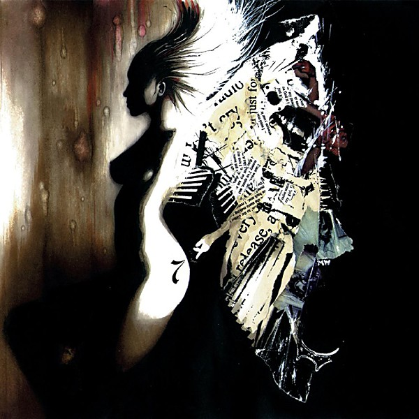

# Headshots

By **Atmosphere**

## Album Data

- **Catalog:** Beets
- **Format:** Digital, Album
- **Album:** Headshots
- **Artist:** Atmosphere
- **Albumartist:** Atmosphere
- **Genre:** Hip Hop
- **MusicBrainz Album Artist ID:** [ef954679-5ee7-4016-acef-7ac71f2fa3d8](https://musicbrainz.org/artist/ef954679-5ee7-4016-acef-7ac71f2fa3d8)
- **MusicBrainz Album ID:** [3bb7c16e-4279-41ab-a94b-9ee6aac69e35](https://musicbrainz.org/release/3bb7c16e-4279-41ab-a94b-9ee6aac69e35)
- **MusicBrainz Release Group ID:** [9617e05a-3a4a-3883-a30a-90ddacf5ddef](https://musicbrainz.org/release-group/9617e05a-3a4a-3883-a30a-90ddacf5ddef)
- **Year:** 2005
- **Catalog #:** 
- **Label:** 
- **Total Tracks:** 00

## Album Tracks

### Track 18 - American Idle

- **Artist:** 2 Mex/Slug/The Shape Shifters/Busdriver
- **Format:** AAC
- **Genre:** Hip Hop
- **Length:** 5:47
- **MusicBrainz Track ID:** 
- **Title:** American Idle
- **Track:** 18
- **Year:** 2004

### Track 03 - Hold Mine feat. Blueprint, Aesop Rock, Eyedea & Illogic

- **Artist:** Atmosphere
- **Format:** AAC
- **Genre:** Hip Hop
- **Length:** 4:54
- **MusicBrainz Track ID:** 
- **Title:** Hold Mine feat. Blueprint, Aesop Rock, Eyedea & Illogic
- **Track:** 03
- **Year:** 2005

### Track 04 - Get Depressed

- **Artist:** Atmosphere
- **Format:** MP3
- **Genre:** Hip Hop
- **Length:** 4:56
- **MusicBrainz Track ID:** 
- **Title:** Get Depressed
- **Track:** 04
- **Year:** 2005

### Track 05 - Fallen feat. Vakill

- **Artist:** Atmosphere
- **Format:** AAC
- **Genre:** Hip Hop
- **Length:** 5:27
- **MusicBrainz Track ID:** 
- **Title:** Fallen feat. Vakill
- **Track:** 05
- **Year:** 2005

### Track 06 - Seven Goes Bonkers Pt. 1 feat. Dose One

- **Artist:** Atmosphere
- **Format:** MP3
- **Genre:** Hip Hop
- **Length:** 3:04
- **MusicBrainz Track ID:** 
- **Title:** Seven Goes Bonkers Pt. 1 feat. Dose One
- **Track:** 06
- **Year:** 2005

### Track 07 - Windy feat. Mr. Skurge

- **Artist:** Atmosphere
- **Format:** MP3
- **Genre:** Hip Hop
- **Length:** 2:56
- **MusicBrainz Track ID:** 
- **Title:** Windy feat. Mr. Skurge
- **Track:** 07
- **Year:** 2005

### Track 08 - H Overtkill feat. Mac Lethal

- **Artist:** Atmosphere
- **Format:** MP3
- **Genre:** Hip Hop
- **Length:** 4:08
- **MusicBrainz Track ID:** 
- **Title:** H Overtkill feat. Mac Lethal
- **Track:** 08
- **Year:** 2005

### Track 12 - Cats Van Bags (Remix) feat. Brother Ali

- **Artist:** Atmosphere
- **Format:** MP3
- **Genre:** Hip Hop
- **Length:** 4:08
- **MusicBrainz Track ID:** 
- **Title:** Cats Van Bags (Remix) feat. Brother Ali
- **Track:** 12
- **Year:** 2005

### Track 13 - Seven Goes Bonkers Pt. 2 feat. Dose One

- **Artist:** Atmosphere
- **Format:** MP3
- **Genre:** Hip Hop
- **Length:** 3:46
- **MusicBrainz Track ID:** 
- **Title:** Seven Goes Bonkers Pt. 2 feat. Dose One
- **Track:** 13
- **Year:** 2005

### Track 14 - Steel Toe Verses The Rookie feat. Micranots

- **Artist:** Atmosphere
- **Format:** AAC
- **Genre:** Hip Hop
- **Length:** 5:17
- **MusicBrainz Track ID:** 
- **Title:** Steel Toe Verses The Rookie feat. Micranots
- **Track:** 14
- **Year:** 2005

### Track 16 - Knock Knock Joke 2

- **Artist:** Atmosphere
- **Format:** MP3
- **Genre:** Hip Hop
- **Length:** 2:10
- **MusicBrainz Track ID:** 
- **Title:** Knock Knock Joke 2
- **Track:** 16
- **Year:** 2005

### Track 17 - Sick Pimpin' (Remix)

- **Artist:** Atmosphere
- **Format:** MP3
- **Genre:** Hip Hop
- **Length:** 5:03
- **MusicBrainz Track ID:** 
- **Title:** Sick Pimpin' (Remix)
- **Track:** 17
- **Year:** 2005

### Track 18 - Oooooooh

- **Artist:** Atmosphere
- **Format:** MP3
- **Genre:** Hip Hop
- **Length:** 3:13
- **MusicBrainz Track ID:** 
- **Title:** Oooooooh
- **Track:** 18
- **Year:** 2005

### Track 01 - Snapshot feat. Booka B

- **Artist:** Atmosphere
- **Format:** AAC
- **Genre:** Hip Hop
- **Length:** 4:12
- **MusicBrainz Track ID:** 
- **Title:** Snapshot feat. Booka B
- **Track:** 01
- **Year:** 2005

### Track 02 - Wooden Ships feat. PNS

- **Artist:** Atmosphere
- **Format:** MP3
- **Genre:** Hip Hop
- **Length:** 4:21
- **MusicBrainz Track ID:** 
- **Title:** Wooden Ships feat. PNS
- **Track:** 02
- **Year:** 2005

### Track 09 - Better Man feat. Creature

- **Artist:** Atmosphere
- **Format:** AAC
- **Genre:** Hip Hop
- **Length:** 3:19
- **MusicBrainz Track ID:** 
- **Title:** Better Man feat. Creature
- **Track:** 09
- **Year:** 2005

### Track 15 - Gotta Love 'Em feat. Eyedea

- **Artist:** Atmosphere
- **Format:** AAC
- **Genre:** Hip Hop
- **Length:** 5:01
- **MusicBrainz Track ID:** 
- **Title:** Gotta Love 'Em feat. Eyedea
- **Track:** 15
- **Year:** 2005

### Track 15 - Insomnia 411

- **Artist:** Roosevelt Franklin
- **Format:** MP3
- **Genre:** Hip Hop
- **Length:** 6:11
- **MusicBrainz Track ID:** 
- **Title:** Insomnia 411
- **Track:** 15
- **Year:** 2003

## See also

- [God Loves Ugly](God_Loves_Ugly.md)
- [New, Unreleased & B-Sides Vol. 2](New__Unreleased_and_B-Sides_Vol_2.md)
- [Overcast!](Overcast!.md)
- [Sad Clown Bad Dub II](Sad_Clown_Bad_Dub_II.md)
- [Sad Clown Bad Summer Number 9](Sad_Clown_Bad_Summer_Number_9.md)
- [Seven's Travels](Sevens_Travels.md)
- [To All My Friends, Blood Makes the Blade Holy - The Atmosphere EP's](To_All_My_Friends__Blood_Makes_the_Blade_Holy_-_The_Atmosphere_EPs.md)
- [When Life Gives You Lemons, You Paint That Shit Gold](When_Life_Gives_You_Lemons__You_Paint_That_Shit_Gold.md)
- [You Can't Imagine How Much Fun We're Having Disc 1](You_Cant_Imagine_How_Much_Fun_Were_Having_Disc_1.md)
- [Roon: Southsiders (Édition Studio Masters)](../../Roon/Atmosphere/Southsiders_Édition_Studio_Masters.md)
- [Roon: When Life Gives You Lemons, You Paint That Shit Gold](../../Roon/Atmosphere/When_Life_Gives_You_Lemons__You_Paint_That_Shit_Gold.md)
