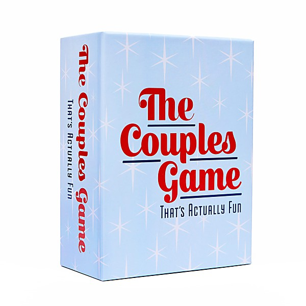

# New, Unreleased & B-Sides Vol. 2

By **Atmosphere**

## Album Data

- **Catalog:** Beets
- **Format:** Digital, Album
- **Album:** New, Unreleased & B-Sides Vol. 2
- **Artist:** Atmosphere
- **Albumartist:** Atmosphere
- **Genre:** Hip Hop
- **MusicBrainz Album Artist ID:** 
- **MusicBrainz Album ID:** 
- **MusicBrainz Release Group ID:** 
- **Year:** 2005
- **Catalog #:** RS0008-2
- **Label:** Rhymesayers Entertainment
- **Total Tracks:** 18

## Album Tracks

### Track 01 - 1597

- **Artist:** Atmosphere
- **Format:** MP3
- **Genre:** Hip Hop
- **Length:** 3:04
- **MusicBrainz Track ID:** [8aff9086-7e3e-48dc-a41b-1feae7a04bcf](https://musicbrainz.org/recording/8aff9086-7e3e-48dc-a41b-1feae7a04bcf)
- **Title:** 1597
- **Track:** 01
- **Year:** 1997

### Track 02 - Brief Description

- **Artist:** Atmosphere
- **Format:** MP3
- **Genre:** Hip Hop
- **Length:** 4:16
- **MusicBrainz Track ID:** [d88227ab-3aff-4991-aea0-f1c1ecabc3f5](https://musicbrainz.org/recording/d88227ab-3aff-4991-aea0-f1c1ecabc3f5)
- **Title:** Brief Description
- **Track:** 02
- **Year:** 1997

### Track 04 - Complications

- **Artist:** Atmosphere
- **Format:** AAC
- **Genre:** Hip Hop
- **Length:** 5:04
- **MusicBrainz Track ID:** [aa50aa84-de92-4801-9e12-756952f9533d](https://musicbrainz.org/recording/aa50aa84-de92-4801-9e12-756952f9533d)
- **Title:** Complications
- **Track:** 04
- **Year:** 1997

### Track 05 - 4

- **Artist:** Atmosphere
- **Format:** AAC
- **Genre:** Hip Hop
- **Length:** 3:10
- **MusicBrainz Track ID:** [30069dbc-3a7b-409d-8a0b-2ddec6cd021f](https://musicbrainz.org/recording/30069dbc-3a7b-409d-8a0b-2ddec6cd021f)
- **Title:** 4
- **Track:** 05
- **Year:** 1997

### Track 07 - Clay

- **Artist:** Atmosphere
- **Format:** AAC
- **Genre:** Hip Hop
- **Length:** 3:49
- **MusicBrainz Track ID:** [3eecd432-a2e2-4d7e-ac40-e51d9fb30c19](https://musicbrainz.org/recording/3eecd432-a2e2-4d7e-ac40-e51d9fb30c19)
- **Title:** Clay
- **Track:** 07
- **Year:** 1997

### Track 08 - @

- **Artist:** Atmosphere
- **Format:** AAC
- **Genre:** Hip Hop
- **Length:** 2:17
- **MusicBrainz Track ID:** [dc61c94d-76b3-4533-829c-1c9d8ae1bef4](https://musicbrainz.org/recording/dc61c94d-76b3-4533-829c-1c9d8ae1bef4)
- **Title:** @
- **Track:** 08
- **Year:** 1997

### Track 09 - Sound Is Vibration

- **Artist:** Atmosphere
- **Format:** AAC
- **Genre:** Hip Hop
- **Length:** 3:57
- **MusicBrainz Track ID:** [d85d55fb-960c-449e-9578-52a94c461ff1](https://musicbrainz.org/recording/d85d55fb-960c-449e-9578-52a94c461ff1)
- **Title:** Sound Is Vibration
- **Track:** 09
- **Year:** 1997

### Track 10 - Multiples

- **Artist:** Atmosphere
- **Format:** AAC
- **Genre:** Hip Hop
- **Length:** 4:13
- **MusicBrainz Track ID:** [4f101489-0804-49dd-9d0f-1f6dc841d64e](https://musicbrainz.org/recording/4f101489-0804-49dd-9d0f-1f6dc841d64e)
- **Title:** Multiples
- **Track:** 10
- **Year:** 1997

### Track 11 - Scapegoat

- **Artist:** Atmosphere
- **Format:** AAC
- **Genre:** Hip Hop
- **Length:** 3:52
- **MusicBrainz Track ID:** [5dc514ed-4ba1-49a4-954e-2e75295e7226](https://musicbrainz.org/recording/5dc514ed-4ba1-49a4-954e-2e75295e7226)
- **Title:** Scapegoat
- **Track:** 11
- **Year:** 1997

### Track 12 - Ode to the Modern Man (Lightning Blend)

- **Artist:** Atmosphere
- **Format:** AAC
- **Genre:** Hip Hop
- **Length:** 4:01
- **MusicBrainz Track ID:** [d39bdb21-ea5f-4ac4-96e1-72a4cc6202d6](https://musicbrainz.org/recording/d39bdb21-ea5f-4ac4-96e1-72a4cc6202d6)
- **Title:** Ode to the Modern Man (Lightning Blend)
- **Track:** 12
- **Year:** 1997

### Track 13 - WND

- **Artist:** Atmosphere
- **Format:** AAC
- **Genre:** Hip Hop
- **Length:** 3:08
- **MusicBrainz Track ID:** [f82713f2-5642-444f-81ed-83b6fec6d8f1](https://musicbrainz.org/recording/f82713f2-5642-444f-81ed-83b6fec6d8f1)
- **Title:** WND
- **Track:** 13
- **Year:** 1997

### Track 14 - Multiples (reprise)

- **Artist:** Atmosphere
- **Format:** MP3
- **Genre:** Rapcore
- **Length:** 4:42
- **MusicBrainz Track ID:** [d6510a60-78c6-45bd-ba4c-eac575d04795](https://musicbrainz.org/recording/d6510a60-78c6-45bd-ba4c-eac575d04795)
- **Title:** Multiples (reprise)
- **Track:** 14
- **Year:** 1997

### Track 15 - Caved In

- **Artist:** Atmosphere
- **Format:** AAC
- **Genre:** Hip Hop
- **Length:** 3:44
- **MusicBrainz Track ID:** [fdecbe1c-48a9-4e7b-825d-7f9eb14e187e](https://musicbrainz.org/recording/fdecbe1c-48a9-4e7b-825d-7f9eb14e187e)
- **Title:** Caved In
- **Track:** 15
- **Year:** 1997

### Track 16 - Cuando Limpia El Humo

- **Artist:** Atmosphere
- **Format:** AAC
- **Genre:** Hip Hop
- **Length:** 5:12
- **MusicBrainz Track ID:** [9ed95b50-249b-46e6-a014-3ca718076b37](https://musicbrainz.org/recording/9ed95b50-249b-46e6-a014-3ca718076b37)
- **Title:** Cuando Limpia El Humo
- **Track:** 16
- **Year:** 1997

### Track 17 - The Outernet

- **Artist:** Atmosphere
- **Format:** MP3
- **Genre:** Hip Hop
- **Length:** 7:16
- **MusicBrainz Track ID:** [c8e25d2a-6e9c-4b00-82ce-ceeb0116a552](https://musicbrainz.org/recording/c8e25d2a-6e9c-4b00-82ce-ceeb0116a552)
- **Title:** The Outernet
- **Track:** 17
- **Year:** 1997

### Track 03 - Current Status

- **Artist:** Atmosphere feat. Beyond
- **Format:** AAC
- **Genre:** Hip Hop
- **Length:** 3:40
- **MusicBrainz Track ID:** [5b49f68e-d40d-48d9-a649-8ffd92742ac7](https://musicbrainz.org/recording/5b49f68e-d40d-48d9-a649-8ffd92742ac7)
- **Title:** Current Status
- **Track:** 03
- **Year:** 1997

### Track 06 - Adjust

- **Artist:** Atmosphere feat. Beyond
- **Format:** AAC
- **Genre:** Hip Hop
- **Length:** 4:44
- **MusicBrainz Track ID:** [85af4bc1-c1ac-4c75-b512-ec25cf4414f9](https://musicbrainz.org/recording/85af4bc1-c1ac-4c75-b512-ec25cf4414f9)
- **Title:** Adjust
- **Track:** 06
- **Year:** 1997

## See also

- [God Loves Ugly](God_Loves_Ugly.md)
- [Headshots](Headshots.md)
- [Overcast!](Overcast!.md)
- [Sad Clown Bad Dub II](Sad_Clown_Bad_Dub_II.md)
- [Sad Clown Bad Summer Number 9](Sad_Clown_Bad_Summer_Number_9.md)
- [Seven's Travels](Sevens_Travels.md)
- [To All My Friends, Blood Makes the Blade Holy - The Atmosphere EP's](To_All_My_Friends__Blood_Makes_the_Blade_Holy_-_The_Atmosphere_EPs.md)
- [When Life Gives You Lemons, You Paint That Shit Gold](When_Life_Gives_You_Lemons__You_Paint_That_Shit_Gold.md)
- [You Can't Imagine How Much Fun We're Having Disc 1](You_Cant_Imagine_How_Much_Fun_Were_Having_Disc_1.md)
- [Roon: Southsiders (Édition Studio Masters)](../../Roon/Atmosphere/Southsiders_Édition_Studio_Masters.md)
- [Roon: When Life Gives You Lemons, You Paint That Shit Gold](../../Roon/Atmosphere/When_Life_Gives_You_Lemons__You_Paint_That_Shit_Gold.md)
