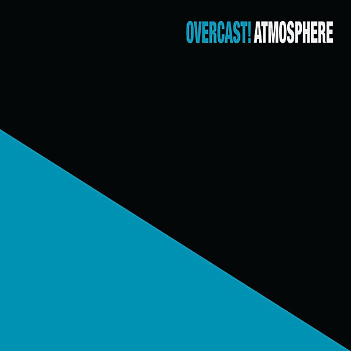

# Overcast!

By **Atmosphere**

## Album Data

- **Catalog:** Beets
- **Format:** Digital, Album
- **Album:** Overcast!
- **Artist:** Atmosphere
- **Albumartist:** Atmosphere
- **Genre:** Hip Hop
- **MusicBrainz Album Artist ID:** [ef954679-5ee7-4016-acef-7ac71f2fa3d8](https://musicbrainz.org/artist/ef954679-5ee7-4016-acef-7ac71f2fa3d8)
- **MusicBrainz Album ID:** [b34a248f-7b04-42e4-b4e8-72121d1a07ae](https://musicbrainz.org/release/b34a248f-7b04-42e4-b4e8-72121d1a07ae)
- **MusicBrainz Release Group ID:** [b6167a2d-ac42-3529-8801-7c9ba708a5be](https://musicbrainz.org/release-group/b6167a2d-ac42-3529-8801-7c9ba708a5be)
- **Year:** 1997
- **Catalog #:** 
- **Label:** 
- **Total Tracks:** 00

## Album Tracks

### Track 48 - Body Pillow

- **Artist:** Atmosphere
- **Format:** MP3
- **Genre:** Rapcore
- **Length:** 3:34
- **MusicBrainz Track ID:** 
- **Title:** Body Pillow
- **Track:** 48
- **Year:** 2002

### Track 48 - Fashion Magazine

- **Artist:** Atmosphere
- **Format:** MP3
- **Genre:** Hip Hop
- **Length:** 2:21
- **MusicBrainz Track ID:** 
- **Title:** Fashion Magazine
- **Track:** 48
- **Year:** 2002

### Track 48 - Hells Playground

- **Artist:** Atmosphere
- **Format:** MP3
- **Genre:** Hip Hop
- **Length:** 3:14
- **MusicBrainz Track ID:** 
- **Title:** Hells Playground
- **Track:** 48
- **Year:** 2002

### Track 48 - Inside Outsider

- **Artist:** Atmosphere
- **Format:** MP3
- **Genre:** Hip Hop
- **Length:** 3:39
- **MusicBrainz Track ID:** 
- **Title:** Inside Outsider
- **Track:** 48
- **Year:** 2002

### Track 48 - Running With Scissors

- **Artist:** Atmosphere
- **Format:** MP3
- **Genre:** Hip Hop
- **Length:** 3:20
- **MusicBrainz Track ID:** 
- **Title:** Running With Scissors
- **Track:** 48
- **Year:** 2002

### Track 48 - The River

- **Artist:** Atmosphere
- **Format:** MP3
- **Genre:** Hip Hop
- **Length:** 5:08
- **MusicBrainz Track ID:** 
- **Title:** The River
- **Track:** 48
- **Year:** 2002

### Track 48 - The Wind

- **Artist:** Atmosphere
- **Format:** MP3
- **Genre:** Hip Hop
- **Length:** 4:37
- **MusicBrainz Track ID:** 
- **Title:** The Wind
- **Track:** 48
- **Year:** 2002

### Track 48 - Hungry Fuck

- **Artist:** Atmosphere
- **Format:** MP3
- **Genre:** Hip Hop
- **Length:** 2:11
- **MusicBrainz Track ID:** 
- **Title:** Hungry Fuck
- **Track:** 48
- **Year:** 2002

### Track 48 - Sad Clown

- **Artist:** Atmosphere
- **Format:** MP3
- **Genre:** Hip Hop
- **Length:** 2:49
- **MusicBrainz Track ID:** 
- **Title:** Sad Clown
- **Track:** 48
- **Year:** 2002

### Track 48 - The Ocean

- **Artist:** Atmosphere
- **Format:** MP3
- **Genre:** Hip Hop
- **Length:** 4:38
- **MusicBrainz Track ID:** 
- **Title:** The Ocean
- **Track:** 48
- **Year:** 2002

### Track 48 - The Pill

- **Artist:** Atmosphere
- **Format:** MP3
- **Genre:** Hip Hop
- **Length:** 1:27
- **MusicBrainz Track ID:** 
- **Title:** The Pill
- **Track:** 48
- **Year:** 2002

### Track 48 - When It Breaks

- **Artist:** Atmosphere
- **Format:** MP3
- **Genre:** Hip Hop
- **Length:** 3:07
- **MusicBrainz Track ID:** 
- **Title:** When It Breaks
- **Track:** 48
- **Year:** 2002

## See also

- [God Loves Ugly](God_Loves_Ugly.md)
- [Headshots](Headshots.md)
- [New, Unreleased & B-Sides Vol. 2](New__Unreleased_and_B-Sides_Vol_2.md)
- [Sad Clown Bad Dub II](Sad_Clown_Bad_Dub_II.md)
- [Sad Clown Bad Summer Number 9](Sad_Clown_Bad_Summer_Number_9.md)
- [Seven's Travels](Sevens_Travels.md)
- [To All My Friends, Blood Makes the Blade Holy - The Atmosphere EP's](To_All_My_Friends__Blood_Makes_the_Blade_Holy_-_The_Atmosphere_EPs.md)
- [When Life Gives You Lemons, You Paint That Shit Gold](When_Life_Gives_You_Lemons__You_Paint_That_Shit_Gold.md)
- [You Can't Imagine How Much Fun We're Having Disc 1](You_Cant_Imagine_How_Much_Fun_Were_Having_Disc_1.md)
- [Roon: Southsiders (Édition Studio Masters)](../../Roon/Atmosphere/Southsiders_Édition_Studio_Masters.md)
- [Roon: When Life Gives You Lemons, You Paint That Shit Gold](../../Roon/Atmosphere/When_Life_Gives_You_Lemons__You_Paint_That_Shit_Gold.md)
