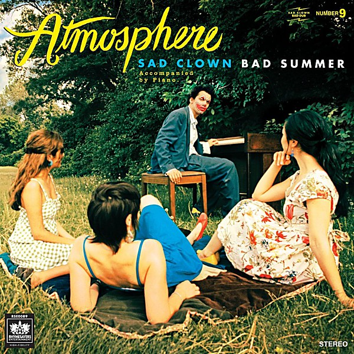

# Sad Clown Bad Summer Number 9

By **Atmosphere**

## Album Data

- **Catalog:** Beets
- **Format:** Digital, Album
- **Album:** Sad Clown Bad Summer Number 9
- **Artist:** Atmosphere
- **Albumartist:** Atmosphere
- **Genre:** Uk Garage
- **MusicBrainz Album Artist ID:** [ef954679-5ee7-4016-acef-7ac71f2fa3d8](https://musicbrainz.org/artist/ef954679-5ee7-4016-acef-7ac71f2fa3d8)
- **MusicBrainz Album ID:** [2e5982e9-f356-4f2e-9929-a13882c2db93](https://musicbrainz.org/release/2e5982e9-f356-4f2e-9929-a13882c2db93)
- **MusicBrainz Release Group ID:** [ee2e3895-d59a-38c8-b55c-3437e38694af](https://musicbrainz.org/release-group/ee2e3895-d59a-38c8-b55c-3437e38694af)
- **Year:** 2007
- **Catalog #:** 
- **Label:** Rhymesayers Entertainment
- **Total Tracks:** 19

## Album Tracks

### Track 01 - History

- **Artist:** Atmosphere
- **Format:** AAC
- **Genre:** Hip Hop
- **Length:** 1:24
- **MusicBrainz Track ID:** [https](https://musicbrainz.org/recording/https)
- **Title:** History
- **Track:** 01
- **Year:** 2003

### Track 02 - Trying to Find a Balance

- **Artist:** Atmosphere
- **Format:** AAC
- **Genre:** Hip Hop
- **Length:** 4:17
- **MusicBrainz Track ID:** [https](https://musicbrainz.org/recording/https)
- **Title:** Trying to Find a Balance
- **Track:** 02
- **Year:** 2003

### Track 03 - Bird Sings Why the Caged I Know

- **Artist:** Atmosphere
- **Format:** AAC
- **Genre:** Hip Hop
- **Length:** 2:56
- **MusicBrainz Track ID:** [https](https://musicbrainz.org/recording/https)
- **Title:** Bird Sings Why the Caged I Know
- **Track:** 03
- **Year:** 2003

### Track 04 - Reflections

- **Artist:** Atmosphere
- **Format:** AAC
- **Genre:** Funk
- **Length:** 4:19
- **MusicBrainz Track ID:** [https](https://musicbrainz.org/recording/https)
- **Title:** Reflections
- **Track:** 04
- **Year:** 2003

### Track 05 - Gotta Lotta Walls

- **Artist:** Atmosphere
- **Format:** AAC
- **Genre:** Hip Hop
- **Length:** 4:46
- **MusicBrainz Track ID:** [https](https://musicbrainz.org/recording/https)
- **Title:** Gotta Lotta Walls
- **Track:** 05
- **Year:** 2003

### Track 06 - The Keys to Life vs. 15 Minutes of Fame

- **Artist:** Atmosphere
- **Format:** AAC
- **Genre:** Hip Hop
- **Length:** 2:38
- **MusicBrainz Track ID:** [https](https://musicbrainz.org/recording/https)
- **Title:** The Keys to Life vs. 15 Minutes of Fame
- **Track:** 06
- **Year:** 2003

### Track 07 - Apple

- **Artist:** Atmosphere
- **Format:** AAC
- **Genre:** Psychedelic Rock
- **Length:** 1:59
- **MusicBrainz Track ID:** [https](https://musicbrainz.org/recording/https)
- **Title:** Apple
- **Track:** 07
- **Year:** 2003

### Track 08 - Suicidegirls

- **Artist:** Atmosphere
- **Format:** AAC
- **Genre:** Electronica
- **Length:** 2:40
- **MusicBrainz Track ID:** [https](https://musicbrainz.org/recording/https)
- **Title:** Suicidegirls
- **Track:** 08
- **Year:** 2003

### Track 10 - Cats Van Bags

- **Artist:** Atmosphere
- **Format:** AAC
- **Genre:** Hip Hop
- **Length:** 4:01
- **MusicBrainz Track ID:** [https](https://musicbrainz.org/recording/https)
- **Title:** Cats Van Bags
- **Track:** 10
- **Year:** 2003

### Track 11 - Los Angeles

- **Artist:** Atmosphere
- **Format:** AAC
- **Genre:** Hip Hop
- **Length:** 2:14
- **MusicBrainz Track ID:** [https](https://musicbrainz.org/recording/https)
- **Title:** Los Angeles
- **Track:** 11
- **Year:** 2003

### Track 12 - Lifter Puller

- **Artist:** Atmosphere
- **Format:** AAC
- **Genre:** Hip Hop
- **Length:** 6:18
- **MusicBrainz Track ID:** [https](https://musicbrainz.org/recording/https)
- **Title:** Lifter Puller
- **Track:** 12
- **Year:** 2003

### Track 13 - Shoes

- **Artist:** Atmosphere
- **Format:** AAC
- **Genre:** Hip Hop
- **Length:** 3:01
- **MusicBrainz Track ID:** [https](https://musicbrainz.org/recording/https)
- **Title:** Shoes
- **Track:** 13
- **Year:** 2003

### Track 14 - National Disgrace

- **Artist:** Atmosphere
- **Format:** AAC
- **Genre:** Hip Hop
- **Length:** 5:02
- **MusicBrainz Track ID:** [https](https://musicbrainz.org/recording/https)
- **Title:** National Disgrace
- **Track:** 14
- **Year:** 2003

### Track 15 - Denvemolorado

- **Artist:** Atmosphere
- **Format:** MP3
- **Genre:** Hip Hop
- **Length:** 3:11
- **MusicBrainz Track ID:** [https](https://musicbrainz.org/recording/https)
- **Title:** Denvemolorado
- **Track:** 15
- **Year:** 2003

### Track 16 - Liquor Lyles Cool July

- **Artist:** Atmosphere
- **Format:** AAC
- **Genre:** Uk Garage
- **Length:** 2:24
- **MusicBrainz Track ID:** [https](https://musicbrainz.org/recording/https)
- **Title:** Liquor Lyles Cool July
- **Track:** 16
- **Year:** 2003

### Track 17 - Good Times (Sick Pimpin')

- **Artist:** Atmosphere
- **Format:** AAC
- **Genre:** Hip Hop
- **Length:** 4:56
- **MusicBrainz Track ID:** [https](https://musicbrainz.org/recording/https)
- **Title:** Good Times (Sick Pimpin')
- **Track:** 17
- **Year:** 2003

### Track 18 - In My Continental

- **Artist:** Atmosphere
- **Format:** MP3
- **Genre:** Hip Hop
- **Length:** 4:28
- **MusicBrainz Track ID:** [https](https://musicbrainz.org/recording/https)
- **Title:** In My Continental
- **Track:** 18
- **Year:** 2003

### Track 19 - Always Coming Back Home to You

- **Artist:** Atmosphere
- **Format:** MP3
- **Genre:** Hip Hop
- **Length:** 9:11
- **MusicBrainz Track ID:** [https](https://musicbrainz.org/recording/https)
- **Title:** Always Coming Back Home to You
- **Track:** 19
- **Year:** 2003

## See also

- [God Loves Ugly](God_Loves_Ugly.md)
- [Headshots](Headshots.md)
- [New, Unreleased & B-Sides Vol. 2](New__Unreleased_and_B-Sides_Vol_2.md)
- [Overcast!](Overcast!.md)
- [Sad Clown Bad Dub II](Sad_Clown_Bad_Dub_II.md)
- [Seven's Travels](Sevens_Travels.md)
- [To All My Friends, Blood Makes the Blade Holy - The Atmosphere EP's](To_All_My_Friends__Blood_Makes_the_Blade_Holy_-_The_Atmosphere_EPs.md)
- [When Life Gives You Lemons, You Paint That Shit Gold](When_Life_Gives_You_Lemons__You_Paint_That_Shit_Gold.md)
- [You Can't Imagine How Much Fun We're Having Disc 1](You_Cant_Imagine_How_Much_Fun_Were_Having_Disc_1.md)
- [Roon: Southsiders (Édition Studio Masters)](../../Roon/Atmosphere/Southsiders_Édition_Studio_Masters.md)
- [Roon: When Life Gives You Lemons, You Paint That Shit Gold](../../Roon/Atmosphere/When_Life_Gives_You_Lemons__You_Paint_That_Shit_Gold.md)
