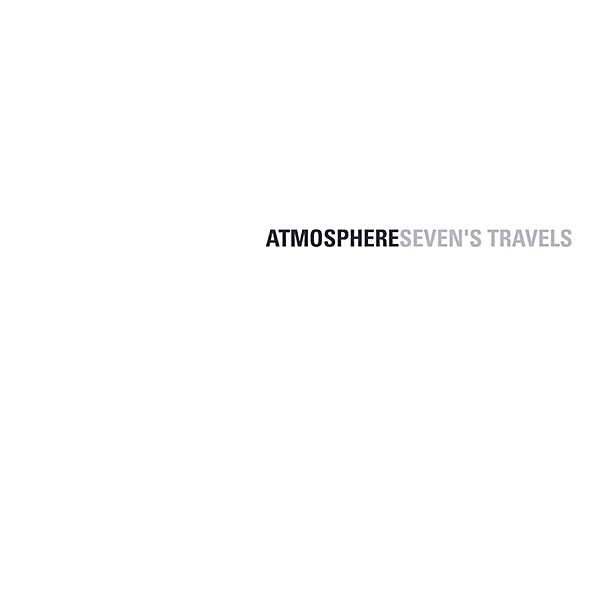

# Seven's Travels

By **Atmosphere**

## Album Data

- **Catalog:** Beets
- **Format:** Digital, Album
- **Album:** Seven's Travels
- **Artist:** Atmosphere
- **Albumartist:** Atmosphere
- **Genre:** Hip Hop
- **MusicBrainz Album Artist ID:** [https](https://musicbrainz.org/artist/https)
- **MusicBrainz Album ID:** [https](https://musicbrainz.org/release/https)
- **MusicBrainz Release Group ID:** 
- **Year:** 2003
- **Catalog #:** 
- **Label:** 
- **Total Tracks:** 12

## Album Tracks

### Track 04 - The Best Day

- **Artist:** Atmosphere
- **Format:** AAC
- **Genre:** Alternative Hip Hop
- **Length:** 3:36
- **MusicBrainz Track ID:** 
- **Title:** The Best Day
- **Track:** 04
- **Year:** 2010

## See also

- [God Loves Ugly](God_Loves_Ugly.md)
- [Headshots](Headshots.md)
- [New, Unreleased & B-Sides Vol. 2](New__Unreleased_and_B-Sides_Vol_2.md)
- [Overcast!](Overcast!.md)
- [Sad Clown Bad Dub II](Sad_Clown_Bad_Dub_II.md)
- [Sad Clown Bad Summer Number 9](Sad_Clown_Bad_Summer_Number_9.md)
- [To All My Friends, Blood Makes the Blade Holy - The Atmosphere EP's](To_All_My_Friends__Blood_Makes_the_Blade_Holy_-_The_Atmosphere_EPs.md)
- [When Life Gives You Lemons, You Paint That Shit Gold](When_Life_Gives_You_Lemons__You_Paint_That_Shit_Gold.md)
- [You Can't Imagine How Much Fun We're Having Disc 1](You_Cant_Imagine_How_Much_Fun_Were_Having_Disc_1.md)
- [Roon: Southsiders (Édition Studio Masters)](../../Roon/Atmosphere/Southsiders_Édition_Studio_Masters.md)
- [Roon: When Life Gives You Lemons, You Paint That Shit Gold](../../Roon/Atmosphere/When_Life_Gives_You_Lemons__You_Paint_That_Shit_Gold.md)
