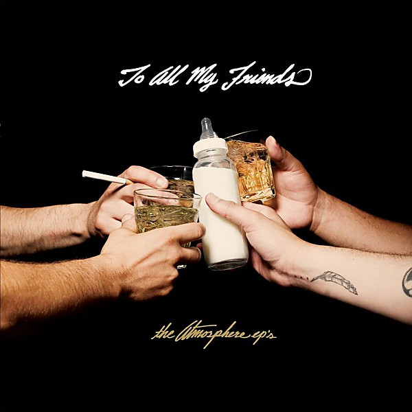

# To All My Friends, Blood Makes the Blade Holy - The Atmosphere EP's

By **Atmosphere**

## Album Data

- **Catalog:** Beets
- **Format:** Digital, Album
- **Album:** To All My Friends, Blood Makes the Blade Holy - The Atmosphere EP's
- **Artist:** Atmosphere
- **Albumartist:** Atmosphere
- **Genre:** Hip Hop
- **MusicBrainz Album Artist ID:** 
- **MusicBrainz Album ID:** 
- **MusicBrainz Release Group ID:** 
- **Year:** 2010
- **Catalog #:** RSE-0095
- **Label:** Rhymesayers Entertainment
- **Total Tracks:** 15

## Album Tracks

### Track 01 - Like the Rest of Us

- **Artist:** Atmosphere
- **Format:** AAC
- **Genre:** Hip Hop
- **Length:** 3:23
- **MusicBrainz Track ID:** [1c312f79-fce0-4e66-8676-3b3133976bfc](https://musicbrainz.org/recording/1c312f79-fce0-4e66-8676-3b3133976bfc)
- **Title:** Like the Rest of Us
- **Track:** 01
- **Year:** 2008

### Track 02 - Puppets

- **Artist:** Atmosphere
- **Format:** AAC
- **Genre:** Alternative Hip Hop
- **Length:** 3:41
- **MusicBrainz Track ID:** [6f22c770-8fac-4b0c-83a6-32d287d600b1](https://musicbrainz.org/recording/6f22c770-8fac-4b0c-83a6-32d287d600b1)
- **Title:** Puppets
- **Track:** 02
- **Year:** 2008

### Track 03 - The Skinny

- **Artist:** Atmosphere
- **Format:** AAC
- **Genre:** Alternative Hip Hop
- **Length:** 3:36
- **MusicBrainz Track ID:** [85f1e0b2-ebb0-4f2e-a4b7-1f913926ecb0](https://musicbrainz.org/recording/85f1e0b2-ebb0-4f2e-a4b7-1f913926ecb0)
- **Title:** The Skinny
- **Track:** 03
- **Year:** 2008

### Track 04 - Dreamer

- **Artist:** Atmosphere
- **Format:** AAC
- **Genre:** Hip Hop
- **Length:** 4:06
- **MusicBrainz Track ID:** [3faafdfb-154f-4b7c-909a-32c154ca4d48](https://musicbrainz.org/recording/3faafdfb-154f-4b7c-909a-32c154ca4d48)
- **Title:** Dreamer
- **Track:** 04
- **Year:** 2008

### Track 05 - Shoulda Known

- **Artist:** Atmosphere
- **Format:** AAC
- **Genre:** Funk
- **Length:** 3:09
- **MusicBrainz Track ID:** [f2250f1e-1397-4a15-84df-9a3d887839b1](https://musicbrainz.org/recording/f2250f1e-1397-4a15-84df-9a3d887839b1)
- **Title:** Shoulda Known
- **Track:** 05
- **Year:** 2008

### Track 06 - You

- **Artist:** Atmosphere
- **Format:** AAC
- **Genre:** Uk Garage
- **Length:** 3:16
- **MusicBrainz Track ID:** [7c69fd57-66d8-4d75-af90-9ac625c2551c](https://musicbrainz.org/recording/7c69fd57-66d8-4d75-af90-9ac625c2551c)
- **Title:** You
- **Track:** 06
- **Year:** 2008

### Track 07 - Painting

- **Artist:** Atmosphere
- **Format:** AAC
- **Genre:** Hip Hop
- **Length:** 3:00
- **MusicBrainz Track ID:** [c1b63963-d1d6-455b-bce0-9e07efa3910d](https://musicbrainz.org/recording/c1b63963-d1d6-455b-bce0-9e07efa3910d)
- **Title:** Painting
- **Track:** 07
- **Year:** 2008

### Track 08 - Your Glasshouse

- **Artist:** Atmosphere
- **Format:** AAC
- **Genre:** Electronica
- **Length:** 4:00
- **MusicBrainz Track ID:** [a78dbde6-f7a2-4fab-8b37-ad27f3a42ea9](https://musicbrainz.org/recording/a78dbde6-f7a2-4fab-8b37-ad27f3a42ea9)
- **Title:** Your Glasshouse
- **Track:** 08
- **Year:** 2008

### Track 09 - Yesterday

- **Artist:** Atmosphere
- **Format:** AAC
- **Genre:** Alternative Hip Hop
- **Length:** 3:23
- **MusicBrainz Track ID:** [fe0be180-4df4-41df-9578-4651561601dd](https://musicbrainz.org/recording/fe0be180-4df4-41df-9578-4651561601dd)
- **Title:** Yesterday
- **Track:** 09
- **Year:** 2008

### Track 10 - Guarantees

- **Artist:** Atmosphere
- **Format:** MP3
- **Genre:** Hip Hop
- **Length:** 4:31
- **MusicBrainz Track ID:** [282ca3b9-3aac-4cff-a0c7-483577fb2104](https://musicbrainz.org/recording/282ca3b9-3aac-4cff-a0c7-483577fb2104)
- **Title:** Guarantees
- **Track:** 10
- **Year:** 2008

### Track 11 - Me

- **Artist:** Atmosphere
- **Format:** AAC
- **Genre:** Alternative Hip Hop
- **Length:** 3:40
- **MusicBrainz Track ID:** [e71244f2-3d66-41fc-a8fa-f8a20ed73db7](https://musicbrainz.org/recording/e71244f2-3d66-41fc-a8fa-f8a20ed73db7)
- **Title:** Me
- **Track:** 11
- **Year:** 2008

### Track 12 - Wild Wild Horses

- **Artist:** Atmosphere
- **Format:** AAC
- **Genre:** Soul
- **Length:** 4:19
- **MusicBrainz Track ID:** [357de849-3a50-4410-bdad-b26c25e1f8ef](https://musicbrainz.org/recording/357de849-3a50-4410-bdad-b26c25e1f8ef)
- **Title:** Wild Wild Horses
- **Track:** 12
- **Year:** 2008

### Track 13 - Can’t Break

- **Artist:** Atmosphere
- **Format:** MP3
- **Genre:** Alternative Hip Hop
- **Length:** 3:32
- **MusicBrainz Track ID:** [46ed688a-8839-4b12-9be4-8e8ab9473586](https://musicbrainz.org/recording/46ed688a-8839-4b12-9be4-8e8ab9473586)
- **Title:** Can’t Break
- **Track:** 13
- **Year:** 2008

### Track 14 - The Waitress

- **Artist:** Atmosphere
- **Format:** AAC
- **Genre:** Uk Garage
- **Length:** 3:02
- **MusicBrainz Track ID:** [c36916d7-583d-43ff-b007-53d05afde5e8](https://musicbrainz.org/recording/c36916d7-583d-43ff-b007-53d05afde5e8)
- **Title:** The Waitress
- **Track:** 14
- **Year:** 2008

### Track 15 - In Her Music Box

- **Artist:** Atmosphere
- **Format:** AAC
- **Genre:** Hip Hop
- **Length:** 4:20
- **MusicBrainz Track ID:** [d3250fb9-b4aa-4336-ac52-80994de7d88d](https://musicbrainz.org/recording/d3250fb9-b4aa-4336-ac52-80994de7d88d)
- **Title:** In Her Music Box
- **Track:** 15
- **Year:** 2008

## See also

- [God Loves Ugly](God_Loves_Ugly.md)
- [Headshots](Headshots.md)
- [New, Unreleased & B-Sides Vol. 2](New__Unreleased_and_B-Sides_Vol_2.md)
- [Overcast!](Overcast!.md)
- [Sad Clown Bad Dub II](Sad_Clown_Bad_Dub_II.md)
- [Sad Clown Bad Summer Number 9](Sad_Clown_Bad_Summer_Number_9.md)
- [Seven's Travels](Sevens_Travels.md)
- [When Life Gives You Lemons, You Paint That Shit Gold](When_Life_Gives_You_Lemons__You_Paint_That_Shit_Gold.md)
- [You Can't Imagine How Much Fun We're Having Disc 1](You_Cant_Imagine_How_Much_Fun_Were_Having_Disc_1.md)
- [Roon: Southsiders (Édition Studio Masters)](../../Roon/Atmosphere/Southsiders_Édition_Studio_Masters.md)
- [Roon: When Life Gives You Lemons, You Paint That Shit Gold](../../Roon/Atmosphere/When_Life_Gives_You_Lemons__You_Paint_That_Shit_Gold.md)
