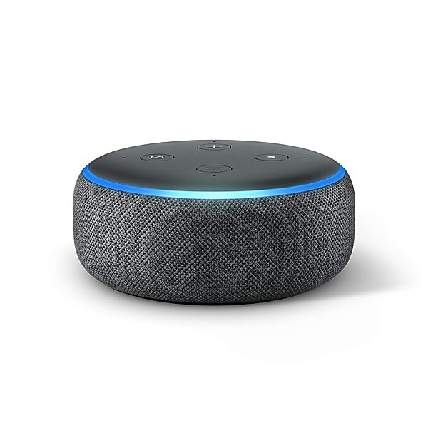

# You Can't Imagine How Much Fun We're Having Disc 1

By **Atmosphere**

## Album Data

- **Catalog:** Beets
- **Format:** Digital, Album
- **Album:** You Can't Imagine How Much Fun We're Having Disc 1
- **Artist:** Atmosphere
- **Albumartist:** Atmosphere
- **Genre:** Hip Hop
- **MusicBrainz Album Artist ID:** 
- **MusicBrainz Album ID:** 
- **MusicBrainz Release Group ID:** 
- **Year:** 2005
- **Catalog #:** 
- **Label:** 
- **Total Tracks:** 00

## Album Tracks

### Track 01 - The Arrival (The Baby Farmer)

- **Artist:** Atmosphere
- **Format:** AAC
- **Genre:** Hip Hop
- **Length:** 4:27
- **MusicBrainz Track ID:** 
- **Title:** The Arrival (The Baby Farmer)
- **Track:** 01
- **Year:** 2005

### Track 02 - Panic Attack (The P.A.)

- **Artist:** Atmosphere
- **Format:** AAC
- **Genre:** Hip Hop
- **Length:** 4:37
- **MusicBrainz Track ID:** 
- **Title:** Panic Attack (The P.A.)
- **Track:** 02
- **Year:** 2005

### Track 04 - Musical Chairs (Stop the Fucking Music)

- **Artist:** Atmosphere
- **Format:** AAC
- **Genre:** Hip Hop
- **Length:** 3:52
- **MusicBrainz Track ID:** 
- **Title:** Musical Chairs (Stop the Fucking Music)
- **Track:** 04
- **Year:** 2005

### Track 05 - Say Hey There (Gotta Go to Mexico)

- **Artist:** Atmosphere
- **Format:** AAC
- **Genre:** Hip Hop
- **Length:** 4:29
- **MusicBrainz Track ID:** 
- **Title:** Say Hey There (Gotta Go to Mexico)
- **Track:** 05
- **Year:** 2005

### Track 06 - Hockey Hair (You Can't Imagine How Much Fun We're Having)

- **Artist:** Atmosphere
- **Format:** AAC
- **Genre:** Hip Hop
- **Length:** 2:53
- **MusicBrainz Track ID:** 
- **Title:** Hockey Hair (You Can't Imagine How Much Fun We're Having)
- **Track:** 06
- **Year:** 2005

### Track 08 - Pour Me Another (Another Poor Me)

- **Artist:** Atmosphere
- **Format:** AAC
- **Genre:** Hip Hop
- **Length:** 4:49
- **MusicBrainz Track ID:** 
- **Title:** Pour Me Another (Another Poor Me)
- **Track:** 08
- **Year:** 2005

### Track 09 - Smart Went Crazy (The Beauty Pill)

- **Artist:** Atmosphere
- **Format:** AAC
- **Genre:** Hip Hop
- **Length:** 3:38
- **MusicBrainz Track ID:** 
- **Title:** Smart Went Crazy (The Beauty Pill)
- **Track:** 09
- **Year:** 2005

### Track 10 - Angelface (Multiples 5 vs Travel 4)

- **Artist:** Atmosphere
- **Format:** AAC
- **Genre:** Hip Hop
- **Length:** 4:00
- **MusicBrainz Track ID:** 
- **Title:** Angelface (Multiples 5 vs Travel 4)
- **Track:** 10
- **Year:** 2005

### Track 11 - That Night (Sunshine Blues)

- **Artist:** Atmosphere
- **Format:** AAC
- **Genre:** Hip Hop
- **Length:** 2:41
- **MusicBrainz Track ID:** 
- **Title:** That Night (Sunshine Blues)
- **Track:** 11
- **Year:** 2005

### Track 12 - Get Fly (What If Jesus Forgot to Put You on the Guestlist?)

- **Artist:** Atmosphere
- **Format:** AAC
- **Genre:** Hip Hop
- **Length:** 4:45
- **MusicBrainz Track ID:** 
- **Title:** Get Fly (What If Jesus Forgot to Put You on the Guestlist?)
- **Track:** 12
- **Year:** 2005

### Track 13 - Little Man (I Love You)

- **Artist:** Atmosphere
- **Format:** AAC
- **Genre:** Hip Hop
- **Length:** 4:14
- **MusicBrainz Track ID:** 
- **Title:** Little Man (I Love You)
- **Track:** 13
- **Year:** 2005

## See also

- [God Loves Ugly](God_Loves_Ugly.md)
- [Headshots](Headshots.md)
- [New, Unreleased & B-Sides Vol. 2](New__Unreleased_and_B-Sides_Vol_2.md)
- [Overcast!](Overcast!.md)
- [Sad Clown Bad Dub II](Sad_Clown_Bad_Dub_II.md)
- [Sad Clown Bad Summer Number 9](Sad_Clown_Bad_Summer_Number_9.md)
- [Seven's Travels](Sevens_Travels.md)
- [To All My Friends, Blood Makes the Blade Holy - The Atmosphere EP's](To_All_My_Friends__Blood_Makes_the_Blade_Holy_-_The_Atmosphere_EPs.md)
- [When Life Gives You Lemons, You Paint That Shit Gold](When_Life_Gives_You_Lemons__You_Paint_That_Shit_Gold.md)
- [Roon: Southsiders (Édition Studio Masters)](../../Roon/Atmosphere/Southsiders_Édition_Studio_Masters.md)
- [Roon: When Life Gives You Lemons, You Paint That Shit Gold](../../Roon/Atmosphere/When_Life_Gives_You_Lemons__You_Paint_That_Shit_Gold.md)
