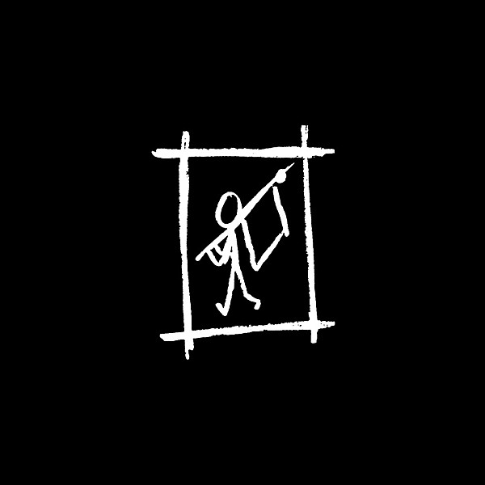

# Dixie

By **Avail**

## Album Data

- **Catalog:** Beets
- **Format:** Digital, Album
- **Album:** Dixie
- **Artist:** Avail
- **Albumartist:** Avail
- **Genre:** Punk Rock
- **MusicBrainz Album Artist ID:** [https](https://musicbrainz.org/artist/https)
- **MusicBrainz Album ID:** [https](https://musicbrainz.org/release/https)
- **MusicBrainz Release Group ID:** 
- **Year:** 2006
- **Catalog #:** JT1109
- **Label:** Jade Tree
- **Total Tracks:** 23

## Album Tracks

### Track 01 - On the Nod

- **Artist:** Avail
- **Format:** AAC
- **Genre:** Hardcore Punk
- **Length:** 2:06
- **MusicBrainz Track ID:** [https](https://musicbrainz.org/recording/https)
- **Title:** On the Nod
- **Track:** 01
- **Year:** 2006

### Track 02 - Clone

- **Artist:** Avail
- **Format:** AAC
- **Genre:** Hardcore Punk
- **Length:** 2:40
- **MusicBrainz Track ID:** [https](https://musicbrainz.org/recording/https)
- **Title:** Clone
- **Track:** 02
- **Year:** 2006

### Track 03 - Tuning

- **Artist:** Avail
- **Format:** AAC
- **Genre:** Hardcore Punk
- **Length:** 2:42
- **MusicBrainz Track ID:** [https](https://musicbrainz.org/recording/https)
- **Title:** Tuning
- **Track:** 03
- **Year:** 2006

### Track 04 - Song

- **Artist:** Avail
- **Format:** AAC
- **Genre:** Hardcore Punk
- **Length:** 2:07
- **MusicBrainz Track ID:** [https](https://musicbrainz.org/recording/https)
- **Title:** Song
- **Track:** 04
- **Year:** 2006

### Track 05 - Sidewalk

- **Artist:** Avail
- **Format:** AAC
- **Genre:** Hardcore Punk
- **Length:** 1:55
- **MusicBrainz Track ID:** [https](https://musicbrainz.org/recording/https)
- **Title:** Sidewalk
- **Track:** 05
- **Year:** 2006

### Track 06 - 25 Years

- **Artist:** Avail
- **Format:** AAC
- **Genre:** Hardcore Punk
- **Length:** 3:47
- **MusicBrainz Track ID:** [https](https://musicbrainz.org/recording/https)
- **Title:** 25 Years
- **Track:** 06
- **Year:** 2006

### Track 07 - Virus

- **Artist:** Avail
- **Format:** AAC
- **Genre:** Hardcore Punk
- **Length:** 2:58
- **MusicBrainz Track ID:** [https](https://musicbrainz.org/recording/https)
- **Title:** Virus
- **Track:** 07
- **Year:** 2006

### Track 08 - Beliefs Pile

- **Artist:** Avail
- **Format:** AAC
- **Genre:** Hardcore Punk
- **Length:** 3:05
- **MusicBrainz Track ID:** [https](https://musicbrainz.org/recording/https)
- **Title:** Beliefs Pile
- **Track:** 08
- **Year:** 2006

### Track 09 - Treading On Heels

- **Artist:** Avail
- **Format:** AAC
- **Genre:** Hardcore Punk
- **Length:** 3:00
- **MusicBrainz Track ID:** [https](https://musicbrainz.org/recording/https)
- **Title:** Treading On Heels
- **Track:** 09
- **Year:** 2006

### Track 10 - Model

- **Artist:** Avail
- **Format:** AAC
- **Genre:** Hardcore Punk
- **Length:** 3:35
- **MusicBrainz Track ID:** [https](https://musicbrainz.org/recording/https)
- **Title:** Model
- **Track:** 10
- **Year:** 2006

### Track 11 - South Bound 95

- **Artist:** Avail
- **Format:** AAC
- **Genre:** Hardcore Punk
- **Length:** 1:42
- **MusicBrainz Track ID:** [https](https://musicbrainz.org/recording/https)
- **Title:** South Bound 95
- **Track:** 11
- **Year:** 2006

### Track 12 - Pink Houses

- **Artist:** Avail
- **Format:** AAC
- **Genre:** Hardcore Punk
- **Length:** 3:20
- **MusicBrainz Track ID:** [https](https://musicbrainz.org/recording/https)
- **Title:** Pink Houses
- **Track:** 12
- **Year:** 2006

### Track 13 - Connection

- **Artist:** Avail
- **Format:** AAC
- **Genre:** Hardcore Punk
- **Length:** 3:35
- **MusicBrainz Track ID:** [https](https://musicbrainz.org/recording/https)
- **Title:** Connection
- **Track:** 13
- **Year:** 2006

### Track 14 - Mr. Morgan

- **Artist:** Avail
- **Format:** AAC
- **Genre:** Hardcore Punk
- **Length:** 3:02
- **MusicBrainz Track ID:** [https](https://musicbrainz.org/recording/https)
- **Title:** Mr. Morgan
- **Track:** 14
- **Year:** 2006

### Track 15 - Sidewalk (Live)

- **Artist:** Avail
- **Format:** AAC
- **Genre:** Hardcore Punk
- **Length:** 2:12
- **MusicBrainz Track ID:** [https](https://musicbrainz.org/recording/https)
- **Title:** Sidewalk (Live)
- **Track:** 15
- **Year:** 2006

### Track 16 - Stride (Live)

- **Artist:** Avail
- **Format:** AAC
- **Genre:** Hardcore Punk
- **Length:** 2:43
- **MusicBrainz Track ID:** [https](https://musicbrainz.org/recording/https)
- **Title:** Stride (Live)
- **Track:** 16
- **Year:** 2006

### Track 17 - Song (Live)

- **Artist:** Avail
- **Format:** AAC
- **Genre:** Hardcore Punk
- **Length:** 2:15
- **MusicBrainz Track ID:** [https](https://musicbrainz.org/recording/https)
- **Title:** Song (Live)
- **Track:** 17
- **Year:** 2006

### Track 18 - Observations (Live)

- **Artist:** Avail
- **Format:** AAC
- **Genre:** Hardcore Punk
- **Length:** 1:02
- **MusicBrainz Track ID:** [https](https://musicbrainz.org/recording/https)
- **Title:** Observations (Live)
- **Track:** 18
- **Year:** 2006

### Track 19 - Predictable (Live)

- **Artist:** Avail
- **Format:** AAC
- **Genre:** Hardcore Punk
- **Length:** 1:17
- **MusicBrainz Track ID:** [https](https://musicbrainz.org/recording/https)
- **Title:** Predictable (Live)
- **Track:** 19
- **Year:** 2006

### Track 20 - Forgotten (Live)

- **Artist:** Avail
- **Format:** AAC
- **Genre:** Hardcore Punk
- **Length:** 2:43
- **MusicBrainz Track ID:** [https](https://musicbrainz.org/recording/https)
- **Title:** Forgotten (Live)
- **Track:** 20
- **Year:** 2006

### Track 21 - Pinned Up (Live)

- **Artist:** Avail
- **Format:** AAC
- **Genre:** Hardcore Punk
- **Length:** 4:25
- **MusicBrainz Track ID:** [https](https://musicbrainz.org/recording/https)
- **Title:** Pinned Up (Live)
- **Track:** 21
- **Year:** 2006

### Track 22 - Kiss Off (Live)

- **Artist:** Avail
- **Format:** AAC
- **Genre:** Hardcore Punk
- **Length:** 2:35
- **MusicBrainz Track ID:** [https](https://musicbrainz.org/recording/https)
- **Title:** Kiss Off (Live)
- **Track:** 22
- **Year:** 2006

### Track 23 - Connection (Live)

- **Artist:** Avail
- **Format:** AAC
- **Genre:** Hardcore Punk
- **Length:** 3:28
- **MusicBrainz Track ID:** [https](https://musicbrainz.org/recording/https)
- **Title:** Connection (Live)
- **Track:** 23
- **Year:** 2006

