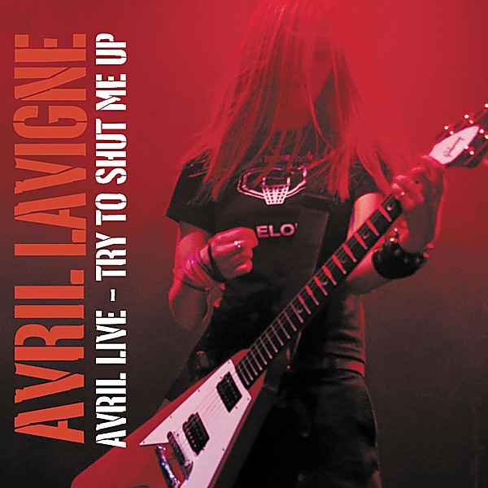

# Live Acoustic

By **Avril Lavigne**

## Album Data

- **Catalog:** Beets
- **Format:** Digital, Album
- **Album:** Live Acoustic
- **Artist:** Avril Lavigne
- **Albumartist:** Avril Lavigne
- **Genre:** Pop Punk
- **MusicBrainz Album Artist ID:** 
- **MusicBrainz Album ID:** 
- **MusicBrainz Release Group ID:** 
- **Year:** 0000
- **Catalog #:** 
- **Label:** 
- **Total Tracks:** 00

## Album Tracks

### Track 01 - He Wasn't

- **Artist:** Avril Lavigne
- **Format:** MP3
- **Genre:** Pop Punk
- **Length:** 3:17
- **MusicBrainz Track ID:** 
- **Title:** He Wasn't
- **Track:** 01
- **Year:** 0000

### Track 02 - My Happy Ending

- **Artist:** Avril Lavigne
- **Format:** MP3
- **Genre:** Pop Punk
- **Length:** 3:57
- **MusicBrainz Track ID:** 
- **Title:** My Happy Ending
- **Track:** 02
- **Year:** 0000

### Track 03 - Sk8er Boi

- **Artist:** Avril Lavigne
- **Format:** MP3
- **Genre:** Pop Punk
- **Length:** 3:38
- **MusicBrainz Track ID:** 
- **Title:** Sk8er Boi
- **Track:** 03
- **Year:** 0000

### Track 04 - Don't Tell Me

- **Artist:** Avril Lavigne
- **Format:** MP3
- **Genre:** Pop Punk
- **Length:** 3:39
- **MusicBrainz Track ID:** 
- **Title:** Don't Tell Me
- **Track:** 04
- **Year:** 0000

### Track 05 - Take Me Away

- **Artist:** Avril Lavigne
- **Format:** MP3
- **Genre:** Pop Punk
- **Length:** 2:54
- **MusicBrainz Track ID:** 
- **Title:** Take Me Away
- **Track:** 05
- **Year:** 0000

### Track 06 - Nobody's Home

- **Artist:** Avril Lavigne
- **Format:** MP3
- **Genre:** Punk Rock
- **Length:** 3:39
- **MusicBrainz Track ID:** 
- **Title:** Nobody's Home
- **Track:** 06
- **Year:** 0000

