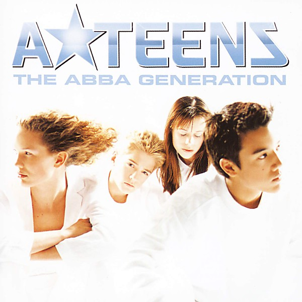

# The ABBA Generation

By **A★Teens**

## Album Data

- **Catalog:** Beets
- **Format:** Digital, Album
- **Album:** The ABBA Generation
- **Artist:** A★teens
- **Albumartist:** A★Teens
- **Genre:** Teen Pop
- **MusicBrainz Album Artist ID:** [69d9cb53-5b8f-41b0-ac84-49eabea535b2](https://musicbrainz.org/artist/69d9cb53-5b8f-41b0-ac84-49eabea535b2)
- **MusicBrainz Album ID:** [124c88a7-cb13-4548-8133-881687eeab86](https://musicbrainz.org/release/124c88a7-cb13-4548-8133-881687eeab86)
- **MusicBrainz Release Group ID:** [4d57a457-3ff6-3839-86f8-5116e2c71a59](https://musicbrainz.org/release-group/4d57a457-3ff6-3839-86f8-5116e2c71a59)
- **Year:** 1999
- **Catalog #:** 547 666-2
- **Label:** Stockholm Records
- **Total Tracks:** 11

## Album Tracks

### Track 01 - Mamma Mia

- **Artist:** A★Teens
- **Format:** ALAC
- **Genre:** Dance-Pop
- **Length:** 3:44
- **MusicBrainz Track ID:** [f57bd596-18b7-40ff-b4c4-501eadfdeb79](https://musicbrainz.org/recording/f57bd596-18b7-40ff-b4c4-501eadfdeb79)
- **Title:** Mamma Mia
- **Track:** 01
- **Year:** 1999

### Track 02 - Gimme! Gimme! Gimme! (A Man After Midnight)

- **Artist:** A★Teens
- **Format:** ALAC
- **Genre:** Dance-Pop
- **Length:** 3:56
- **MusicBrainz Track ID:** [51cd7b98-f532-45bb-b95b-1667dbddcd5a](https://musicbrainz.org/recording/51cd7b98-f532-45bb-b95b-1667dbddcd5a)
- **Title:** Gimme! Gimme! Gimme! (A Man After Midnight)
- **Track:** 02
- **Year:** 1999

### Track 03 - Super Trouper

- **Artist:** A★Teens
- **Format:** ALAC
- **Genre:** Teen Pop
- **Length:** 3:52
- **MusicBrainz Track ID:** [989b5f2b-13cc-41bc-b7a5-3d5b03241e10](https://musicbrainz.org/recording/989b5f2b-13cc-41bc-b7a5-3d5b03241e10)
- **Title:** Super Trouper
- **Track:** 03
- **Year:** 1999

### Track 04 - One of Us

- **Artist:** A★Teens
- **Format:** ALAC
- **Genre:** Europop
- **Length:** 3:55
- **MusicBrainz Track ID:** [7b033c26-9313-4a93-9a47-00d899811b71](https://musicbrainz.org/recording/7b033c26-9313-4a93-9a47-00d899811b71)
- **Title:** One of Us
- **Track:** 04
- **Year:** 1999

### Track 05 - Voulez‐Vous

- **Artist:** A★Teens
- **Format:** ALAC
- **Genre:** Screamo
- **Length:** 3:41
- **MusicBrainz Track ID:** [02ba0d69-e94b-4a1d-b518-01b8db75aefd](https://musicbrainz.org/recording/02ba0d69-e94b-4a1d-b518-01b8db75aefd)
- **Title:** Voulez‐Vous
- **Track:** 05
- **Year:** 1999

### Track 06 - S.O.S.

- **Artist:** A★Teens
- **Format:** ALAC
- **Genre:** Dance-Pop
- **Length:** 3:11
- **MusicBrainz Track ID:** [bf5199e6-f027-4261-a3d3-bb296b3cb99d](https://musicbrainz.org/recording/bf5199e6-f027-4261-a3d3-bb296b3cb99d)
- **Title:** S.O.S.
- **Track:** 06
- **Year:** 1999

### Track 07 - Dancing Queen

- **Artist:** A★Teens
- **Format:** ALAC
- **Genre:** Disco
- **Length:** 3:52
- **MusicBrainz Track ID:** [13006b38-48da-4629-b404-d5d03be220d0](https://musicbrainz.org/recording/13006b38-48da-4629-b404-d5d03be220d0)
- **Title:** Dancing Queen
- **Track:** 07
- **Year:** 1999

### Track 08 - Take a Chance on Me

- **Artist:** A★Teens
- **Format:** ALAC
- **Genre:** Dance-Pop
- **Length:** 3:51
- **MusicBrainz Track ID:** [b0106dc3-be7b-4fab-bfd5-57c7f2f9dd27](https://musicbrainz.org/recording/b0106dc3-be7b-4fab-bfd5-57c7f2f9dd27)
- **Title:** Take a Chance on Me
- **Track:** 08
- **Year:** 1999

### Track 09 - Lay All Your Love on Me

- **Artist:** A★Teens
- **Format:** ALAC
- **Genre:** Dance-Pop
- **Length:** 4:03
- **MusicBrainz Track ID:** [5adf1df3-e46e-4330-abeb-265f5d524f6f](https://musicbrainz.org/recording/5adf1df3-e46e-4330-abeb-265f5d524f6f)
- **Title:** Lay All Your Love on Me
- **Track:** 09
- **Year:** 1999

### Track 10 - The Name of the Game

- **Artist:** A★Teens
- **Format:** ALAC
- **Genre:** Pop
- **Length:** 4:20
- **MusicBrainz Track ID:** [c5d54d97-4263-4c16-8313-64adbe1f1a3a](https://musicbrainz.org/recording/c5d54d97-4263-4c16-8313-64adbe1f1a3a)
- **Title:** The Name of the Game
- **Track:** 10
- **Year:** 1999

### Track 11 - Our Last Summer

- **Artist:** A★Teens
- **Format:** ALAC
- **Genre:** Europop
- **Length:** 4:30
- **MusicBrainz Track ID:** [87aae229-1109-4186-b5e9-92fdc5a1630e](https://musicbrainz.org/recording/87aae229-1109-4186-b5e9-92fdc5a1630e)
- **Title:** Our Last Summer
- **Track:** 11
- **Year:** 1999

