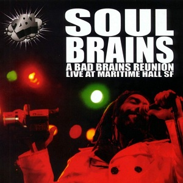

# Bad Brains

By **Bad Brains**

## Album Data

- **Catalog:** Beets
- **Format:** Digital, Album
- **Album:** Bad Brains
- **Artist:** Bad Brains
- **Albumartist:** Bad Brains
- **Genre:** Hardcore Punk
- **MusicBrainz Album Artist ID:** [e919b253-da5b-4aae-a444-6a368376a2d6](https://musicbrainz.org/artist/e919b253-da5b-4aae-a444-6a368376a2d6)
- **MusicBrainz Album ID:** [08d7c8d3-c1d9-42fe-9df0-a0a34f055b02](https://musicbrainz.org/release/08d7c8d3-c1d9-42fe-9df0-a0a34f055b02)
- **MusicBrainz Release Group ID:** [458f4bdf-ffbe-3643-977a-73e80d3d7b08](https://musicbrainz.org/release-group/458f4bdf-ffbe-3643-977a-73e80d3d7b08)
- **Year:** 1996
- **Catalog #:** 
- **Label:** SST Records
- **Total Tracks:** 10

## Album Tracks

### Track 02 - I Against I

- **Artist:** Bad Brains
- **Format:** AAC
- **Genre:** Hardcore Punk
- **Length:** 2:50
- **MusicBrainz Track ID:** [3ef6c150-964b-4838-802d-ac168b5dafe2](https://musicbrainz.org/recording/3ef6c150-964b-4838-802d-ac168b5dafe2)
- **Title:** I Against I
- **Track:** 02
- **Year:** 1986

### Track 05 - Secret 77

- **Artist:** Bad Brains
- **Format:** AAC
- **Genre:** Emo
- **Length:** 4:04
- **MusicBrainz Track ID:** [e599a5ac-ef8f-4b3e-854c-090699a81b44](https://musicbrainz.org/recording/e599a5ac-ef8f-4b3e-854c-090699a81b44)
- **Title:** Secret 77
- **Track:** 05
- **Year:** 1986

### Track 06 - Let Me Help

- **Artist:** Bad Brains
- **Format:** AAC
- **Genre:** Hardcore Punk
- **Length:** 2:17
- **MusicBrainz Track ID:** [9ce04844-f5d8-4862-b360-c8b8c69872f7](https://musicbrainz.org/recording/9ce04844-f5d8-4862-b360-c8b8c69872f7)
- **Title:** Let Me Help
- **Track:** 06
- **Year:** 1986

### Track 07 - She's Calling You

- **Artist:** Bad Brains
- **Format:** AAC
- **Genre:** Hardcore Punk
- **Length:** 3:42
- **MusicBrainz Track ID:** [b6e254ed-5e49-4d71-8a5c-4db698e16ab6](https://musicbrainz.org/recording/b6e254ed-5e49-4d71-8a5c-4db698e16ab6)
- **Title:** She's Calling You
- **Track:** 07
- **Year:** 1986

### Track 08 - Sacred Love

- **Artist:** Bad Brains
- **Format:** AAC
- **Genre:** Hardcore Punk
- **Length:** 3:40
- **MusicBrainz Track ID:** [a5ec58d8-e05e-4d8b-a691-11ffa9e9d1bb](https://musicbrainz.org/recording/a5ec58d8-e05e-4d8b-a691-11ffa9e9d1bb)
- **Title:** Sacred Love
- **Track:** 08
- **Year:** 1986

### Track 09 - Hired Gun

- **Artist:** Bad Brains
- **Format:** AAC
- **Genre:** Hardcore Punk
- **Length:** 3:45
- **MusicBrainz Track ID:** [032eab0a-a23f-463b-94e8-71fdace6e828](https://musicbrainz.org/recording/032eab0a-a23f-463b-94e8-71fdace6e828)
- **Title:** Hired Gun
- **Track:** 09
- **Year:** 1986

### Track 10 - Return to Heaven

- **Artist:** Bad Brains
- **Format:** AAC
- **Genre:** Hardcore Punk
- **Length:** 3:19
- **MusicBrainz Track ID:** [b9b49233-60ac-4ee7-96a9-99f8337c497f](https://musicbrainz.org/recording/b9b49233-60ac-4ee7-96a9-99f8337c497f)
- **Title:** Return to Heaven
- **Track:** 10
- **Year:** 1986

## See also

- [I Against I](I_Against_I.md)
- [Rock for Light](Rock_for_Light.md)
