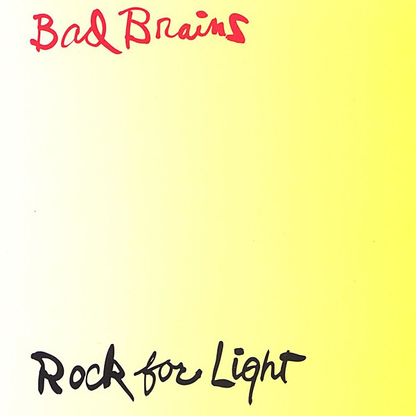

# Rock for Light

By **Bad Brains**

## Album Data

- **Catalog:** Beets
- **Format:** Digital, Album
- **Album:** Rock for Light
- **Artist:** Bad Brains
- **Albumartist:** Bad Brains
- **Genre:** Hardcore Punk
- **MusicBrainz Album Artist ID:** [e919b253-da5b-4aae-a444-6a368376a2d6](https://musicbrainz.org/artist/e919b253-da5b-4aae-a444-6a368376a2d6)
- **MusicBrainz Album ID:** [f9d7b29b-d842-4702-96d2-e0b64e1198f4](https://musicbrainz.org/release/f9d7b29b-d842-4702-96d2-e0b64e1198f4)
- **MusicBrainz Release Group ID:** [876288a6-9b52-342b-a998-4d7dc01bc8bf](https://musicbrainz.org/release-group/876288a6-9b52-342b-a998-4d7dc01bc8bf)
- **Year:** 1991
- **Catalog #:** CAROL 1613-2
- **Label:** Caroline Records
- **Total Tracks:** 20

## Album Tracks

### Track 01 - Big Takeover

- **Artist:** Bad Brains
- **Format:** AAC
- **Genre:** Hardcore Punk
- **Length:** 2:29
- **MusicBrainz Track ID:** [c518c4e0-b2b0-4590-9866-3c2fc77d1dac](https://musicbrainz.org/recording/c518c4e0-b2b0-4590-9866-3c2fc77d1dac)
- **Title:** Big Takeover
- **Track:** 01
- **Year:** 1991

### Track 02 - Attitude

- **Artist:** Bad Brains
- **Format:** AAC
- **Genre:** Hardcore Punk
- **Length:** 1:09
- **MusicBrainz Track ID:** [93548529-cca6-4db7-b17d-bc7ac4274e9e](https://musicbrainz.org/recording/93548529-cca6-4db7-b17d-bc7ac4274e9e)
- **Title:** Attitude
- **Track:** 02
- **Year:** 1991

### Track 03 - Right Brigade

- **Artist:** Bad Brains
- **Format:** AAC
- **Genre:** Hardcore Punk
- **Length:** 2:07
- **MusicBrainz Track ID:** [96f56f0f-9510-4df5-88e3-7161fd4fa66a](https://musicbrainz.org/recording/96f56f0f-9510-4df5-88e3-7161fd4fa66a)
- **Title:** Right Brigade
- **Track:** 03
- **Year:** 1991

### Track 04 - Joshua’s Song

- **Artist:** Bad Brains
- **Format:** AAC
- **Genre:** Hardcore Punk
- **Length:** 0:32
- **MusicBrainz Track ID:** [00baced0-8a4e-4740-a995-c6252ae28a83](https://musicbrainz.org/recording/00baced0-8a4e-4740-a995-c6252ae28a83)
- **Title:** Joshua’s Song
- **Track:** 04
- **Year:** 1991

### Track 05 - I and I Survive

- **Artist:** Bad Brains
- **Format:** AAC
- **Genre:** Dub
- **Length:** 5:13
- **MusicBrainz Track ID:** [25a3ea46-eae5-4ec4-ad23-643fdfa580c3](https://musicbrainz.org/recording/25a3ea46-eae5-4ec4-ad23-643fdfa580c3)
- **Title:** I and I Survive
- **Track:** 05
- **Year:** 1991

### Track 06 - Banned in D.C.

- **Artist:** Bad Brains
- **Format:** AAC
- **Genre:** Hardcore Punk
- **Length:** 1:57
- **MusicBrainz Track ID:** [4f4fdf4c-d2b6-4028-b09e-3a8222b852fc](https://musicbrainz.org/recording/4f4fdf4c-d2b6-4028-b09e-3a8222b852fc)
- **Title:** Banned in D.C.
- **Track:** 06
- **Year:** 1991

### Track 07 - Supertouch

- **Artist:** Bad Brains
- **Format:** AAC
- **Genre:** Hardcore Punk
- **Length:** 2:20
- **MusicBrainz Track ID:** [cad218c2-dafd-4164-97b5-7216ed3264cc](https://musicbrainz.org/recording/cad218c2-dafd-4164-97b5-7216ed3264cc)
- **Title:** Supertouch
- **Track:** 07
- **Year:** 1991

### Track 08 - Destroy Babylon

- **Artist:** Bad Brains
- **Format:** AAC
- **Genre:** Hardcore Punk
- **Length:** 1:19
- **MusicBrainz Track ID:** [a453daf0-df07-4910-a110-09f4b40b88ad](https://musicbrainz.org/recording/a453daf0-df07-4910-a110-09f4b40b88ad)
- **Title:** Destroy Babylon
- **Track:** 08
- **Year:** 1991

### Track 09 - F.V.K.

- **Artist:** Bad Brains
- **Format:** AAC
- **Genre:** Hardcore Punk
- **Length:** 0:58
- **MusicBrainz Track ID:** [2267d457-3715-4702-9a02-238595dc9b95](https://musicbrainz.org/recording/2267d457-3715-4702-9a02-238595dc9b95)
- **Title:** F.V.K.
- **Track:** 09
- **Year:** 1991

### Track 10 - The Meek

- **Artist:** Bad Brains
- **Format:** AAC
- **Genre:** Dub
- **Length:** 3:36
- **MusicBrainz Track ID:** [fb0748d7-bde0-43e8-b73c-137a1424c694](https://musicbrainz.org/recording/fb0748d7-bde0-43e8-b73c-137a1424c694)
- **Title:** The Meek
- **Track:** 10
- **Year:** 1991

### Track 11 - I

- **Artist:** Bad Brains
- **Format:** AAC
- **Genre:** Hardcore Punk
- **Length:** 1:55
- **MusicBrainz Track ID:** [664d4fc2-06ba-4e6c-a90f-ecac1aa74855](https://musicbrainz.org/recording/664d4fc2-06ba-4e6c-a90f-ecac1aa74855)
- **Title:** I
- **Track:** 11
- **Year:** 1991

### Track 12 - Coptic Times

- **Artist:** Bad Brains
- **Format:** AAC
- **Genre:** Hardcore Punk
- **Length:** 2:06
- **MusicBrainz Track ID:** [aac5aaf6-bb38-4caf-8b31-2ae284a13d4a](https://musicbrainz.org/recording/aac5aaf6-bb38-4caf-8b31-2ae284a13d4a)
- **Title:** Coptic Times
- **Track:** 12
- **Year:** 1991

### Track 13 - Sailin’ On

- **Artist:** Bad Brains
- **Format:** AAC
- **Genre:** Hardcore Punk
- **Length:** 1:45
- **MusicBrainz Track ID:** [05d395fe-ea1b-4356-a5eb-b0b9cfe87f47](https://musicbrainz.org/recording/05d395fe-ea1b-4356-a5eb-b0b9cfe87f47)
- **Title:** Sailin’ On
- **Track:** 13
- **Year:** 1991

### Track 14 - Rock for Light

- **Artist:** Bad Brains
- **Format:** AAC
- **Genre:** Hardcore Punk
- **Length:** 1:36
- **MusicBrainz Track ID:** [bf775d39-b1c2-4474-8037-5b662f05b88d](https://musicbrainz.org/recording/bf775d39-b1c2-4474-8037-5b662f05b88d)
- **Title:** Rock for Light
- **Track:** 14
- **Year:** 1991

### Track 15 - Rally Round Jah Throne

- **Artist:** Bad Brains
- **Format:** AAC
- **Genre:** Ragga
- **Length:** 3:58
- **MusicBrainz Track ID:** [c12e7ec3-dbd3-4fa6-80fc-4e3890cb8e00](https://musicbrainz.org/recording/c12e7ec3-dbd3-4fa6-80fc-4e3890cb8e00)
- **Title:** Rally Round Jah Throne
- **Track:** 15
- **Year:** 1991

### Track 16 - At the Movies

- **Artist:** Bad Brains
- **Format:** AAC
- **Genre:** Hardcore Punk
- **Length:** 2:16
- **MusicBrainz Track ID:** [7f167bbe-d301-4d7d-9f86-f67372ea26cf](https://musicbrainz.org/recording/7f167bbe-d301-4d7d-9f86-f67372ea26cf)
- **Title:** At the Movies
- **Track:** 16
- **Year:** 1991

### Track 17 - Riot Squad

- **Artist:** Bad Brains
- **Format:** AAC
- **Genre:** Hardcore Punk
- **Length:** 1:59
- **MusicBrainz Track ID:** [6580e06c-6fd1-47b6-8acd-d18e602a4815](https://musicbrainz.org/recording/6580e06c-6fd1-47b6-8acd-d18e602a4815)
- **Title:** Riot Squad
- **Track:** 17
- **Year:** 1991

### Track 18 - How Low Can a Punk Get

- **Artist:** Bad Brains
- **Format:** AAC
- **Genre:** Hardcore Punk
- **Length:** 1:49
- **MusicBrainz Track ID:** [7927979e-c632-4514-b27d-a9433a41ba2c](https://musicbrainz.org/recording/7927979e-c632-4514-b27d-a9433a41ba2c)
- **Title:** How Low Can a Punk Get
- **Track:** 18
- **Year:** 1991

### Track 19 - We Will Not

- **Artist:** Bad Brains
- **Format:** AAC
- **Genre:** Hardcore Punk
- **Length:** 1:34
- **MusicBrainz Track ID:** [853e32d1-ff2b-4dda-860d-1b49f29d1c11](https://musicbrainz.org/recording/853e32d1-ff2b-4dda-860d-1b49f29d1c11)
- **Title:** We Will Not
- **Track:** 19
- **Year:** 1991

### Track 20 - Jam

- **Artist:** Bad Brains
- **Format:** AAC
- **Genre:** Dub
- **Length:** 1:15
- **MusicBrainz Track ID:** [0e303857-952f-4d91-ae3e-d790bb5ebe2c](https://musicbrainz.org/recording/0e303857-952f-4d91-ae3e-d790bb5ebe2c)
- **Title:** Jam
- **Track:** 20
- **Year:** 1991

## See also

- [Bad Brains](Bad_Brains.md)
- [I Against I](I_Against_I.md)
