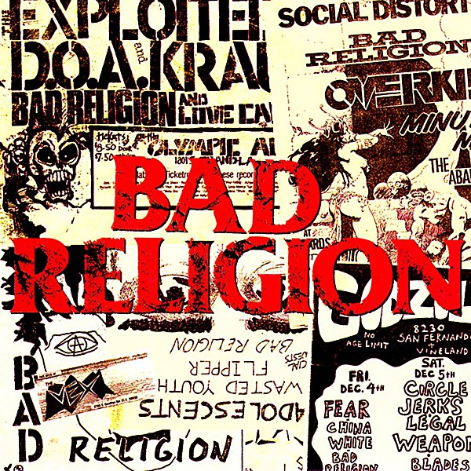

# All Ages

By **Bad Religion**

## Album Data

- **Catalog:** Beets
- **Format:** Digital, Album
- **Album:** All Ages
- **Artist:** Bad Religion
- **Albumartist:** Bad Religion
- **Genre:** Punk Rock
- **MusicBrainz Album Artist ID:** [149e6720-4e4a-41a4-afca-6d29083fc091](https://musicbrainz.org/artist/149e6720-4e4a-41a4-afca-6d29083fc091)
- **MusicBrainz Album ID:** [93632036-33c2-4b65-9bbf-f095d5620465](https://musicbrainz.org/release/93632036-33c2-4b65-9bbf-f095d5620465)
- **MusicBrainz Release Group ID:** [db9652b8-7b27-3ed8-8e08-27606db1b041](https://musicbrainz.org/release-group/db9652b8-7b27-3ed8-8e08-27606db1b041)
- **Year:** 1995
- **Catalog #:** 87276-2
- **Label:** Epitaph
- **Total Tracks:** 09

## Album Tracks

### Track 01 - Hark! The Herald Angels Sing

- **Artist:** Bad Religion
- **Format:** AAC
- **Genre:** Punk Rock
- **Length:** 1:59
- **MusicBrainz Track ID:** [0f4ebd32-39d2-425c-b5bf-ddbe33e1b13a](https://musicbrainz.org/recording/0f4ebd32-39d2-425c-b5bf-ddbe33e1b13a)
- **Title:** Hark! The Herald Angels Sing
- **Track:** 01
- **Year:** 2013

### Track 02 - O Come All Ye Faithful

- **Artist:** Bad Religion
- **Format:** AAC
- **Genre:** Post-Punk
- **Length:** 2:05
- **MusicBrainz Track ID:** [7681214b-8cdc-4f3a-966e-d258d89d765e](https://musicbrainz.org/recording/7681214b-8cdc-4f3a-966e-d258d89d765e)
- **Title:** O Come All Ye Faithful
- **Track:** 02
- **Year:** 2013

### Track 03 - O Come, O Come Emmanuel

- **Artist:** Bad Religion
- **Format:** AAC
- **Genre:** Punk Rock
- **Length:** 2:07
- **MusicBrainz Track ID:** [e4e6b06d-c1b8-4e06-a231-2b06356ea0a5](https://musicbrainz.org/recording/e4e6b06d-c1b8-4e06-a231-2b06356ea0a5)
- **Title:** O Come, O Come Emmanuel
- **Track:** 03
- **Year:** 2013

### Track 04 - White Christmas

- **Artist:** Bad Religion
- **Format:** AAC
- **Genre:** Punk Rock
- **Length:** 1:49
- **MusicBrainz Track ID:** [db2f2456-cb1c-4024-84d9-c7a16bf0251d](https://musicbrainz.org/recording/db2f2456-cb1c-4024-84d9-c7a16bf0251d)
- **Title:** White Christmas
- **Track:** 04
- **Year:** 2013

### Track 05 - Little Drummer Boy

- **Artist:** Bad Religion
- **Format:** AAC
- **Genre:** Punk Rock
- **Length:** 2:04
- **MusicBrainz Track ID:** [dcb6dd7d-c5e2-41cf-9a02-76769ddbcf55](https://musicbrainz.org/recording/dcb6dd7d-c5e2-41cf-9a02-76769ddbcf55)
- **Title:** Little Drummer Boy
- **Track:** 05
- **Year:** 2013

### Track 06 - God Rest Ye Merry Gentlemen

- **Artist:** Bad Religion
- **Format:** AAC
- **Genre:** Punk Rock
- **Length:** 1:39
- **MusicBrainz Track ID:** [bd102901-ab01-4d1a-9958-2db2dce59a2b](https://musicbrainz.org/recording/bd102901-ab01-4d1a-9958-2db2dce59a2b)
- **Title:** God Rest Ye Merry Gentlemen
- **Track:** 06
- **Year:** 2013

### Track 07 - What Child Is This?

- **Artist:** Bad Religion
- **Format:** AAC
- **Genre:** Punk Rock
- **Length:** 1:53
- **MusicBrainz Track ID:** [d0714b61-4e1e-4be6-ba0e-20d3ea13f968](https://musicbrainz.org/recording/d0714b61-4e1e-4be6-ba0e-20d3ea13f968)
- **Title:** What Child Is This?
- **Track:** 07
- **Year:** 2013

### Track 08 - Angels We Have Heard on High

- **Artist:** Bad Religion
- **Format:** AAC
- **Genre:** Punk Rock
- **Length:** 2:07
- **MusicBrainz Track ID:** [e0b0ac20-8bf2-4370-8d7b-01f058c75b14](https://musicbrainz.org/recording/e0b0ac20-8bf2-4370-8d7b-01f058c75b14)
- **Title:** Angels We Have Heard on High
- **Track:** 08
- **Year:** 2013

### Track 09 - American Jesus (Andy Wallace mix)

- **Artist:** Bad Religion
- **Format:** AAC
- **Genre:** Punk Rock
- **Length:** 3:16
- **MusicBrainz Track ID:** [9c7de497-d4ef-499e-a426-05f132d2750b](https://musicbrainz.org/recording/9c7de497-d4ef-499e-a426-05f132d2750b)
- **Title:** American Jesus (Andy Wallace mix)
- **Track:** 09
- **Year:** 2013

## See also

- [Against the Grain](Against_the_Grain.md)
- [Christmas Songs](Christmas_Songs.md)
- [Generator](Generator.md)
- [New Maps of Hell](New_Maps_of_Hell.md)
- [No Control](No_Control.md)
- [No Substance](No_Substance.md)
- [Recipe for Hate](Recipe_for_Hate.md)
- [Stranger Than Fiction](Stranger_Than_Fiction.md)
- [Suffer](Suffer.md)
- [The Dissent Of Man](The_Dissent_Of_Man.md)
- [The Empire Strikes First](The_Empire_Strikes_First.md)
- [The Gray Race](The_Gray_Race.md)
- [The New America](The_New_America.md)
- [The Process of Belief](The_Process_of_Belief.md)
- [True North](True_North.md)
- [CD: Against The Grain](../../CD/Bad_Religion/Against_The_Grain.md)
- [CD: ](../../CD/Bad_Religion/Bad_Religion.md)
- [CD: The Dissent Of Man](../../CD/Bad_Religion/The_Dissent_Of_Man.md)
- [CD: The Process of Belief](../../CD/Bad_Religion/The_Process_of_Belief.md)
- [Roon: Against The Grain (2005 Remaster)](../../Roon/Bad_Religion/Against_The_Grain_2005_Remaster.md)
- [Roon: Recipe For Hate](../../Roon/Bad_Religion/Recipe_For_Hate.md)
- [Roon: Stranger Than Fiction (Deluxe Edition Remastered)](../../Roon/Bad_Religion/Stranger_Than_Fiction_Deluxe_Edition_Remastered.md)
- [Roon: The Dissent Of Man (Bonus Track Version)](../../Roon/Bad_Religion/The_Dissent_Of_Man_Bonus_Track_Version.md)
- [Roon: The Empire Strikes First](../../Roon/Bad_Religion/The_Empire_Strikes_First.md)
- [Roon: The New America](../../Roon/Bad_Religion/The_New_America.md)
- [Roon: The Process Of Belief](../../Roon/Bad_Religion/The_Process_Of_Belief.md)
