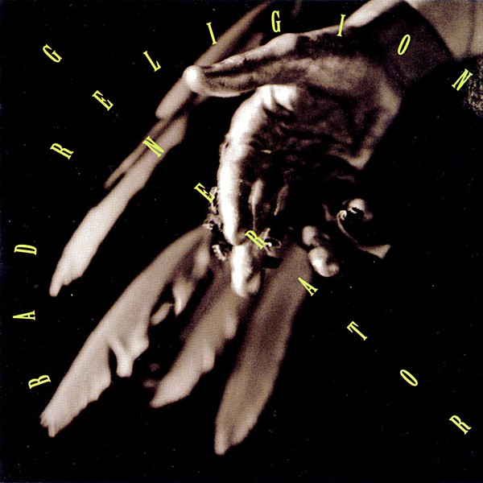

# Generator

By **Bad Religion**

## Album Data

- **Catalog:** Beets
- **Format:** Digital, Album
- **Album:** Generator
- **Artist:** Bad Religion
- **Albumartist:** Bad Religion
- **Genre:** Hardcore Punk
- **MusicBrainz Album Artist ID:** [149e6720-4e4a-41a4-afca-6d29083fc091](https://musicbrainz.org/artist/149e6720-4e4a-41a4-afca-6d29083fc091)
- **MusicBrainz Album ID:** [606a385a-b6f1-465d-b502-bab7fdac8746](https://musicbrainz.org/release/606a385a-b6f1-465d-b502-bab7fdac8746)
- **MusicBrainz Release Group ID:** [d7d4ff5d-9d0f-3436-b9f2-126864c07833](https://musicbrainz.org/release-group/d7d4ff5d-9d0f-3436-b9f2-126864c07833)
- **Year:** 1992
- **Catalog #:** 86863-2
- **Label:** Epitaph
- **Total Tracks:** 16

## Album Tracks

### Track 01 - 52 Seconds

- **Artist:** Bad Religion
- **Format:** ALAC
- **Genre:** Hardcore Punk
- **Length:** 0:58
- **MusicBrainz Track ID:** [d2b6893d-933f-471d-ac10-36e8495a10fa](https://musicbrainz.org/recording/d2b6893d-933f-471d-ac10-36e8495a10fa)
- **Title:** 52 Seconds
- **Track:** 01
- **Year:** 2007

### Track 02 - Heroes & Martyrs

- **Artist:** Bad Religion
- **Format:** ALAC
- **Genre:** Punk Rock
- **Length:** 1:25
- **MusicBrainz Track ID:** [0e55a78d-cfe9-4925-9a94-0e599453c268](https://musicbrainz.org/recording/0e55a78d-cfe9-4925-9a94-0e599453c268)
- **Title:** Heroes & Martyrs
- **Track:** 02
- **Year:** 2007

### Track 03 - Germs of Perfection

- **Artist:** Bad Religion
- **Format:** ALAC
- **Genre:** Hardcore Punk
- **Length:** 1:27
- **MusicBrainz Track ID:** [4729067f-7d8b-4c9c-8beb-058e294c3e73](https://musicbrainz.org/recording/4729067f-7d8b-4c9c-8beb-058e294c3e73)
- **Title:** Germs of Perfection
- **Track:** 03
- **Year:** 2007

### Track 04 - New Dark Ages

- **Artist:** Bad Religion
- **Format:** ALAC
- **Genre:** Punk Rock
- **Length:** 2:47
- **MusicBrainz Track ID:** [0943d288-0357-4b12-83bf-00788fc9c383](https://musicbrainz.org/recording/0943d288-0357-4b12-83bf-00788fc9c383)
- **Title:** New Dark Ages
- **Track:** 04
- **Year:** 2007

### Track 05 - Requiem for Dissent

- **Artist:** Bad Religion
- **Format:** ALAC
- **Genre:** Punk Rock
- **Length:** 2:08
- **MusicBrainz Track ID:** [f69f1713-6145-4833-ae54-f86a1f0bdd51](https://musicbrainz.org/recording/f69f1713-6145-4833-ae54-f86a1f0bdd51)
- **Title:** Requiem for Dissent
- **Track:** 05
- **Year:** 2007

### Track 06 - Before You Die

- **Artist:** Bad Religion
- **Format:** ALAC
- **Genre:** Punk Rock
- **Length:** 2:34
- **MusicBrainz Track ID:** [66d0d570-1f79-4526-82b2-038abfd31dc8](https://musicbrainz.org/recording/66d0d570-1f79-4526-82b2-038abfd31dc8)
- **Title:** Before You Die
- **Track:** 06
- **Year:** 2007

### Track 07 - Honest Goodbye

- **Artist:** Bad Religion
- **Format:** ALAC
- **Genre:** Punk Rock
- **Length:** 2:51
- **MusicBrainz Track ID:** [18e1eba7-6818-4a10-8fa2-1036873a1f70](https://musicbrainz.org/recording/18e1eba7-6818-4a10-8fa2-1036873a1f70)
- **Title:** Honest Goodbye
- **Track:** 07
- **Year:** 2007

### Track 08 - Dearly Beloved

- **Artist:** Bad Religion
- **Format:** ALAC
- **Genre:** Punk Rock
- **Length:** 2:19
- **MusicBrainz Track ID:** [ad053cad-c321-4f6b-8d33-981ba0694d86](https://musicbrainz.org/recording/ad053cad-c321-4f6b-8d33-981ba0694d86)
- **Title:** Dearly Beloved
- **Track:** 08
- **Year:** 2007

### Track 09 - Grains of Wrath

- **Artist:** Bad Religion
- **Format:** ALAC
- **Genre:** Punk Rock
- **Length:** 3:00
- **MusicBrainz Track ID:** [ad8b0e14-4c9f-427c-918e-33f0a37fa9d1](https://musicbrainz.org/recording/ad8b0e14-4c9f-427c-918e-33f0a37fa9d1)
- **Title:** Grains of Wrath
- **Track:** 09
- **Year:** 2007

### Track 10 - Murder

- **Artist:** Bad Religion
- **Format:** ALAC
- **Genre:** Hardcore Punk
- **Length:** 1:18
- **MusicBrainz Track ID:** [258a368c-c969-47b0-9fd1-eaa349e34253](https://musicbrainz.org/recording/258a368c-c969-47b0-9fd1-eaa349e34253)
- **Title:** Murder
- **Track:** 10
- **Year:** 2007

### Track 11 - Scrutiny

- **Artist:** Bad Religion
- **Format:** ALAC
- **Genre:** Punk Rock
- **Length:** 2:36
- **MusicBrainz Track ID:** [fd642053-7665-4bab-8a72-8f5936efca17](https://musicbrainz.org/recording/fd642053-7665-4bab-8a72-8f5936efca17)
- **Title:** Scrutiny
- **Track:** 11
- **Year:** 2007

### Track 12 - Prodigal Son

- **Artist:** Bad Religion
- **Format:** ALAC
- **Genre:** Punk Rock
- **Length:** 3:07
- **MusicBrainz Track ID:** [fce7864d-ed88-4fc2-b83b-359233e57151](https://musicbrainz.org/recording/fce7864d-ed88-4fc2-b83b-359233e57151)
- **Title:** Prodigal Son
- **Track:** 12
- **Year:** 2007

### Track 13 - The Grand Delusion

- **Artist:** Bad Religion
- **Format:** ALAC
- **Genre:** Punk Rock
- **Length:** 2:10
- **MusicBrainz Track ID:** [6a64ff5e-acc7-4310-b272-71e01886efed](https://musicbrainz.org/recording/6a64ff5e-acc7-4310-b272-71e01886efed)
- **Title:** The Grand Delusion
- **Track:** 13
- **Year:** 2007

### Track 14 - Lost Pilgrim

- **Artist:** Bad Religion
- **Format:** ALAC
- **Genre:** Pop Punk
- **Length:** 2:28
- **MusicBrainz Track ID:** [e6640dbe-b81d-4fd7-95cc-28c15f46226e](https://musicbrainz.org/recording/e6640dbe-b81d-4fd7-95cc-28c15f46226e)
- **Title:** Lost Pilgrim
- **Track:** 14
- **Year:** 2007

### Track 15 - Submission Complete

- **Artist:** Bad Religion
- **Format:** ALAC
- **Genre:** Pop Punk
- **Length:** 3:40
- **MusicBrainz Track ID:** [3e190ee9-451f-403e-b879-0922475a9a97](https://musicbrainz.org/recording/3e190ee9-451f-403e-b879-0922475a9a97)
- **Title:** Submission Complete
- **Track:** 15
- **Year:** 2007

### Track 16 - Fields of Mars

- **Artist:** Bad Religion
- **Format:** ALAC
- **Genre:** Punk Rock
- **Length:** 3:39
- **MusicBrainz Track ID:** [c5e7c637-1faa-4eb3-ae7d-f8f6013ca022](https://musicbrainz.org/recording/c5e7c637-1faa-4eb3-ae7d-f8f6013ca022)
- **Title:** Fields of Mars
- **Track:** 16
- **Year:** 2007

## See also

- [Against the Grain](Against_the_Grain.md)
- [All Ages](All_Ages.md)
- [Christmas Songs](Christmas_Songs.md)
- [New Maps of Hell](New_Maps_of_Hell.md)
- [No Control](No_Control.md)
- [No Substance](No_Substance.md)
- [Recipe for Hate](Recipe_for_Hate.md)
- [Stranger Than Fiction](Stranger_Than_Fiction.md)
- [Suffer](Suffer.md)
- [The Dissent Of Man](The_Dissent_Of_Man.md)
- [The Empire Strikes First](The_Empire_Strikes_First.md)
- [The Gray Race](The_Gray_Race.md)
- [The New America](The_New_America.md)
- [The Process of Belief](The_Process_of_Belief.md)
- [True North](True_North.md)
- [CD: Against The Grain](../../CD/Bad_Religion/Against_The_Grain.md)
- [CD: ](../../CD/Bad_Religion/Bad_Religion.md)
- [CD: The Dissent Of Man](../../CD/Bad_Religion/The_Dissent_Of_Man.md)
- [CD: The Process of Belief](../../CD/Bad_Religion/The_Process_of_Belief.md)
- [Roon: Against The Grain (2005 Remaster)](../../Roon/Bad_Religion/Against_The_Grain_2005_Remaster.md)
- [Roon: Recipe For Hate](../../Roon/Bad_Religion/Recipe_For_Hate.md)
- [Roon: Stranger Than Fiction (Deluxe Edition Remastered)](../../Roon/Bad_Religion/Stranger_Than_Fiction_Deluxe_Edition_Remastered.md)
- [Roon: The Dissent Of Man (Bonus Track Version)](../../Roon/Bad_Religion/The_Dissent_Of_Man_Bonus_Track_Version.md)
- [Roon: The Empire Strikes First](../../Roon/Bad_Religion/The_Empire_Strikes_First.md)
- [Roon: The New America](../../Roon/Bad_Religion/The_New_America.md)
- [Roon: The Process Of Belief](../../Roon/Bad_Religion/The_Process_Of_Belief.md)
