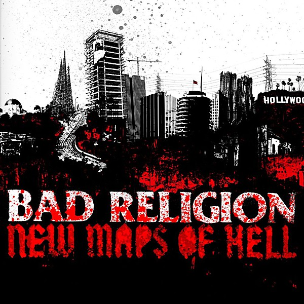

# New Maps of Hell

By **Bad Religion**

## Album Data

- **Catalog:** Beets
- **Format:** Digital, Album
- **Album:** New Maps of Hell
- **Artist:** Bad Religion
- **Albumartist:** Bad Religion
- **Genre:** Hardcore Punk
- **MusicBrainz Album Artist ID:** [149e6720-4e4a-41a4-afca-6d29083fc091](https://musicbrainz.org/artist/149e6720-4e4a-41a4-afca-6d29083fc091)
- **MusicBrainz Album ID:** [c488cab7-01df-48e1-a39b-346db6b2ed21](https://musicbrainz.org/release/c488cab7-01df-48e1-a39b-346db6b2ed21)
- **MusicBrainz Release Group ID:** [0152245f-5bc3-3971-a571-d6e773fb0bf2](https://musicbrainz.org/release-group/0152245f-5bc3-3971-a571-d6e773fb0bf2)
- **Year:** 2007
- **Catalog #:** E-86406-2
- **Label:** Epitaph
- **Total Tracks:** 15

## Album Tracks

### Track 01 - Change of Ideas

- **Artist:** Bad Religion
- **Format:** AAC
- **Genre:** Punk Rock
- **Length:** 0:55
- **MusicBrainz Track ID:** [6a2547ee-fe27-4953-8e32-3a8c135761fb](https://musicbrainz.org/recording/6a2547ee-fe27-4953-8e32-3a8c135761fb)
- **Title:** Change of Ideas
- **Track:** 01
- **Year:** 1989

### Track 02 - Big Bang

- **Artist:** Bad Religion
- **Format:** AAC
- **Genre:** Punk Rock
- **Length:** 1:42
- **MusicBrainz Track ID:** [3a683f05-4c5e-4777-8cd0-3b2b1f22b634](https://musicbrainz.org/recording/3a683f05-4c5e-4777-8cd0-3b2b1f22b634)
- **Title:** Big Bang
- **Track:** 02
- **Year:** 1989

### Track 03 - No Control

- **Artist:** Bad Religion
- **Format:** AAC
- **Genre:** Skate Punk
- **Length:** 1:47
- **MusicBrainz Track ID:** [832ccf1a-e63d-4ee7-9fe4-48e161fea561](https://musicbrainz.org/recording/832ccf1a-e63d-4ee7-9fe4-48e161fea561)
- **Title:** No Control
- **Track:** 03
- **Year:** 1989

### Track 04 - Sometimes I Feel Like

- **Artist:** Bad Religion
- **Format:** AAC
- **Genre:** Punk Rock
- **Length:** 1:34
- **MusicBrainz Track ID:** [11a8b0c7-901e-4164-9bef-e1c4b9922a48](https://musicbrainz.org/recording/11a8b0c7-901e-4164-9bef-e1c4b9922a48)
- **Title:** Sometimes I Feel Like
- **Track:** 04
- **Year:** 1989

### Track 05 - Automatic Man

- **Artist:** Bad Religion
- **Format:** AAC
- **Genre:** Hardcore Punk
- **Length:** 1:40
- **MusicBrainz Track ID:** [e628e06b-987b-4d4d-a9f6-290453613ba7](https://musicbrainz.org/recording/e628e06b-987b-4d4d-a9f6-290453613ba7)
- **Title:** Automatic Man
- **Track:** 05
- **Year:** 1989

### Track 06 - I Want to Conquer the World

- **Artist:** Bad Religion
- **Format:** AAC
- **Genre:** Punk Rock
- **Length:** 2:17
- **MusicBrainz Track ID:** [d6d4cb93-389c-4c01-ab2f-b91218102c6f](https://musicbrainz.org/recording/d6d4cb93-389c-4c01-ab2f-b91218102c6f)
- **Title:** I Want to Conquer the World
- **Track:** 06
- **Year:** 1989

### Track 07 - Sanity

- **Artist:** Bad Religion
- **Format:** AAC
- **Genre:** Punk Rock
- **Length:** 2:44
- **MusicBrainz Track ID:** [23122424-f4da-4cbc-b1a3-f0912b88f82b](https://musicbrainz.org/recording/23122424-f4da-4cbc-b1a3-f0912b88f82b)
- **Title:** Sanity
- **Track:** 07
- **Year:** 1989

### Track 08 - Henchman

- **Artist:** Bad Religion
- **Format:** AAC
- **Genre:** Punk Rock
- **Length:** 1:07
- **MusicBrainz Track ID:** [1466a111-a61c-4050-8be1-13debd3ee2f2](https://musicbrainz.org/recording/1466a111-a61c-4050-8be1-13debd3ee2f2)
- **Title:** Henchman
- **Track:** 08
- **Year:** 1989

### Track 09 - It Must Look Pretty Appealing

- **Artist:** Bad Religion
- **Format:** AAC
- **Genre:** Punk Rock
- **Length:** 1:22
- **MusicBrainz Track ID:** [309ea484-2b8a-4d28-a143-a887114a9798](https://musicbrainz.org/recording/309ea484-2b8a-4d28-a143-a887114a9798)
- **Title:** It Must Look Pretty Appealing
- **Track:** 09
- **Year:** 1989

### Track 10 - You

- **Artist:** Bad Religion
- **Format:** AAC
- **Genre:** Hardcore Punk
- **Length:** 2:04
- **MusicBrainz Track ID:** [76133de0-f371-41d8-a6cc-1b0029aca063](https://musicbrainz.org/recording/76133de0-f371-41d8-a6cc-1b0029aca063)
- **Title:** You
- **Track:** 10
- **Year:** 1989

### Track 11 - Progress

- **Artist:** Bad Religion
- **Format:** AAC
- **Genre:** Punk Rock
- **Length:** 2:14
- **MusicBrainz Track ID:** [06347cac-978a-442c-be12-4c5b2bca418e](https://musicbrainz.org/recording/06347cac-978a-442c-be12-4c5b2bca418e)
- **Title:** Progress
- **Track:** 11
- **Year:** 1989

### Track 12 - I Want Something More

- **Artist:** Bad Religion
- **Format:** AAC
- **Genre:** Hardcore Punk
- **Length:** 0:47
- **MusicBrainz Track ID:** [84a2e9c6-5703-4c87-b529-818ce6505540](https://musicbrainz.org/recording/84a2e9c6-5703-4c87-b529-818ce6505540)
- **Title:** I Want Something More
- **Track:** 12
- **Year:** 1989

### Track 14 - Billy

- **Artist:** Bad Religion
- **Format:** AAC
- **Genre:** Punk Rock
- **Length:** 1:55
- **MusicBrainz Track ID:** [8e644ef8-44ef-475a-8176-4f18806c1901](https://musicbrainz.org/recording/8e644ef8-44ef-475a-8176-4f18806c1901)
- **Title:** Billy
- **Track:** 14
- **Year:** 1989

### Track 15 - The World Won’t Stop

- **Artist:** Bad Religion
- **Format:** AAC
- **Genre:** Skate Punk
- **Length:** 1:57
- **MusicBrainz Track ID:** [d3745780-feb4-4cac-a5ab-4c876a4dd0df](https://musicbrainz.org/recording/d3745780-feb4-4cac-a5ab-4c876a4dd0df)
- **Title:** The World Won’t Stop
- **Track:** 15
- **Year:** 1989

## See also

- [Against the Grain](Against_the_Grain.md)
- [All Ages](All_Ages.md)
- [Christmas Songs](Christmas_Songs.md)
- [Generator](Generator.md)
- [No Control](No_Control.md)
- [No Substance](No_Substance.md)
- [Recipe for Hate](Recipe_for_Hate.md)
- [Stranger Than Fiction](Stranger_Than_Fiction.md)
- [Suffer](Suffer.md)
- [The Dissent Of Man](The_Dissent_Of_Man.md)
- [The Empire Strikes First](The_Empire_Strikes_First.md)
- [The Gray Race](The_Gray_Race.md)
- [The New America](The_New_America.md)
- [The Process of Belief](The_Process_of_Belief.md)
- [True North](True_North.md)
- [CD: Against The Grain](../../CD/Bad_Religion/Against_The_Grain.md)
- [CD: ](../../CD/Bad_Religion/Bad_Religion.md)
- [CD: The Dissent Of Man](../../CD/Bad_Religion/The_Dissent_Of_Man.md)
- [CD: The Process of Belief](../../CD/Bad_Religion/The_Process_of_Belief.md)
- [Roon: Against The Grain (2005 Remaster)](../../Roon/Bad_Religion/Against_The_Grain_2005_Remaster.md)
- [Roon: Recipe For Hate](../../Roon/Bad_Religion/Recipe_For_Hate.md)
- [Roon: Stranger Than Fiction (Deluxe Edition Remastered)](../../Roon/Bad_Religion/Stranger_Than_Fiction_Deluxe_Edition_Remastered.md)
- [Roon: The Dissent Of Man (Bonus Track Version)](../../Roon/Bad_Religion/The_Dissent_Of_Man_Bonus_Track_Version.md)
- [Roon: The Empire Strikes First](../../Roon/Bad_Religion/The_Empire_Strikes_First.md)
- [Roon: The New America](../../Roon/Bad_Religion/The_New_America.md)
- [Roon: The Process Of Belief](../../Roon/Bad_Religion/The_Process_Of_Belief.md)
