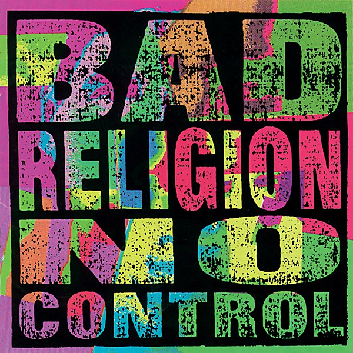

# No Control

By **Bad Religion**

## Album Data

- **Catalog:** Beets
- **Format:** Digital, Album
- **Album:** No Control
- **Artist:** Bad Religion
- **Albumartist:** Bad Religion
- **Genre:** Skate Punk
- **MusicBrainz Album Artist ID:** [149e6720-4e4a-41a4-afca-6d29083fc091](https://musicbrainz.org/artist/149e6720-4e4a-41a4-afca-6d29083fc091)
- **MusicBrainz Album ID:** [24892dc5-ca94-35a9-8fd9-8485dd35f229](https://musicbrainz.org/release/24892dc5-ca94-35a9-8fd9-8485dd35f229)
- **MusicBrainz Release Group ID:** [17576d27-a0ea-3f37-8ef8-9a88f66c1e10](https://musicbrainz.org/release-group/17576d27-a0ea-3f37-8ef8-9a88f66c1e10)
- **Year:** 1989
- **Catalog #:** 83094-2
- **Label:** Atlantic
- **Total Tracks:** 16

## Album Tracks

### Track 01 - Hear It

- **Artist:** Bad Religion
- **Format:** ALAC
- **Genre:** Punk Rock
- **Length:** 1:49
- **MusicBrainz Track ID:** [787191cc-6003-46a6-8483-f4d42e5dba8f](https://musicbrainz.org/recording/787191cc-6003-46a6-8483-f4d42e5dba8f)
- **Title:** Hear It
- **Track:** 01
- **Year:** 1998

### Track 02 - Shades of Truth

- **Artist:** Bad Religion
- **Format:** ALAC
- **Genre:** Punk Rock
- **Length:** 4:01
- **MusicBrainz Track ID:** [fe4741e9-2898-4567-a799-4a2bf99c0883](https://musicbrainz.org/recording/fe4741e9-2898-4567-a799-4a2bf99c0883)
- **Title:** Shades of Truth
- **Track:** 02
- **Year:** 1998

### Track 03 - All Fantastic Images

- **Artist:** Bad Religion
- **Format:** ALAC
- **Genre:** Punk Rock
- **Length:** 2:08
- **MusicBrainz Track ID:** [dd018e56-ccb3-40ad-92c3-b5621d04b888](https://musicbrainz.org/recording/dd018e56-ccb3-40ad-92c3-b5621d04b888)
- **Title:** All Fantastic Images
- **Track:** 03
- **Year:** 1998

### Track 04 - The Biggest Killer in American History

- **Artist:** Bad Religion
- **Format:** ALAC
- **Genre:** Punk Rock
- **Length:** 2:14
- **MusicBrainz Track ID:** [56fd9f43-0dc5-4165-904d-01a471d0a1b0](https://musicbrainz.org/recording/56fd9f43-0dc5-4165-904d-01a471d0a1b0)
- **Title:** The Biggest Killer in American History
- **Track:** 04
- **Year:** 1998

### Track 05 - No Substance

- **Artist:** Bad Religion
- **Format:** ALAC
- **Genre:** Punk Rock
- **Length:** 3:04
- **MusicBrainz Track ID:** [83e8aa75-c1b2-41d0-a56f-c090479f4da3](https://musicbrainz.org/recording/83e8aa75-c1b2-41d0-a56f-c090479f4da3)
- **Title:** No Substance
- **Track:** 05
- **Year:** 1998

### Track 06 - Raise Your Voice!

- **Artist:** Bad Religion
- **Format:** ALAC
- **Genre:** Punk Rock
- **Length:** 2:55
- **MusicBrainz Track ID:** [4f1a0922-f020-4bcd-a608-814b973c0182](https://musicbrainz.org/recording/4f1a0922-f020-4bcd-a608-814b973c0182)
- **Title:** Raise Your Voice!
- **Track:** 06
- **Year:** 1998

### Track 07 - Sowing the Seeds of Utopia

- **Artist:** Bad Religion
- **Format:** ALAC
- **Genre:** Punk Rock
- **Length:** 2:01
- **MusicBrainz Track ID:** [9b65374f-38a1-4f43-9932-2279b9ad4960](https://musicbrainz.org/recording/9b65374f-38a1-4f43-9932-2279b9ad4960)
- **Title:** Sowing the Seeds of Utopia
- **Track:** 07
- **Year:** 1998

### Track 08 - The Hippy Killers

- **Artist:** Bad Religion
- **Format:** ALAC
- **Genre:** Punk Rock
- **Length:** 3:01
- **MusicBrainz Track ID:** [9063bf8a-35c9-4d1f-806d-56ad1b5c5cef](https://musicbrainz.org/recording/9063bf8a-35c9-4d1f-806d-56ad1b5c5cef)
- **Title:** The Hippy Killers
- **Track:** 08
- **Year:** 1998

### Track 09 - The State of the End of the Millennium Address

- **Artist:** Bad Religion
- **Format:** ALAC
- **Genre:** Punk Rock
- **Length:** 2:22
- **MusicBrainz Track ID:** [2878e84e-c1d2-41dc-ba8b-64b9c2fe91a1](https://musicbrainz.org/recording/2878e84e-c1d2-41dc-ba8b-64b9c2fe91a1)
- **Title:** The State of the End of the Millennium Address
- **Track:** 09
- **Year:** 1998

### Track 10 - The Voracious March of Godliness

- **Artist:** Bad Religion
- **Format:** ALAC
- **Genre:** Punk Rock
- **Length:** 2:27
- **MusicBrainz Track ID:** [d60cac72-46c4-4a5b-9c46-3f8311efd4c9](https://musicbrainz.org/recording/d60cac72-46c4-4a5b-9c46-3f8311efd4c9)
- **Title:** The Voracious March of Godliness
- **Track:** 10
- **Year:** 1998

### Track 11 - Mediocre Minds

- **Artist:** Bad Religion
- **Format:** ALAC
- **Genre:** Punk Rock
- **Length:** 1:56
- **MusicBrainz Track ID:** [2319f0c0-ef1f-499c-915c-81df5c9bab30](https://musicbrainz.org/recording/2319f0c0-ef1f-499c-915c-81df5c9bab30)
- **Title:** Mediocre Minds
- **Track:** 11
- **Year:** 1998

### Track 12 - Victims of the Revolution

- **Artist:** Bad Religion
- **Format:** ALAC
- **Genre:** Punk Rock
- **Length:** 3:17
- **MusicBrainz Track ID:** [c41034b4-95d3-4fce-aff1-4b67e4cdfe6f](https://musicbrainz.org/recording/c41034b4-95d3-4fce-aff1-4b67e4cdfe6f)
- **Title:** Victims of the Revolution
- **Track:** 12
- **Year:** 1998

### Track 13 - Strange Denial

- **Artist:** Bad Religion
- **Format:** ALAC
- **Genre:** Punk Rock
- **Length:** 3:02
- **MusicBrainz Track ID:** [72a7463e-13cf-4af1-a6ca-322fefeae654](https://musicbrainz.org/recording/72a7463e-13cf-4af1-a6ca-322fefeae654)
- **Title:** Strange Denial
- **Track:** 13
- **Year:** 1998

### Track 14 - At the Mercy of Imbeciles

- **Artist:** Bad Religion
- **Format:** ALAC
- **Genre:** Punk Rock
- **Length:** 1:33
- **MusicBrainz Track ID:** [23a20260-d2b3-47b5-b870-63be88f0a1ef](https://musicbrainz.org/recording/23a20260-d2b3-47b5-b870-63be88f0a1ef)
- **Title:** At the Mercy of Imbeciles
- **Track:** 14
- **Year:** 1998

### Track 15 - The Same Person

- **Artist:** Bad Religion
- **Format:** ALAC
- **Genre:** Punk Rock
- **Length:** 2:49
- **MusicBrainz Track ID:** [03e9e5e6-dbe5-4302-ad7b-a1f1a4173c37](https://musicbrainz.org/recording/03e9e5e6-dbe5-4302-ad7b-a1f1a4173c37)
- **Title:** The Same Person
- **Track:** 15
- **Year:** 1998

### Track 16 - In So Many Ways

- **Artist:** Bad Religion
- **Format:** ALAC
- **Genre:** Punk Rock
- **Length:** 3:04
- **MusicBrainz Track ID:** [ea597623-a317-4c3f-adb4-f7bd43e3c4c7](https://musicbrainz.org/recording/ea597623-a317-4c3f-adb4-f7bd43e3c4c7)
- **Title:** In So Many Ways
- **Track:** 16
- **Year:** 1998

## See also

- [Against the Grain](Against_the_Grain.md)
- [All Ages](All_Ages.md)
- [Christmas Songs](Christmas_Songs.md)
- [Generator](Generator.md)
- [New Maps of Hell](New_Maps_of_Hell.md)
- [No Substance](No_Substance.md)
- [Recipe for Hate](Recipe_for_Hate.md)
- [Stranger Than Fiction](Stranger_Than_Fiction.md)
- [Suffer](Suffer.md)
- [The Dissent Of Man](The_Dissent_Of_Man.md)
- [The Empire Strikes First](The_Empire_Strikes_First.md)
- [The Gray Race](The_Gray_Race.md)
- [The New America](The_New_America.md)
- [The Process of Belief](The_Process_of_Belief.md)
- [True North](True_North.md)
- [CD: Against The Grain](../../CD/Bad_Religion/Against_The_Grain.md)
- [CD: ](../../CD/Bad_Religion/Bad_Religion.md)
- [CD: The Dissent Of Man](../../CD/Bad_Religion/The_Dissent_Of_Man.md)
- [CD: The Process of Belief](../../CD/Bad_Religion/The_Process_of_Belief.md)
- [Roon: Against The Grain (2005 Remaster)](../../Roon/Bad_Religion/Against_The_Grain_2005_Remaster.md)
- [Roon: Recipe For Hate](../../Roon/Bad_Religion/Recipe_For_Hate.md)
- [Roon: Stranger Than Fiction (Deluxe Edition Remastered)](../../Roon/Bad_Religion/Stranger_Than_Fiction_Deluxe_Edition_Remastered.md)
- [Roon: The Dissent Of Man (Bonus Track Version)](../../Roon/Bad_Religion/The_Dissent_Of_Man_Bonus_Track_Version.md)
- [Roon: The Empire Strikes First](../../Roon/Bad_Religion/The_Empire_Strikes_First.md)
- [Roon: The New America](../../Roon/Bad_Religion/The_New_America.md)
- [Roon: The Process Of Belief](../../Roon/Bad_Religion/The_Process_Of_Belief.md)
