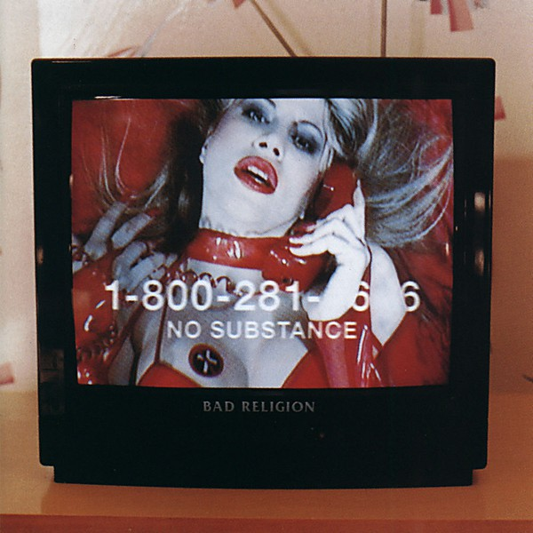

# No Substance

By **Bad Religion**

## Album Data

- **Catalog:** Beets
- **Format:** Digital, Album
- **Album:** No Substance
- **Artist:** Bad Religion
- **Albumartist:** Bad Religion
- **Genre:** Punk Rock
- **MusicBrainz Album Artist ID:** [149e6720-4e4a-41a4-afca-6d29083fc091](https://musicbrainz.org/artist/149e6720-4e4a-41a4-afca-6d29083fc091)
- **MusicBrainz Album ID:** [b38d25fd-a862-4345-85b1-ca2a9dde4788](https://musicbrainz.org/release/b38d25fd-a862-4345-85b1-ca2a9dde4788)
- **MusicBrainz Release Group ID:** [d56c7a34-8f01-3639-89ec-0f2bdaecc1d4](https://musicbrainz.org/release-group/d56c7a34-8f01-3639-89ec-0f2bdaecc1d4)
- **Year:** 1998
- **Catalog #:** 7 82546-2
- **Label:** Atlantic
- **Total Tracks:** 14

## Album Tracks

### Track 01 - Recipe for Hate

- **Artist:** Bad Religion
- **Format:** ALAC
- **Genre:** Punk Rock
- **Length:** 2:02
- **MusicBrainz Track ID:** [771d9f71-987a-4267-b4e6-08375b77ace6](https://musicbrainz.org/recording/771d9f71-987a-4267-b4e6-08375b77ace6)
- **Title:** Recipe for Hate
- **Track:** 01
- **Year:** 1993

### Track 02 - Kerosene

- **Artist:** Bad Religion
- **Format:** ALAC
- **Genre:** Punk Rock
- **Length:** 2:41
- **MusicBrainz Track ID:** [b2e09566-5676-4229-b156-c37e8e88b989](https://musicbrainz.org/recording/b2e09566-5676-4229-b156-c37e8e88b989)
- **Title:** Kerosene
- **Track:** 02
- **Year:** 1993

### Track 03 - American Jesus

- **Artist:** Bad Religion
- **Format:** ALAC
- **Genre:** Punk Rock
- **Length:** 3:17
- **MusicBrainz Track ID:** [453de38c-6d0d-4bb8-93ff-88d78774352a](https://musicbrainz.org/recording/453de38c-6d0d-4bb8-93ff-88d78774352a)
- **Title:** American Jesus
- **Track:** 03
- **Year:** 1993

### Track 04 - Portrait of Authority

- **Artist:** Bad Religion
- **Format:** ALAC
- **Genre:** Punk Rock
- **Length:** 2:44
- **MusicBrainz Track ID:** [42a31f1d-74e3-429e-a13a-e0f51bffdcce](https://musicbrainz.org/recording/42a31f1d-74e3-429e-a13a-e0f51bffdcce)
- **Title:** Portrait of Authority
- **Track:** 04
- **Year:** 1993

### Track 05 - Man With a Mission

- **Artist:** Bad Religion
- **Format:** ALAC
- **Genre:** Punk Rock
- **Length:** 3:11
- **MusicBrainz Track ID:** [258160de-3785-4c93-852e-543a69812351](https://musicbrainz.org/recording/258160de-3785-4c93-852e-543a69812351)
- **Title:** Man With a Mission
- **Track:** 05
- **Year:** 1993

### Track 06 - All Good Soldiers

- **Artist:** Bad Religion
- **Format:** ALAC
- **Genre:** Punk Rock
- **Length:** 3:07
- **MusicBrainz Track ID:** [d3424bfb-65da-41b6-9b9f-1b5e3eeb218a](https://musicbrainz.org/recording/d3424bfb-65da-41b6-9b9f-1b5e3eeb218a)
- **Title:** All Good Soldiers
- **Track:** 06
- **Year:** 1993

### Track 07 - Watch It Die

- **Artist:** Bad Religion
- **Format:** ALAC
- **Genre:** Punk Rock
- **Length:** 2:34
- **MusicBrainz Track ID:** [1e3b888b-29da-4c81-a86b-954de41d871a](https://musicbrainz.org/recording/1e3b888b-29da-4c81-a86b-954de41d871a)
- **Title:** Watch It Die
- **Track:** 07
- **Year:** 1993

### Track 08 - Struck a Nerve

- **Artist:** Bad Religion
- **Format:** ALAC
- **Genre:** Punk Rock
- **Length:** 3:47
- **MusicBrainz Track ID:** [2f83d319-e4f4-4808-ae63-177fe7a2f9e3](https://musicbrainz.org/recording/2f83d319-e4f4-4808-ae63-177fe7a2f9e3)
- **Title:** Struck a Nerve
- **Track:** 08
- **Year:** 1993

### Track 09 - My Poor Friend Me

- **Artist:** Bad Religion
- **Format:** ALAC
- **Genre:** Punk Rock
- **Length:** 2:42
- **MusicBrainz Track ID:** [d22be1c6-1cd1-4c61-afaf-0a3b639355a6](https://musicbrainz.org/recording/d22be1c6-1cd1-4c61-afaf-0a3b639355a6)
- **Title:** My Poor Friend Me
- **Track:** 09
- **Year:** 1993

### Track 10 - Lookin’ In

- **Artist:** Bad Religion
- **Format:** ALAC
- **Genre:** Punk Rock
- **Length:** 2:03
- **MusicBrainz Track ID:** [69e276ff-a4d0-4de1-87ef-a462aeedc2da](https://musicbrainz.org/recording/69e276ff-a4d0-4de1-87ef-a462aeedc2da)
- **Title:** Lookin’ In
- **Track:** 10
- **Year:** 1993

### Track 11 - Don’t Pray on Me

- **Artist:** Bad Religion
- **Format:** ALAC
- **Genre:** Punk Rock
- **Length:** 2:42
- **MusicBrainz Track ID:** [f3966ac3-aade-4476-acce-419fb03af943](https://musicbrainz.org/recording/f3966ac3-aade-4476-acce-419fb03af943)
- **Title:** Don’t Pray on Me
- **Track:** 11
- **Year:** 1993

### Track 12 - Modern Day Catastrophists

- **Artist:** Bad Religion
- **Format:** ALAC
- **Genre:** Punk Rock
- **Length:** 2:46
- **MusicBrainz Track ID:** [1796c53a-2d8c-484c-8a0b-6d01fff9a3ab](https://musicbrainz.org/recording/1796c53a-2d8c-484c-8a0b-6d01fff9a3ab)
- **Title:** Modern Day Catastrophists
- **Track:** 12
- **Year:** 1993

### Track 13 - Skyscraper

- **Artist:** Bad Religion
- **Format:** ALAC
- **Genre:** Punk Rock
- **Length:** 3:15
- **MusicBrainz Track ID:** [34d5b05e-01ce-4180-832f-c05c18689074](https://musicbrainz.org/recording/34d5b05e-01ce-4180-832f-c05c18689074)
- **Title:** Skyscraper
- **Track:** 13
- **Year:** 1993

### Track 14 - Stealth

- **Artist:** Bad Religion
- **Format:** ALAC
- **Genre:** Punk Rock
- **Length:** 0:42
- **MusicBrainz Track ID:** [80ab1bae-6638-4603-b65a-29b9966671c8](https://musicbrainz.org/recording/80ab1bae-6638-4603-b65a-29b9966671c8)
- **Title:** Stealth
- **Track:** 14
- **Year:** 1993

## See also

- [Against the Grain](Against_the_Grain.md)
- [All Ages](All_Ages.md)
- [Christmas Songs](Christmas_Songs.md)
- [Generator](Generator.md)
- [New Maps of Hell](New_Maps_of_Hell.md)
- [No Control](No_Control.md)
- [Recipe for Hate](Recipe_for_Hate.md)
- [Stranger Than Fiction](Stranger_Than_Fiction.md)
- [Suffer](Suffer.md)
- [The Dissent Of Man](The_Dissent_Of_Man.md)
- [The Empire Strikes First](The_Empire_Strikes_First.md)
- [The Gray Race](The_Gray_Race.md)
- [The New America](The_New_America.md)
- [The Process of Belief](The_Process_of_Belief.md)
- [True North](True_North.md)
- [CD: Against The Grain](../../CD/Bad_Religion/Against_The_Grain.md)
- [CD: ](../../CD/Bad_Religion/Bad_Religion.md)
- [CD: The Dissent Of Man](../../CD/Bad_Religion/The_Dissent_Of_Man.md)
- [CD: The Process of Belief](../../CD/Bad_Religion/The_Process_of_Belief.md)
- [Roon: Against The Grain (2005 Remaster)](../../Roon/Bad_Religion/Against_The_Grain_2005_Remaster.md)
- [Roon: Recipe For Hate](../../Roon/Bad_Religion/Recipe_For_Hate.md)
- [Roon: Stranger Than Fiction (Deluxe Edition Remastered)](../../Roon/Bad_Religion/Stranger_Than_Fiction_Deluxe_Edition_Remastered.md)
- [Roon: The Dissent Of Man (Bonus Track Version)](../../Roon/Bad_Religion/The_Dissent_Of_Man_Bonus_Track_Version.md)
- [Roon: The Empire Strikes First](../../Roon/Bad_Religion/The_Empire_Strikes_First.md)
- [Roon: The New America](../../Roon/Bad_Religion/The_New_America.md)
- [Roon: The Process Of Belief](../../Roon/Bad_Religion/The_Process_Of_Belief.md)
