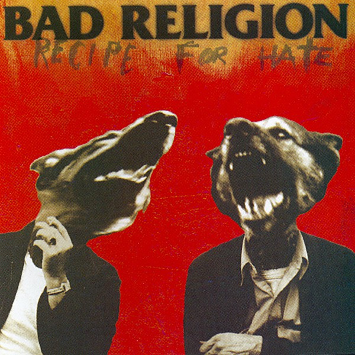

# Recipe for Hate

By **Bad Religion**

## Album Data

- **Catalog:** Beets
- **Format:** Digital, Album
- **Album:** Recipe for Hate
- **Artist:** Bad Religion
- **Albumartist:** Bad Religion
- **Genre:** Punk Rock
- **MusicBrainz Album Artist ID:** [149e6720-4e4a-41a4-afca-6d29083fc091](https://musicbrainz.org/artist/149e6720-4e4a-41a4-afca-6d29083fc091)
- **MusicBrainz Album ID:** [f07d489d-a06e-4f39-b95e-5692e2a4f465](https://musicbrainz.org/release/f07d489d-a06e-4f39-b95e-5692e2a4f465)
- **MusicBrainz Release Group ID:** [3e38adc0-bb7d-39d1-a811-7ce6db5d869d](https://musicbrainz.org/release-group/3e38adc0-bb7d-39d1-a811-7ce6db5d869d)
- **Year:** 1993
- **Catalog #:** 82659-2
- **Label:** Atlantic
- **Total Tracks:** 15

## Album Tracks

### Track 01 - Incomplete

- **Artist:** Bad Religion
- **Format:** AAC
- **Genre:** Punk Rock
- **Length:** 2:29
- **MusicBrainz Track ID:** [df4bb9f2-61cf-481c-991a-fbf0059f0958](https://musicbrainz.org/recording/df4bb9f2-61cf-481c-991a-fbf0059f0958)
- **Title:** Incomplete
- **Track:** 01
- **Year:** 1994

### Track 02 - Leave Mine to Me

- **Artist:** Bad Religion
- **Format:** AAC
- **Genre:** Punk Rock
- **Length:** 2:07
- **MusicBrainz Track ID:** [cffbf6c1-68cd-4131-917d-4280fe1c3c9f](https://musicbrainz.org/recording/cffbf6c1-68cd-4131-917d-4280fe1c3c9f)
- **Title:** Leave Mine to Me
- **Track:** 02
- **Year:** 1994

### Track 03 - Stranger Than Fiction

- **Artist:** Bad Religion
- **Format:** AAC
- **Genre:** Punk Rock
- **Length:** 2:22
- **MusicBrainz Track ID:** [d11ffedf-912c-4e81-8c25-fd1070cb9e69](https://musicbrainz.org/recording/d11ffedf-912c-4e81-8c25-fd1070cb9e69)
- **Title:** Stranger Than Fiction
- **Track:** 03
- **Year:** 1994

### Track 04 - Tiny Voices

- **Artist:** Bad Religion
- **Format:** AAC
- **Genre:** Punk Rock
- **Length:** 2:37
- **MusicBrainz Track ID:** [ec44163f-1901-4b38-8432-7f31ef4be0ba](https://musicbrainz.org/recording/ec44163f-1901-4b38-8432-7f31ef4be0ba)
- **Title:** Tiny Voices
- **Track:** 04
- **Year:** 1994

### Track 05 - The Handshake

- **Artist:** Bad Religion
- **Format:** AAC
- **Genre:** Punk Rock
- **Length:** 2:50
- **MusicBrainz Track ID:** [7c0c61b6-d165-425a-b6d7-228912e817fc](https://musicbrainz.org/recording/7c0c61b6-d165-425a-b6d7-228912e817fc)
- **Title:** The Handshake
- **Track:** 05
- **Year:** 1994

### Track 06 - Better Off Dead

- **Artist:** Bad Religion
- **Format:** AAC
- **Genre:** Punk Rock
- **Length:** 2:38
- **MusicBrainz Track ID:** [2485b5f4-0cc1-4a7a-a71b-8bbbc45ff799](https://musicbrainz.org/recording/2485b5f4-0cc1-4a7a-a71b-8bbbc45ff799)
- **Title:** Better Off Dead
- **Track:** 06
- **Year:** 1994

### Track 07 - Infected

- **Artist:** Bad Religion
- **Format:** AAC
- **Genre:** Punk Rock
- **Length:** 4:09
- **MusicBrainz Track ID:** [3c5c39a9-33df-428e-bc0b-6a27f8859899](https://musicbrainz.org/recording/3c5c39a9-33df-428e-bc0b-6a27f8859899)
- **Title:** Infected
- **Track:** 07
- **Year:** 1994

### Track 08 - Television

- **Artist:** Bad Religion
- **Format:** AAC
- **Genre:** Punk Rock
- **Length:** 2:03
- **MusicBrainz Track ID:** [8914f0d3-d34b-4679-894d-00cd95c9c913](https://musicbrainz.org/recording/8914f0d3-d34b-4679-894d-00cd95c9c913)
- **Title:** Television
- **Track:** 08
- **Year:** 1994

### Track 09 - Individual

- **Artist:** Bad Religion
- **Format:** AAC
- **Genre:** Punk Rock
- **Length:** 1:58
- **MusicBrainz Track ID:** [8436f604-75a0-4ecf-b274-232d8b40b7b8](https://musicbrainz.org/recording/8436f604-75a0-4ecf-b274-232d8b40b7b8)
- **Title:** Individual
- **Track:** 09
- **Year:** 1994

### Track 10 - Hooray for Me…

- **Artist:** Bad Religion
- **Format:** AAC
- **Genre:** Punk Rock
- **Length:** 2:50
- **MusicBrainz Track ID:** [9ca5fa1d-a153-4c53-a705-6dba92e5bcbe](https://musicbrainz.org/recording/9ca5fa1d-a153-4c53-a705-6dba92e5bcbe)
- **Title:** Hooray for Me…
- **Track:** 10
- **Year:** 1994

### Track 11 - Slumber

- **Artist:** Bad Religion
- **Format:** AAC
- **Genre:** Punk Rock
- **Length:** 2:39
- **MusicBrainz Track ID:** [c6a7b599-dc17-402f-bbbf-89db6dfea426](https://musicbrainz.org/recording/c6a7b599-dc17-402f-bbbf-89db6dfea426)
- **Title:** Slumber
- **Track:** 11
- **Year:** 1994

### Track 12 - Marked

- **Artist:** Bad Religion
- **Format:** AAC
- **Genre:** Punk Rock
- **Length:** 1:48
- **MusicBrainz Track ID:** [f58e22a7-8208-481c-a0ee-1c27229a2a9f](https://musicbrainz.org/recording/f58e22a7-8208-481c-a0ee-1c27229a2a9f)
- **Title:** Marked
- **Track:** 12
- **Year:** 1994

### Track 13 - Inner Logic

- **Artist:** Bad Religion
- **Format:** AAC
- **Genre:** Punk Rock
- **Length:** 2:57
- **MusicBrainz Track ID:** [367182ef-a814-46ce-bc6e-3872979161ac](https://musicbrainz.org/recording/367182ef-a814-46ce-bc6e-3872979161ac)
- **Title:** Inner Logic
- **Track:** 13
- **Year:** 1994

### Track 14 - What It Is

- **Artist:** Bad Religion
- **Format:** AAC
- **Genre:** Punk Rock
- **Length:** 2:08
- **MusicBrainz Track ID:** [ff4e6d0e-6c10-4a70-b7ff-1d160b5045ad](https://musicbrainz.org/recording/ff4e6d0e-6c10-4a70-b7ff-1d160b5045ad)
- **Title:** What It Is
- **Track:** 14
- **Year:** 1994

### Track 15 - 21st Century (Digital Boy)

- **Artist:** Bad Religion
- **Format:** AAC
- **Genre:** Punk Rock
- **Length:** 2:48
- **MusicBrainz Track ID:** [e974e6ae-39c4-461f-8c25-885298d3863b](https://musicbrainz.org/recording/e974e6ae-39c4-461f-8c25-885298d3863b)
- **Title:** 21st Century (Digital Boy)
- **Track:** 15
- **Year:** 1994

## See also

- [Against the Grain](Against_the_Grain.md)
- [All Ages](All_Ages.md)
- [Christmas Songs](Christmas_Songs.md)
- [Generator](Generator.md)
- [New Maps of Hell](New_Maps_of_Hell.md)
- [No Control](No_Control.md)
- [No Substance](No_Substance.md)
- [Stranger Than Fiction](Stranger_Than_Fiction.md)
- [Suffer](Suffer.md)
- [The Dissent Of Man](The_Dissent_Of_Man.md)
- [The Empire Strikes First](The_Empire_Strikes_First.md)
- [The Gray Race](The_Gray_Race.md)
- [The New America](The_New_America.md)
- [The Process of Belief](The_Process_of_Belief.md)
- [True North](True_North.md)
- [CD: Against The Grain](../../CD/Bad_Religion/Against_The_Grain.md)
- [CD: ](../../CD/Bad_Religion/Bad_Religion.md)
- [CD: The Dissent Of Man](../../CD/Bad_Religion/The_Dissent_Of_Man.md)
- [CD: The Process of Belief](../../CD/Bad_Religion/The_Process_of_Belief.md)
- [Roon: Against The Grain (2005 Remaster)](../../Roon/Bad_Religion/Against_The_Grain_2005_Remaster.md)
- [Roon: Recipe For Hate](../../Roon/Bad_Religion/Recipe_For_Hate.md)
- [Roon: Stranger Than Fiction (Deluxe Edition Remastered)](../../Roon/Bad_Religion/Stranger_Than_Fiction_Deluxe_Edition_Remastered.md)
- [Roon: The Dissent Of Man (Bonus Track Version)](../../Roon/Bad_Religion/The_Dissent_Of_Man_Bonus_Track_Version.md)
- [Roon: The Empire Strikes First](../../Roon/Bad_Religion/The_Empire_Strikes_First.md)
- [Roon: The New America](../../Roon/Bad_Religion/The_New_America.md)
- [Roon: The Process Of Belief](../../Roon/Bad_Religion/The_Process_Of_Belief.md)
