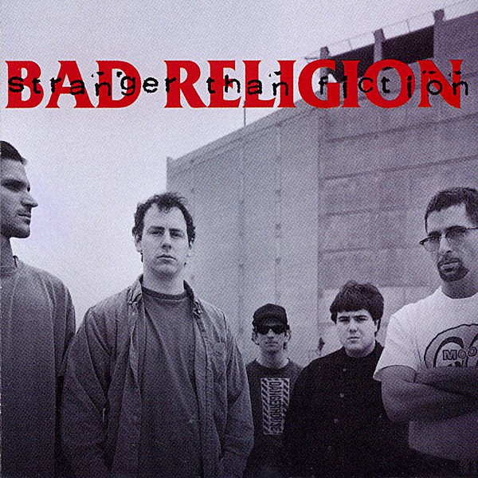

# Stranger Than Fiction

By **Bad Religion**

## Album Data

- **Catalog:** Beets
- **Format:** Digital, Album
- **Album:** Stranger Than Fiction
- **Artist:** Bad Religion
- **Albumartist:** Bad Religion
- **Genre:** Punk Rock
- **MusicBrainz Album Artist ID:** [149e6720-4e4a-41a4-afca-6d29083fc091](https://musicbrainz.org/artist/149e6720-4e4a-41a4-afca-6d29083fc091)
- **MusicBrainz Album ID:** [8f257750-da1e-402b-a5c7-a33dec23e0f1](https://musicbrainz.org/release/8f257750-da1e-402b-a5c7-a33dec23e0f1)
- **MusicBrainz Release Group ID:** [6415981c-4a20-3035-8817-7bf5a5398035](https://musicbrainz.org/release-group/6415981c-4a20-3035-8817-7bf5a5398035)
- **Year:** 1994
- **Catalog #:** E-86404-2
- **Label:** Epitaph
- **Total Tracks:** 15

## Album Tracks

### Track 01 - You Are (The Government)

- **Artist:** Bad Religion
- **Format:** AAC
- **Genre:** Hardcore Punk
- **Length:** 1:22
- **MusicBrainz Track ID:** [6843b361-486b-480c-8e64-fa287a43ec23](https://musicbrainz.org/recording/6843b361-486b-480c-8e64-fa287a43ec23)
- **Title:** You Are (The Government)
- **Track:** 01
- **Year:** 1988

### Track 02 - 1000 More Fools

- **Artist:** Bad Religion
- **Format:** AAC
- **Genre:** Punk Rock
- **Length:** 1:35
- **MusicBrainz Track ID:** [364b34d5-64ec-4b96-ae88-af9d9030d4d3](https://musicbrainz.org/recording/364b34d5-64ec-4b96-ae88-af9d9030d4d3)
- **Title:** 1000 More Fools
- **Track:** 02
- **Year:** 1988

### Track 03 - How Much Is Enough?

- **Artist:** Bad Religion
- **Format:** AAC
- **Genre:** Punk Rock
- **Length:** 1:22
- **MusicBrainz Track ID:** [3988480a-94bb-4ce4-bb64-f4ac31b1776e](https://musicbrainz.org/recording/3988480a-94bb-4ce4-bb64-f4ac31b1776e)
- **Title:** How Much Is Enough?
- **Track:** 03
- **Year:** 1988

### Track 04 - When?

- **Artist:** Bad Religion
- **Format:** AAC
- **Genre:** Skate Punk
- **Length:** 1:40
- **MusicBrainz Track ID:** [2ecde402-5c17-4daf-bf85-28b0b7ab65b2](https://musicbrainz.org/recording/2ecde402-5c17-4daf-bf85-28b0b7ab65b2)
- **Title:** When?
- **Track:** 04
- **Year:** 1988

### Track 05 - Give You Nothing

- **Artist:** Bad Religion
- **Format:** AAC
- **Genre:** Punk Rock
- **Length:** 2:02
- **MusicBrainz Track ID:** [16470e03-f402-4014-a5f5-9276d8d132ae](https://musicbrainz.org/recording/16470e03-f402-4014-a5f5-9276d8d132ae)
- **Title:** Give You Nothing
- **Track:** 05
- **Year:** 1988

### Track 06 - Land of Competition

- **Artist:** Bad Religion
- **Format:** AAC
- **Genre:** Punk Rock
- **Length:** 2:04
- **MusicBrainz Track ID:** [99397f6b-0b55-4f56-a4eb-bbab9c0eaa21](https://musicbrainz.org/recording/99397f6b-0b55-4f56-a4eb-bbab9c0eaa21)
- **Title:** Land of Competition
- **Track:** 06
- **Year:** 1988

### Track 07 - Forbidden Beat

- **Artist:** Bad Religion
- **Format:** AAC
- **Genre:** Punk Rock
- **Length:** 1:57
- **MusicBrainz Track ID:** [c77a386b-0e03-46eb-b0f6-f5e7f6afc82a](https://musicbrainz.org/recording/c77a386b-0e03-46eb-b0f6-f5e7f6afc82a)
- **Title:** Forbidden Beat
- **Track:** 07
- **Year:** 1988

### Track 08 - Best for You

- **Artist:** Bad Religion
- **Format:** AAC
- **Genre:** Punk Rock
- **Length:** 1:55
- **MusicBrainz Track ID:** [4d4ed86e-ff36-4b77-a90f-7608f0e7b847](https://musicbrainz.org/recording/4d4ed86e-ff36-4b77-a90f-7608f0e7b847)
- **Title:** Best for You
- **Track:** 08
- **Year:** 1988

### Track 09 - Suffer

- **Artist:** Bad Religion
- **Format:** AAC
- **Genre:** Punk Rock
- **Length:** 1:47
- **MusicBrainz Track ID:** [5d78c452-4aa9-4e59-956d-93d805088450](https://musicbrainz.org/recording/5d78c452-4aa9-4e59-956d-93d805088450)
- **Title:** Suffer
- **Track:** 09
- **Year:** 1988

### Track 10 - Delirium of Disorder

- **Artist:** Bad Religion
- **Format:** AAC
- **Genre:** Punk Rock
- **Length:** 1:39
- **MusicBrainz Track ID:** [bae4433c-3298-4883-b77a-83dfff7f3e13](https://musicbrainz.org/recording/bae4433c-3298-4883-b77a-83dfff7f3e13)
- **Title:** Delirium of Disorder
- **Track:** 10
- **Year:** 1988

### Track 11 - Part II (The Numbers Game)

- **Artist:** Bad Religion
- **Format:** AAC
- **Genre:** Punk Rock
- **Length:** 1:41
- **MusicBrainz Track ID:** [1e97ce22-fb20-4e77-be4c-060db2a57dba](https://musicbrainz.org/recording/1e97ce22-fb20-4e77-be4c-060db2a57dba)
- **Title:** Part II (The Numbers Game)
- **Track:** 11
- **Year:** 1988

### Track 12 - What Can You Do?

- **Artist:** Bad Religion
- **Format:** AAC
- **Genre:** Punk Rock
- **Length:** 2:44
- **MusicBrainz Track ID:** [88a376e2-98f3-44a6-9c30-3ff49c139e9b](https://musicbrainz.org/recording/88a376e2-98f3-44a6-9c30-3ff49c139e9b)
- **Title:** What Can You Do?
- **Track:** 12
- **Year:** 1988

### Track 13 - Do What You Want

- **Artist:** Bad Religion
- **Format:** AAC
- **Genre:** Hardcore Punk
- **Length:** 1:07
- **MusicBrainz Track ID:** [cb67ad65-aeed-4e93-ba9b-b0d346e6979a](https://musicbrainz.org/recording/cb67ad65-aeed-4e93-ba9b-b0d346e6979a)
- **Title:** Do What You Want
- **Track:** 13
- **Year:** 1988

### Track 14 - Part IV (The Index Fossil)

- **Artist:** Bad Religion
- **Format:** AAC
- **Genre:** Punk Rock
- **Length:** 2:04
- **MusicBrainz Track ID:** [5225be1f-617d-4356-bb7b-da97ff1a8fdd](https://musicbrainz.org/recording/5225be1f-617d-4356-bb7b-da97ff1a8fdd)
- **Title:** Part IV (The Index Fossil)
- **Track:** 14
- **Year:** 1988

### Track 15 - Pessimistic Lines

- **Artist:** Bad Religion
- **Format:** AAC
- **Genre:** Punk Rock
- **Length:** 1:07
- **MusicBrainz Track ID:** [f1e99337-14af-4267-9b75-60c90130d391](https://musicbrainz.org/recording/f1e99337-14af-4267-9b75-60c90130d391)
- **Title:** Pessimistic Lines
- **Track:** 15
- **Year:** 1988

## See also

- [Against the Grain](Against_the_Grain.md)
- [All Ages](All_Ages.md)
- [Christmas Songs](Christmas_Songs.md)
- [Generator](Generator.md)
- [New Maps of Hell](New_Maps_of_Hell.md)
- [No Control](No_Control.md)
- [No Substance](No_Substance.md)
- [Recipe for Hate](Recipe_for_Hate.md)
- [Suffer](Suffer.md)
- [The Dissent Of Man](The_Dissent_Of_Man.md)
- [The Empire Strikes First](The_Empire_Strikes_First.md)
- [The Gray Race](The_Gray_Race.md)
- [The New America](The_New_America.md)
- [The Process of Belief](The_Process_of_Belief.md)
- [True North](True_North.md)
- [CD: Against The Grain](../../CD/Bad_Religion/Against_The_Grain.md)
- [CD: ](../../CD/Bad_Religion/Bad_Religion.md)
- [CD: The Dissent Of Man](../../CD/Bad_Religion/The_Dissent_Of_Man.md)
- [CD: The Process of Belief](../../CD/Bad_Religion/The_Process_of_Belief.md)
- [Roon: Against The Grain (2005 Remaster)](../../Roon/Bad_Religion/Against_The_Grain_2005_Remaster.md)
- [Roon: Recipe For Hate](../../Roon/Bad_Religion/Recipe_For_Hate.md)
- [Roon: Stranger Than Fiction (Deluxe Edition Remastered)](../../Roon/Bad_Religion/Stranger_Than_Fiction_Deluxe_Edition_Remastered.md)
- [Roon: The Dissent Of Man (Bonus Track Version)](../../Roon/Bad_Religion/The_Dissent_Of_Man_Bonus_Track_Version.md)
- [Roon: The Empire Strikes First](../../Roon/Bad_Religion/The_Empire_Strikes_First.md)
- [Roon: The New America](../../Roon/Bad_Religion/The_New_America.md)
- [Roon: The Process Of Belief](../../Roon/Bad_Religion/The_Process_Of_Belief.md)
