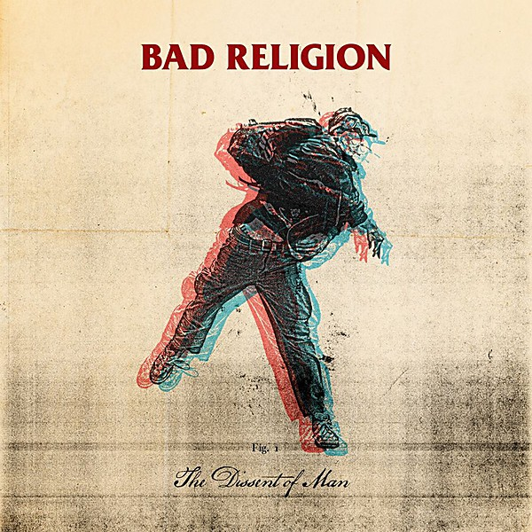

# The Dissent Of Man

By **Bad Religion**

## Album Data

- **Catalog:** Beets
- **Format:** Digital, Album
- **Album:** The Dissent Of Man
- **Artist:** Bad Religion
- **Albumartist:** Bad Religion
- **Genre:** Punk Rock
- **MusicBrainz Album Artist ID:** 
- **MusicBrainz Album ID:** 
- **MusicBrainz Release Group ID:** 
- **Year:** 2010
- **Catalog #:** 86694-2
- **Label:** Epitaph
- **Total Tracks:** 14

## Album Tracks

### Track 01 - Overture

- **Artist:** Bad Religion
- **Format:** ALAC
- **Genre:** Hardcore Punk
- **Length:** 1:11
- **MusicBrainz Track ID:** [baa670d8-92b1-4812-9a77-bdcc4311351a](https://musicbrainz.org/recording/baa670d8-92b1-4812-9a77-bdcc4311351a)
- **Title:** Overture
- **Track:** 01
- **Year:** 2004

### Track 02 - Sinister Rouge

- **Artist:** Bad Religion
- **Format:** ALAC
- **Genre:** Pop Punk
- **Length:** 1:55
- **MusicBrainz Track ID:** [58b2bd03-aa16-4dc7-b4f5-61be68b1f974](https://musicbrainz.org/recording/58b2bd03-aa16-4dc7-b4f5-61be68b1f974)
- **Title:** Sinister Rouge
- **Track:** 02
- **Year:** 2004

### Track 03 - Social Suicide

- **Artist:** Bad Religion
- **Format:** ALAC
- **Genre:** Punk Rock
- **Length:** 1:37
- **MusicBrainz Track ID:** [836d32c2-895a-4a80-b392-e1de3d9de65d](https://musicbrainz.org/recording/836d32c2-895a-4a80-b392-e1de3d9de65d)
- **Title:** Social Suicide
- **Track:** 03
- **Year:** 2004

### Track 04 - Atheist Peace

- **Artist:** Bad Religion
- **Format:** ALAC
- **Genre:** Punk Rock
- **Length:** 1:59
- **MusicBrainz Track ID:** [618066b0-8a1f-488d-8124-cada63fe6320](https://musicbrainz.org/recording/618066b0-8a1f-488d-8124-cada63fe6320)
- **Title:** Atheist Peace
- **Track:** 04
- **Year:** 2004

### Track 05 - All There Is

- **Artist:** Bad Religion
- **Format:** ALAC
- **Genre:** Hardcore Punk
- **Length:** 2:59
- **MusicBrainz Track ID:** [0ecad68f-20bb-4fd3-8bec-d906534ac76c](https://musicbrainz.org/recording/0ecad68f-20bb-4fd3-8bec-d906534ac76c)
- **Title:** All There Is
- **Track:** 05
- **Year:** 2004

### Track 06 - Los Angeles Is Burning

- **Artist:** Bad Religion
- **Format:** ALAC
- **Genre:** Hardcore Punk
- **Length:** 3:25
- **MusicBrainz Track ID:** [2b86510e-8687-4107-b4ae-b0f46c543984](https://musicbrainz.org/recording/2b86510e-8687-4107-b4ae-b0f46c543984)
- **Title:** Los Angeles Is Burning
- **Track:** 06
- **Year:** 2004

### Track 07 - Let Them Eat War

- **Artist:** Bad Religion
- **Format:** ALAC
- **Genre:** Punk Rock
- **Length:** 2:59
- **MusicBrainz Track ID:** [4ce63f58-295c-43e7-a3c7-c00d95e54cff](https://musicbrainz.org/recording/4ce63f58-295c-43e7-a3c7-c00d95e54cff)
- **Title:** Let Them Eat War
- **Track:** 07
- **Year:** 2004

### Track 08 - God’s Love

- **Artist:** Bad Religion
- **Format:** ALAC
- **Genre:** Punk Rock
- **Length:** 2:34
- **MusicBrainz Track ID:** [a0d9f2f3-62ba-4fa9-8ace-951bc615f76c](https://musicbrainz.org/recording/a0d9f2f3-62ba-4fa9-8ace-951bc615f76c)
- **Title:** God’s Love
- **Track:** 08
- **Year:** 2004

### Track 09 - To Another Abyss

- **Artist:** Bad Religion
- **Format:** ALAC
- **Genre:** Punk Rock
- **Length:** 4:09
- **MusicBrainz Track ID:** [c68cf55d-9546-4de5-88e6-8bdab89a7f39](https://musicbrainz.org/recording/c68cf55d-9546-4de5-88e6-8bdab89a7f39)
- **Title:** To Another Abyss
- **Track:** 09
- **Year:** 2004

### Track 10 - The Quickening

- **Artist:** Bad Religion
- **Format:** ALAC
- **Genre:** Punk Rock
- **Length:** 2:21
- **MusicBrainz Track ID:** [8950eb58-3575-4100-ae57-bd6ca44a31a2](https://musicbrainz.org/recording/8950eb58-3575-4100-ae57-bd6ca44a31a2)
- **Title:** The Quickening
- **Track:** 10
- **Year:** 2004

### Track 11 - The Empire Strikes First

- **Artist:** Bad Religion
- **Format:** ALAC
- **Genre:** Hardcore Punk
- **Length:** 3:25
- **MusicBrainz Track ID:** [6d254521-7c59-4fe9-b687-d3dc26b17971](https://musicbrainz.org/recording/6d254521-7c59-4fe9-b687-d3dc26b17971)
- **Title:** The Empire Strikes First
- **Track:** 11
- **Year:** 2004

### Track 12 - Beyond Electric Dreams

- **Artist:** Bad Religion
- **Format:** ALAC
- **Genre:** Punk Rock
- **Length:** 4:04
- **MusicBrainz Track ID:** [79279865-98d3-46e8-b8fe-2921f94bcffc](https://musicbrainz.org/recording/79279865-98d3-46e8-b8fe-2921f94bcffc)
- **Title:** Beyond Electric Dreams
- **Track:** 12
- **Year:** 2004

### Track 13 - Boot Stamping on a Human Face Forever

- **Artist:** Bad Religion
- **Format:** ALAC
- **Genre:** Punk Rock
- **Length:** 3:51
- **MusicBrainz Track ID:** [2f96e193-79ed-4a69-bdca-52ee0a35ee34](https://musicbrainz.org/recording/2f96e193-79ed-4a69-bdca-52ee0a35ee34)
- **Title:** Boot Stamping on a Human Face Forever
- **Track:** 13
- **Year:** 2004

### Track 14 - Live Again (The Fall of Man)

- **Artist:** Bad Religion
- **Format:** ALAC
- **Genre:** Punk Rock
- **Length:** 3:35
- **MusicBrainz Track ID:** [d602d8bc-b7ff-4bfc-8df9-32780f1697b2](https://musicbrainz.org/recording/d602d8bc-b7ff-4bfc-8df9-32780f1697b2)
- **Title:** Live Again (The Fall of Man)
- **Track:** 14
- **Year:** 2004

## See also

- [Against the Grain](Against_the_Grain.md)
- [All Ages](All_Ages.md)
- [Christmas Songs](Christmas_Songs.md)
- [Generator](Generator.md)
- [New Maps of Hell](New_Maps_of_Hell.md)
- [No Control](No_Control.md)
- [No Substance](No_Substance.md)
- [Recipe for Hate](Recipe_for_Hate.md)
- [Stranger Than Fiction](Stranger_Than_Fiction.md)
- [Suffer](Suffer.md)
- [The Empire Strikes First](The_Empire_Strikes_First.md)
- [The Gray Race](The_Gray_Race.md)
- [The New America](The_New_America.md)
- [The Process of Belief](The_Process_of_Belief.md)
- [True North](True_North.md)
- [CD: Against The Grain](../../CD/Bad_Religion/Against_The_Grain.md)
- [CD: ](../../CD/Bad_Religion/Bad_Religion.md)
- [CD: The Dissent Of Man](../../CD/Bad_Religion/The_Dissent_Of_Man.md)
- [CD: The Process of Belief](../../CD/Bad_Religion/The_Process_of_Belief.md)
- [Roon: Against The Grain (2005 Remaster)](../../Roon/Bad_Religion/Against_The_Grain_2005_Remaster.md)
- [Roon: Recipe For Hate](../../Roon/Bad_Religion/Recipe_For_Hate.md)
- [Roon: Stranger Than Fiction (Deluxe Edition Remastered)](../../Roon/Bad_Religion/Stranger_Than_Fiction_Deluxe_Edition_Remastered.md)
- [Roon: The Dissent Of Man (Bonus Track Version)](../../Roon/Bad_Religion/The_Dissent_Of_Man_Bonus_Track_Version.md)
- [Roon: The Empire Strikes First](../../Roon/Bad_Religion/The_Empire_Strikes_First.md)
- [Roon: The New America](../../Roon/Bad_Religion/The_New_America.md)
- [Roon: The Process Of Belief](../../Roon/Bad_Religion/The_Process_Of_Belief.md)
