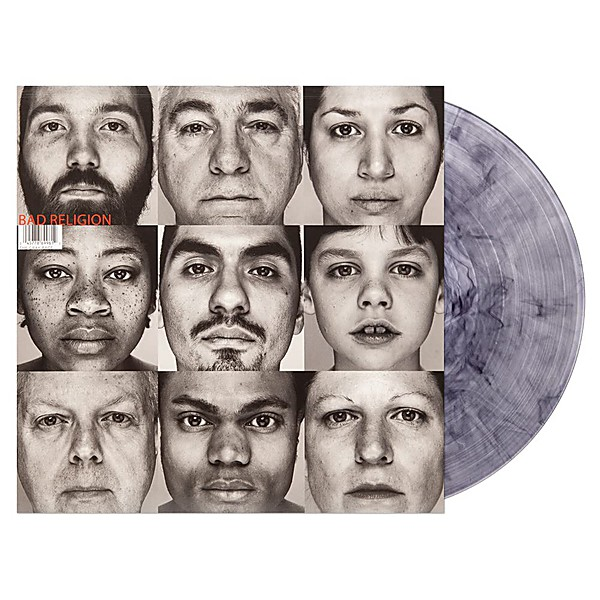

# The Gray Race

By **Bad Religion**

## Album Data

- **Catalog:** Beets
- **Format:** Digital, Album
- **Album:** The Gray Race
- **Artist:** Bad Religion
- **Albumartist:** Bad Religion
- **Genre:** Hardcore Punk
- **MusicBrainz Album Artist ID:** [149e6720-4e4a-41a4-afca-6d29083fc091](https://musicbrainz.org/artist/149e6720-4e4a-41a4-afca-6d29083fc091)
- **MusicBrainz Album ID:** [ebcb92e4-2e80-4de2-8239-46aae16b9a6b](https://musicbrainz.org/release/ebcb92e4-2e80-4de2-8239-46aae16b9a6b)
- **MusicBrainz Release Group ID:** [76a692ee-0cfd-3346-b497-f182eb0e0833](https://musicbrainz.org/release-group/76a692ee-0cfd-3346-b497-f182eb0e0833)
- **Year:** 1996
- **Catalog #:** 83303-2
- **Label:** Atlantic
- **Total Tracks:** 13

## Album Tracks

### Track 01 - You’ve Got a Chance

- **Artist:** Bad Religion
- **Format:** ALAC
- **Genre:** Pop Punk
- **Length:** 3:40
- **MusicBrainz Track ID:** [7e7fa502-c287-45b3-8987-49ae19ddf9d5](https://musicbrainz.org/recording/7e7fa502-c287-45b3-8987-49ae19ddf9d5)
- **Title:** You’ve Got a Chance
- **Track:** 01
- **Year:** 2000

### Track 02 - It’s a Long Way to the Promise Land

- **Artist:** Bad Religion
- **Format:** ALAC
- **Genre:** Pop Punk
- **Length:** 2:28
- **MusicBrainz Track ID:** [ce6679fd-f4c2-48bf-952a-d59d4fe048b2](https://musicbrainz.org/recording/ce6679fd-f4c2-48bf-952a-d59d4fe048b2)
- **Title:** It’s a Long Way to the Promise Land
- **Track:** 02
- **Year:** 2000

### Track 03 - A World Without Melody

- **Artist:** Bad Religion
- **Format:** ALAC
- **Genre:** Punk Rock
- **Length:** 2:32
- **MusicBrainz Track ID:** [d99ed613-31c7-4961-a483-6731ddb6f75a](https://musicbrainz.org/recording/d99ed613-31c7-4961-a483-6731ddb6f75a)
- **Title:** A World Without Melody
- **Track:** 03
- **Year:** 2000

### Track 04 - New America

- **Artist:** Bad Religion
- **Format:** ALAC
- **Genre:** Punk Rock
- **Length:** 3:24
- **MusicBrainz Track ID:** [b28de4b7-cd41-4dc0-b27e-ef485f21d878](https://musicbrainz.org/recording/b28de4b7-cd41-4dc0-b27e-ef485f21d878)
- **Title:** New America
- **Track:** 04
- **Year:** 2000

### Track 05 - 1000 Memories

- **Artist:** Bad Religion
- **Format:** ALAC
- **Genre:** Punk Rock
- **Length:** 3:00
- **MusicBrainz Track ID:** [3b132d0a-a74e-43a4-b1e3-9e28407bba97](https://musicbrainz.org/recording/3b132d0a-a74e-43a4-b1e3-9e28407bba97)
- **Title:** 1000 Memories
- **Track:** 05
- **Year:** 2000

### Track 06 - A Streetkid Named Desire

- **Artist:** Bad Religion
- **Format:** ALAC
- **Genre:** Punk Rock
- **Length:** 3:17
- **MusicBrainz Track ID:** [c316e393-921e-47d4-ad47-5b015ada4eef](https://musicbrainz.org/recording/c316e393-921e-47d4-ad47-5b015ada4eef)
- **Title:** A Streetkid Named Desire
- **Track:** 06
- **Year:** 2000

### Track 07 - Whisper in Time

- **Artist:** Bad Religion
- **Format:** ALAC
- **Genre:** Emo
- **Length:** 2:32
- **MusicBrainz Track ID:** [3baa9c96-ab50-42b5-a73e-c584944d83ef](https://musicbrainz.org/recording/3baa9c96-ab50-42b5-a73e-c584944d83ef)
- **Title:** Whisper in Time
- **Track:** 07
- **Year:** 2000

### Track 08 - Believe It

- **Artist:** Bad Religion
- **Format:** ALAC
- **Genre:** Hardcore Punk
- **Length:** 3:41
- **MusicBrainz Track ID:** [6257596a-0b4a-4083-8b29-607cb3989e82](https://musicbrainz.org/recording/6257596a-0b4a-4083-8b29-607cb3989e82)
- **Title:** Believe It
- **Track:** 08
- **Year:** 2000

### Track 09 - I Love My Computer

- **Artist:** Bad Religion
- **Format:** ALAC
- **Genre:** Hardcore Punk
- **Length:** 3:05
- **MusicBrainz Track ID:** [c49ea399-2758-4bbf-81e6-ee79d0ea4cff](https://musicbrainz.org/recording/c49ea399-2758-4bbf-81e6-ee79d0ea4cff)
- **Title:** I Love My Computer
- **Track:** 09
- **Year:** 2000

### Track 10 - The Hopeless Housewife

- **Artist:** Bad Religion
- **Format:** ALAC
- **Genre:** Punk Rock
- **Length:** 2:59
- **MusicBrainz Track ID:** [573e75a3-8395-47a2-8697-46c4b40760b5](https://musicbrainz.org/recording/573e75a3-8395-47a2-8697-46c4b40760b5)
- **Title:** The Hopeless Housewife
- **Track:** 10
- **Year:** 2000

### Track 11 - There Will Be a Way

- **Artist:** Bad Religion
- **Format:** ALAC
- **Genre:** Punk Rock
- **Length:** 2:52
- **MusicBrainz Track ID:** [6c079366-277f-4647-86c9-aa5d6a165a06](https://musicbrainz.org/recording/6c079366-277f-4647-86c9-aa5d6a165a06)
- **Title:** There Will Be a Way
- **Track:** 11
- **Year:** 2000

### Track 12 - Let It Burn

- **Artist:** Bad Religion
- **Format:** ALAC
- **Genre:** Punk Rock
- **Length:** 2:44
- **MusicBrainz Track ID:** [ec4efe92-35d5-495b-a565-6969750f2328](https://musicbrainz.org/recording/ec4efe92-35d5-495b-a565-6969750f2328)
- **Title:** Let It Burn
- **Track:** 12
- **Year:** 2000

### Track 13 - Don’t Sell Me Short

- **Artist:** Bad Religion
- **Format:** ALAC
- **Genre:** Pop Punk
- **Length:** 3:57
- **MusicBrainz Track ID:** [df648124-4ce7-4b1a-962c-c1c20768ec20](https://musicbrainz.org/recording/df648124-4ce7-4b1a-962c-c1c20768ec20)
- **Title:** Don’t Sell Me Short
- **Track:** 13
- **Year:** 2000

## See also

- [Against the Grain](Against_the_Grain.md)
- [All Ages](All_Ages.md)
- [Christmas Songs](Christmas_Songs.md)
- [Generator](Generator.md)
- [New Maps of Hell](New_Maps_of_Hell.md)
- [No Control](No_Control.md)
- [No Substance](No_Substance.md)
- [Recipe for Hate](Recipe_for_Hate.md)
- [Stranger Than Fiction](Stranger_Than_Fiction.md)
- [Suffer](Suffer.md)
- [The Dissent Of Man](The_Dissent_Of_Man.md)
- [The Empire Strikes First](The_Empire_Strikes_First.md)
- [The New America](The_New_America.md)
- [The Process of Belief](The_Process_of_Belief.md)
- [True North](True_North.md)
- [CD: Against The Grain](../../CD/Bad_Religion/Against_The_Grain.md)
- [CD: ](../../CD/Bad_Religion/Bad_Religion.md)
- [CD: The Dissent Of Man](../../CD/Bad_Religion/The_Dissent_Of_Man.md)
- [CD: The Process of Belief](../../CD/Bad_Religion/The_Process_of_Belief.md)
- [Roon: Against The Grain (2005 Remaster)](../../Roon/Bad_Religion/Against_The_Grain_2005_Remaster.md)
- [Roon: Recipe For Hate](../../Roon/Bad_Religion/Recipe_For_Hate.md)
- [Roon: Stranger Than Fiction (Deluxe Edition Remastered)](../../Roon/Bad_Religion/Stranger_Than_Fiction_Deluxe_Edition_Remastered.md)
- [Roon: The Dissent Of Man (Bonus Track Version)](../../Roon/Bad_Religion/The_Dissent_Of_Man_Bonus_Track_Version.md)
- [Roon: The Empire Strikes First](../../Roon/Bad_Religion/The_Empire_Strikes_First.md)
- [Roon: The New America](../../Roon/Bad_Religion/The_New_America.md)
- [Roon: The Process Of Belief](../../Roon/Bad_Religion/The_Process_Of_Belief.md)
