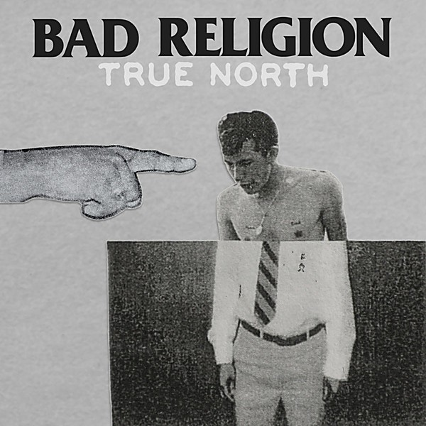

# True North

By **Bad Religion**

## Album Data

- **Catalog:** Beets
- **Format:** Digital, Album
- **Album:** True North
- **Artist:** Bad Religion
- **Albumartist:** Bad Religion
- **Genre:** Punk Rock
- **MusicBrainz Album Artist ID:** [149e6720-4e4a-41a4-afca-6d29083fc091](https://musicbrainz.org/artist/149e6720-4e4a-41a4-afca-6d29083fc091)
- **MusicBrainz Album ID:** [9c2f4013-5c85-4e84-b308-00a7be795971](https://musicbrainz.org/release/9c2f4013-5c85-4e84-b308-00a7be795971)
- **MusicBrainz Release Group ID:** [7899cb09-a886-4296-8b18-888e5607b269](https://musicbrainz.org/release-group/7899cb09-a886-4296-8b18-888e5607b269)
- **Year:** 2013
- **Catalog #:** 87228-2
- **Label:** Epitaph
- **Total Tracks:** 16

## Album Tracks

### Track 01 - True North

- **Artist:** Bad Religion
- **Format:** AAC
- **Genre:** Punk Rock
- **Length:** 1:55
- **MusicBrainz Track ID:** [323655f7-b1f4-4a23-83b6-d955713758c7](https://musicbrainz.org/recording/323655f7-b1f4-4a23-83b6-d955713758c7)
- **Title:** True North
- **Track:** 01
- **Year:** 2013

### Track 02 - Past Is Dead

- **Artist:** Bad Religion
- **Format:** AAC
- **Genre:** Punk Rock
- **Length:** 2:38
- **MusicBrainz Track ID:** [0a0d4110-ff3c-4f31-973b-50a67855e777](https://musicbrainz.org/recording/0a0d4110-ff3c-4f31-973b-50a67855e777)
- **Title:** Past Is Dead
- **Track:** 02
- **Year:** 2013

### Track 03 - Robin Hood in Reverse

- **Artist:** Bad Religion
- **Format:** AAC
- **Genre:** Hardcore Punk
- **Length:** 2:53
- **MusicBrainz Track ID:** [273015ed-70ac-4260-b35b-40a9a93410b7](https://musicbrainz.org/recording/273015ed-70ac-4260-b35b-40a9a93410b7)
- **Title:** Robin Hood in Reverse
- **Track:** 03
- **Year:** 2013

### Track 04 - Land of Endless Greed

- **Artist:** Bad Religion
- **Format:** AAC
- **Genre:** Skate Punk
- **Length:** 1:53
- **MusicBrainz Track ID:** [21774b01-d2a9-46e4-bf37-3009fbc6833f](https://musicbrainz.org/recording/21774b01-d2a9-46e4-bf37-3009fbc6833f)
- **Title:** Land of Endless Greed
- **Track:** 04
- **Year:** 2013

### Track 05 - Fuck You

- **Artist:** Bad Religion
- **Format:** AAC
- **Genre:** Punk Rock
- **Length:** 2:14
- **MusicBrainz Track ID:** [aafff380-09f3-4a22-a53c-f701a6a60f16](https://musicbrainz.org/recording/aafff380-09f3-4a22-a53c-f701a6a60f16)
- **Title:** Fuck You
- **Track:** 05
- **Year:** 2013

### Track 06 - Dharma and the Bomb

- **Artist:** Bad Religion
- **Format:** AAC
- **Genre:** Punk Rock
- **Length:** 2:00
- **MusicBrainz Track ID:** [3d8e178c-f6f3-438f-8830-c7c1ae0f45b0](https://musicbrainz.org/recording/3d8e178c-f6f3-438f-8830-c7c1ae0f45b0)
- **Title:** Dharma and the Bomb
- **Track:** 06
- **Year:** 2013

### Track 07 - Hello Cruel World

- **Artist:** Bad Religion
- **Format:** AAC
- **Genre:** Punk Rock
- **Length:** 3:50
- **MusicBrainz Track ID:** [40d18389-4ab3-4b06-a1d8-5568664ff1ca](https://musicbrainz.org/recording/40d18389-4ab3-4b06-a1d8-5568664ff1ca)
- **Title:** Hello Cruel World
- **Track:** 07
- **Year:** 2013

### Track 08 - Vanity

- **Artist:** Bad Religion
- **Format:** AAC
- **Genre:** Punk Rock
- **Length:** 1:01
- **MusicBrainz Track ID:** [9535465e-950f-4f88-9edd-965849e948f4](https://musicbrainz.org/recording/9535465e-950f-4f88-9edd-965849e948f4)
- **Title:** Vanity
- **Track:** 08
- **Year:** 2013

### Track 09 - In Their Hearts Is Right

- **Artist:** Bad Religion
- **Format:** AAC
- **Genre:** Punk Rock
- **Length:** 1:59
- **MusicBrainz Track ID:** [928660ad-531f-4958-a964-491c601699f7](https://musicbrainz.org/recording/928660ad-531f-4958-a964-491c601699f7)
- **Title:** In Their Hearts Is Right
- **Track:** 09
- **Year:** 2013

### Track 10 - Crisis Time

- **Artist:** Bad Religion
- **Format:** AAC
- **Genre:** Punk Rock
- **Length:** 2:39
- **MusicBrainz Track ID:** [03cb541e-da5f-48bd-89d4-29fcd485acbd](https://musicbrainz.org/recording/03cb541e-da5f-48bd-89d4-29fcd485acbd)
- **Title:** Crisis Time
- **Track:** 10
- **Year:** 2013

### Track 11 - Dept. of False Hope

- **Artist:** Bad Religion
- **Format:** AAC
- **Genre:** Punk Rock
- **Length:** 2:40
- **MusicBrainz Track ID:** [f1755c6a-599a-4b03-ba43-ccfea2537c0e](https://musicbrainz.org/recording/f1755c6a-599a-4b03-ba43-ccfea2537c0e)
- **Title:** Dept. of False Hope
- **Track:** 11
- **Year:** 2013

### Track 12 - Nothing to Dismay

- **Artist:** Bad Religion
- **Format:** AAC
- **Genre:** Skate Punk
- **Length:** 2:06
- **MusicBrainz Track ID:** [93620c15-99ef-44be-a640-8e64e39f3870](https://musicbrainz.org/recording/93620c15-99ef-44be-a640-8e64e39f3870)
- **Title:** Nothing to Dismay
- **Track:** 12
- **Year:** 2013

### Track 13 - Popular Consensus

- **Artist:** Bad Religion
- **Format:** AAC
- **Genre:** Punk Rock
- **Length:** 1:52
- **MusicBrainz Track ID:** [7c6f54c2-f79f-44e1-ad56-2779c225e3ed](https://musicbrainz.org/recording/7c6f54c2-f79f-44e1-ad56-2779c225e3ed)
- **Title:** Popular Consensus
- **Track:** 13
- **Year:** 2013

### Track 14 - My Head Is Full of Ghosts

- **Artist:** Bad Religion
- **Format:** AAC
- **Genre:** Skate Punk
- **Length:** 1:46
- **MusicBrainz Track ID:** [fadcd1a4-202c-4d17-8c63-d855104a5bc5](https://musicbrainz.org/recording/fadcd1a4-202c-4d17-8c63-d855104a5bc5)
- **Title:** My Head Is Full of Ghosts
- **Track:** 14
- **Year:** 2013

### Track 15 - The Island

- **Artist:** Bad Religion
- **Format:** AAC
- **Genre:** Punk Rock
- **Length:** 1:28
- **MusicBrainz Track ID:** [ce9bcf25-3a93-4216-8f61-cb324b74dde6](https://musicbrainz.org/recording/ce9bcf25-3a93-4216-8f61-cb324b74dde6)
- **Title:** The Island
- **Track:** 15
- **Year:** 2013

### Track 16 - Changing Tide

- **Artist:** Bad Religion
- **Format:** AAC
- **Genre:** Punk Rock
- **Length:** 2:18
- **MusicBrainz Track ID:** [41889880-5b6f-447a-8a8a-94c12f2ea3e1](https://musicbrainz.org/recording/41889880-5b6f-447a-8a8a-94c12f2ea3e1)
- **Title:** Changing Tide
- **Track:** 16
- **Year:** 2013

## See also

- [Against the Grain](Against_the_Grain.md)
- [All Ages](All_Ages.md)
- [Christmas Songs](Christmas_Songs.md)
- [Generator](Generator.md)
- [New Maps of Hell](New_Maps_of_Hell.md)
- [No Control](No_Control.md)
- [No Substance](No_Substance.md)
- [Recipe for Hate](Recipe_for_Hate.md)
- [Stranger Than Fiction](Stranger_Than_Fiction.md)
- [Suffer](Suffer.md)
- [The Dissent Of Man](The_Dissent_Of_Man.md)
- [The Empire Strikes First](The_Empire_Strikes_First.md)
- [The Gray Race](The_Gray_Race.md)
- [The New America](The_New_America.md)
- [The Process of Belief](The_Process_of_Belief.md)
- [CD: Against The Grain](../../CD/Bad_Religion/Against_The_Grain.md)
- [CD: ](../../CD/Bad_Religion/Bad_Religion.md)
- [CD: The Dissent Of Man](../../CD/Bad_Religion/The_Dissent_Of_Man.md)
- [CD: The Process of Belief](../../CD/Bad_Religion/The_Process_of_Belief.md)
- [Roon: Against The Grain (2005 Remaster)](../../Roon/Bad_Religion/Against_The_Grain_2005_Remaster.md)
- [Roon: Recipe For Hate](../../Roon/Bad_Religion/Recipe_For_Hate.md)
- [Roon: Stranger Than Fiction (Deluxe Edition Remastered)](../../Roon/Bad_Religion/Stranger_Than_Fiction_Deluxe_Edition_Remastered.md)
- [Roon: The Dissent Of Man (Bonus Track Version)](../../Roon/Bad_Religion/The_Dissent_Of_Man_Bonus_Track_Version.md)
- [Roon: The Empire Strikes First](../../Roon/Bad_Religion/The_Empire_Strikes_First.md)
- [Roon: The New America](../../Roon/Bad_Religion/The_New_America.md)
- [Roon: The Process Of Belief](../../Roon/Bad_Religion/The_Process_Of_Belief.md)
