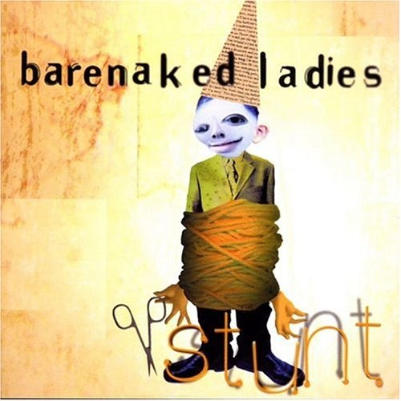

# Stunt

By **Barenaked Ladies**

## Album Data

- **Catalog:** Beets
- **Format:** Digital, Album
- **Album:** Stunt
- **Artist:** Barenaked Ladies
- **Albumartist:** Barenaked Ladies
- **Genre:** Pop Rock
- **MusicBrainz Album Artist ID:** [86e736b4-93e2-40ff-9e1c-fb7c63fef5f6](https://musicbrainz.org/artist/86e736b4-93e2-40ff-9e1c-fb7c63fef5f6)
- **MusicBrainz Album ID:** [003e4113-6dac-445a-889c-62668ec9f675](https://musicbrainz.org/release/003e4113-6dac-445a-889c-62668ec9f675)
- **MusicBrainz Release Group ID:** [48981955-4c0d-3ade-b11c-d2e5f29ed981](https://musicbrainz.org/release-group/48981955-4c0d-3ade-b11c-d2e5f29ed981)
- **Year:** 1998
- **Catalog #:** 9 46963-2
- **Label:** Reprise Records
- **Total Tracks:** 13

## Album Tracks

### Track 01 - One Week

- **Artist:** Barenaked Ladies
- **Format:** ALAC
- **Genre:** Pop Rock
- **Length:** 2:49
- **MusicBrainz Track ID:** [f23b468c-0205-46ef-a7f0-eb0e16cfbfeb](https://musicbrainz.org/recording/f23b468c-0205-46ef-a7f0-eb0e16cfbfeb)
- **Title:** One Week
- **Track:** 01
- **Year:** 1998

### Track 02 - It’s All Been Done

- **Artist:** Barenaked Ladies
- **Format:** ALAC
- **Genre:** Pop Rock
- **Length:** 3:26
- **MusicBrainz Track ID:** [e4505974-a09f-4cf5-b4ca-ae887cad3c2b](https://musicbrainz.org/recording/e4505974-a09f-4cf5-b4ca-ae887cad3c2b)
- **Title:** It’s All Been Done
- **Track:** 02
- **Year:** 1998

### Track 03 - Light Up My Room

- **Artist:** Barenaked Ladies
- **Format:** ALAC
- **Genre:** Soft Rock
- **Length:** 3:36
- **MusicBrainz Track ID:** [24485e15-9a49-4ab8-9698-1a76f5e6d707](https://musicbrainz.org/recording/24485e15-9a49-4ab8-9698-1a76f5e6d707)
- **Title:** Light Up My Room
- **Track:** 03
- **Year:** 1998

### Track 04 - I’ll Be That Girl

- **Artist:** Barenaked Ladies
- **Format:** ALAC
- **Genre:** Pop Rock
- **Length:** 3:33
- **MusicBrainz Track ID:** [f59f1a0c-1ce5-4be8-9d9c-b12e11bf4eab](https://musicbrainz.org/recording/f59f1a0c-1ce5-4be8-9d9c-b12e11bf4eab)
- **Title:** I’ll Be That Girl
- **Track:** 04
- **Year:** 1998

### Track 05 - Leave

- **Artist:** Barenaked Ladies
- **Format:** ALAC
- **Genre:** Pop Rock
- **Length:** 3:23
- **MusicBrainz Track ID:** [9c84a3ab-48ce-48bd-aebc-637e28c21df4](https://musicbrainz.org/recording/9c84a3ab-48ce-48bd-aebc-637e28c21df4)
- **Title:** Leave
- **Track:** 05
- **Year:** 1998

### Track 06 - Alcohol

- **Artist:** Barenaked Ladies
- **Format:** ALAC
- **Genre:** Alternative Rock
- **Length:** 3:43
- **MusicBrainz Track ID:** [44a3883e-4cdd-4396-b748-f7ea81c63a3e](https://musicbrainz.org/recording/44a3883e-4cdd-4396-b748-f7ea81c63a3e)
- **Title:** Alcohol
- **Track:** 06
- **Year:** 1998

### Track 07 - Call and Answer

- **Artist:** Barenaked Ladies
- **Format:** ALAC
- **Genre:** Alternative Rock
- **Length:** 5:48
- **MusicBrainz Track ID:** [05b34070-535a-4b92-aa9b-ecb97cd39c24](https://musicbrainz.org/recording/05b34070-535a-4b92-aa9b-ecb97cd39c24)
- **Title:** Call and Answer
- **Track:** 07
- **Year:** 1998

### Track 08 - In the Car

- **Artist:** Barenaked Ladies
- **Format:** ALAC
- **Genre:** Alternative Rock
- **Length:** 3:53
- **MusicBrainz Track ID:** [299344d3-461e-4a9f-829e-0fc4a15f37e7](https://musicbrainz.org/recording/299344d3-461e-4a9f-829e-0fc4a15f37e7)
- **Title:** In the Car
- **Track:** 08
- **Year:** 1998

### Track 09 - Never Is Enough

- **Artist:** Barenaked Ladies
- **Format:** ALAC
- **Genre:** Pop Rock
- **Length:** 3:23
- **MusicBrainz Track ID:** [51dd85bf-9cb3-4875-8343-fe5e3501a610](https://musicbrainz.org/recording/51dd85bf-9cb3-4875-8343-fe5e3501a610)
- **Title:** Never Is Enough
- **Track:** 09
- **Year:** 1998

### Track 10 - Who Needs Sleep?

- **Artist:** Barenaked Ladies
- **Format:** ALAC
- **Genre:** Pop Rock
- **Length:** 3:44
- **MusicBrainz Track ID:** [a74bf484-b3ab-4bc9-b9a5-751dfb240e6d](https://musicbrainz.org/recording/a74bf484-b3ab-4bc9-b9a5-751dfb240e6d)
- **Title:** Who Needs Sleep?
- **Track:** 10
- **Year:** 1998

### Track 11 - Told You So

- **Artist:** Barenaked Ladies
- **Format:** ALAC
- **Genre:** Indie Rock
- **Length:** 4:21
- **MusicBrainz Track ID:** [059aafb1-ca40-4cff-b60d-5571201c1c87](https://musicbrainz.org/recording/059aafb1-ca40-4cff-b60d-5571201c1c87)
- **Title:** Told You So
- **Track:** 11
- **Year:** 1998

### Track 12 - Some Fantastic

- **Artist:** Barenaked Ladies
- **Format:** ALAC
- **Genre:** Alternative Rock
- **Length:** 4:16
- **MusicBrainz Track ID:** [6526c359-f693-4cab-b7af-59eebb470306](https://musicbrainz.org/recording/6526c359-f693-4cab-b7af-59eebb470306)
- **Title:** Some Fantastic
- **Track:** 12
- **Year:** 1998

### Track 13 - When You Dream

- **Artist:** Barenaked Ladies
- **Format:** ALAC
- **Genre:** Alternative Rock
- **Length:** 5:19
- **MusicBrainz Track ID:** [3f5e1a25-ba76-4956-8b34-e1be54348bc5](https://musicbrainz.org/recording/3f5e1a25-ba76-4956-8b34-e1be54348bc5)
- **Title:** When You Dream
- **Track:** 13
- **Year:** 1998

