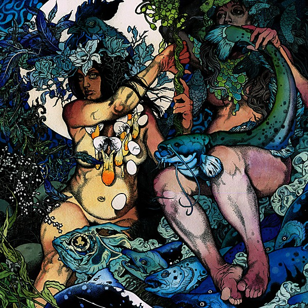

# Blue Record

By **Baroness**

## Album Data

- **Catalog:** Beets
- **Format:** Digital, Album
- **Album:** Blue Record
- **Artist:** Baroness
- **Albumartist:** Baroness
- **Genre:** Stoner Metal
- **MusicBrainz Album Artist ID:** [eeb41a1e-4326-4d04-8c47-0f564ceecd68](https://musicbrainz.org/artist/eeb41a1e-4326-4d04-8c47-0f564ceecd68)
- **MusicBrainz Album ID:** [a7530b17-d547-49a1-8ea7-87141ae5349b](https://musicbrainz.org/release/a7530b17-d547-49a1-8ea7-87141ae5349b)
- **MusicBrainz Release Group ID:** [d9a01dd4-31d2-43c5-bdf5-1666cf0d54ea](https://musicbrainz.org/release-group/d9a01dd4-31d2-43c5-bdf5-1666cf0d54ea)
- **Year:** 2009
- **Catalog #:** 
- **Label:** Relapse Records
- **Total Tracks:** 10

## Album Tracks

### Track 01 - Rays on Pinion

- **Artist:** Baroness
- **Format:** AAC
- **Genre:** Post-Metal
- **Length:** 7:35
- **MusicBrainz Track ID:** [7d90f946-769f-45a9-ad0a-cd5ec640e7aa](https://musicbrainz.org/recording/7d90f946-769f-45a9-ad0a-cd5ec640e7aa)
- **Title:** Rays on Pinion
- **Track:** 01
- **Year:** 2007

### Track 02 - The Birthing

- **Artist:** Baroness
- **Format:** AAC
- **Genre:** Stoner Metal
- **Length:** 5:03
- **MusicBrainz Track ID:** [2b64b783-337a-4eb7-965e-44449f540998](https://musicbrainz.org/recording/2b64b783-337a-4eb7-965e-44449f540998)
- **Title:** The Birthing
- **Track:** 02
- **Year:** 2007

### Track 03 - Isak

- **Artist:** Baroness
- **Format:** AAC
- **Genre:** Stoner Metal
- **Length:** 4:22
- **MusicBrainz Track ID:** [34b0354f-60ad-46ca-b376-2fa255c771a4](https://musicbrainz.org/recording/34b0354f-60ad-46ca-b376-2fa255c771a4)
- **Title:** Isak
- **Track:** 03
- **Year:** 2007

### Track 04 - Wailing Wintry Wind

- **Artist:** Baroness
- **Format:** AAC
- **Genre:** Post-Metal
- **Length:** 5:54
- **MusicBrainz Track ID:** [9a4710f3-4d6b-47ae-a8cf-cf0c535e5008](https://musicbrainz.org/recording/9a4710f3-4d6b-47ae-a8cf-cf0c535e5008)
- **Title:** Wailing Wintry Wind
- **Track:** 04
- **Year:** 2007

### Track 05 - Cockroach en fleur

- **Artist:** Baroness
- **Format:** AAC
- **Genre:** Post-Metal
- **Length:** 1:50
- **MusicBrainz Track ID:** [85e6f247-7bf5-40a1-ba35-2feebef2cb32](https://musicbrainz.org/recording/85e6f247-7bf5-40a1-ba35-2feebef2cb32)
- **Title:** Cockroach en fleur
- **Track:** 05
- **Year:** 2007

### Track 06 - Wanderlust

- **Artist:** Baroness
- **Format:** AAC
- **Genre:** Post-Metal
- **Length:** 4:29
- **MusicBrainz Track ID:** [86ee7fba-de6c-4d47-9567-9ce0581c4145](https://musicbrainz.org/recording/86ee7fba-de6c-4d47-9567-9ce0581c4145)
- **Title:** Wanderlust
- **Track:** 06
- **Year:** 2007

### Track 07 - Aleph

- **Artist:** Baroness
- **Format:** AAC
- **Genre:** Post-Metal
- **Length:** 4:21
- **MusicBrainz Track ID:** [c76ed685-5e46-48f0-b702-22282f865142](https://musicbrainz.org/recording/c76ed685-5e46-48f0-b702-22282f865142)
- **Title:** Aleph
- **Track:** 07
- **Year:** 2007

### Track 08 - Teeth of a Cogwheel

- **Artist:** Baroness
- **Format:** AAC
- **Genre:** Post-Metal
- **Length:** 2:16
- **MusicBrainz Track ID:** [b8a05b97-9e7d-4377-85a9-5cb2f7c8a346](https://musicbrainz.org/recording/b8a05b97-9e7d-4377-85a9-5cb2f7c8a346)
- **Title:** Teeth of a Cogwheel
- **Track:** 08
- **Year:** 2007

### Track 09 - O’Appalachia

- **Artist:** Baroness
- **Format:** AAC
- **Genre:** Stoner Metal
- **Length:** 2:36
- **MusicBrainz Track ID:** [da381b47-8a67-419f-91db-1edf890b5ddf](https://musicbrainz.org/recording/da381b47-8a67-419f-91db-1edf890b5ddf)
- **Title:** O’Appalachia
- **Track:** 09
- **Year:** 2007

### Track 10 - Grad

- **Artist:** Baroness
- **Format:** AAC
- **Genre:** Stoner Metal
- **Length:** 5:54
- **MusicBrainz Track ID:** [26cbcaae-1923-4ecb-bf71-e95d7b9aa00b](https://musicbrainz.org/recording/26cbcaae-1923-4ecb-bf71-e95d7b9aa00b)
- **Title:** Grad
- **Track:** 10
- **Year:** 2007

## See also

- [Red Album](Red_Album.md)
- [Second](Second.md)
