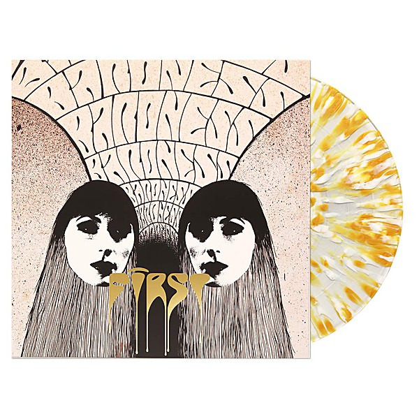

# Second

By **Baroness**

## Album Data

- **Catalog:** Beets
- **Format:** Digital, Album
- **Album:** Second
- **Artist:** Baroness
- **Albumartist:** Baroness
- **Genre:** Mathcore
- **MusicBrainz Album Artist ID:** [eeb41a1e-4326-4d04-8c47-0f564ceecd68](https://musicbrainz.org/artist/eeb41a1e-4326-4d04-8c47-0f564ceecd68)
- **MusicBrainz Album ID:** [7116fbc6-c1da-4bb7-8645-05234af1e720](https://musicbrainz.org/release/7116fbc6-c1da-4bb7-8645-05234af1e720)
- **MusicBrainz Release Group ID:** [cd90b04d-2f30-3a79-82d7-804a9c5b4493](https://musicbrainz.org/release-group/cd90b04d-2f30-3a79-82d7-804a9c5b4493)
- **Year:** 2005
- **Catalog #:** hr010
- **Label:** Hyperrealist Records
- **Total Tracks:** 03

## Album Tracks

### Track 01 - Red Sky

- **Artist:** Baroness
- **Format:** AAC
- **Genre:** Post-Hardcore
- **Length:** 5:44
- **MusicBrainz Track ID:** [4df3fc1d-7be1-427a-a879-d3ef42b6326e](https://musicbrainz.org/recording/4df3fc1d-7be1-427a-a879-d3ef42b6326e)
- **Title:** Red Sky
- **Track:** 01
- **Year:** 2005

### Track 02 - Son of Sun

- **Artist:** Baroness
- **Format:** AAC
- **Genre:** Groove Metal
- **Length:** 7:04
- **MusicBrainz Track ID:** [48630e0e-3aa2-491e-b633-7aa488d6eb58](https://musicbrainz.org/recording/48630e0e-3aa2-491e-b633-7aa488d6eb58)
- **Title:** Son of Sun
- **Track:** 02
- **Year:** 2005

### Track 03 - Vision

- **Artist:** Baroness
- **Format:** AAC
- **Genre:** Post-Metal
- **Length:** 7:32
- **MusicBrainz Track ID:** [154d45d8-c528-4413-9558-0c01ce622805](https://musicbrainz.org/recording/154d45d8-c528-4413-9558-0c01ce622805)
- **Title:** Vision
- **Track:** 03
- **Year:** 2005

## See also

- [Blue Record](Blue_Record.md)
- [Red Album](Red_Album.md)
