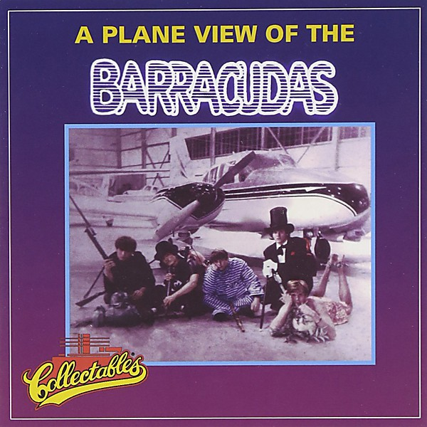

# A Plane View Of The Barracudas

By **Barracudas**

## Album Data

- **Catalog:** Beets
- **Format:** Digital, Album
- **Album:** A Plane View Of The Barracudas
- **Artist:** Barracudas
- **Albumartist:** Barracudas
- **Genre:** Surf Rock
- **MusicBrainz Album Artist ID:** 
- **MusicBrainz Album ID:** 
- **MusicBrainz Release Group ID:** 
- **Year:** 1967
- **Catalog #:** 
- **Label:** Collectables
- **Total Tracks:** 00

## Album Tracks

### Track 14 - all my lovin'

- **Artist:** Barracudas
- **Format:** MP3
- **Genre:** Surf Rock
- **Length:** 2:04
- **MusicBrainz Track ID:** 
- **Title:** all my lovin'
- **Track:** 14
- **Year:** 1967

