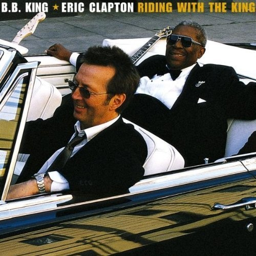

# Riding With the King

By **B.B. King & Eric Clapton**

## Album Data

- **Catalog:** Beets
- **Format:** Digital, Album
- **Album:** Riding With the King
- **Artist:** B.b. King & Eric Clapton
- **Albumartist:** B.B. King & Eric Clapton
- **Genre:** Rock
- **MusicBrainz Album Artist ID:** [dcb03ce3-67a5-4eb3-b2d1-2a12d93a38f3](https://musicbrainz.org/artist/dcb03ce3-67a5-4eb3-b2d1-2a12d93a38f3)
- **MusicBrainz Album ID:** [49e00206-2955-48a8-a9ba-a58a2fda916e](https://musicbrainz.org/release/49e00206-2955-48a8-a9ba-a58a2fda916e)
- **MusicBrainz Release Group ID:** [866529e9-0ca2-35fa-8c6f-65ec1424ff0e](https://musicbrainz.org/release-group/866529e9-0ca2-35fa-8c6f-65ec1424ff0e)
- **Year:** 2000
- **Catalog #:** 9 47612-2
- **Label:** Reprise Records
- **Total Tracks:** 12

## Album Tracks

### Track 01 - Riding With the King

- **Artist:** B.B. King & Eric Clapton
- **Format:** ALAC
- **Genre:** Rock
- **Length:** 4:23
- **MusicBrainz Track ID:** [5212e895-9b71-403e-a421-21a45f7bfe92](https://musicbrainz.org/recording/5212e895-9b71-403e-a421-21a45f7bfe92)
- **Title:** Riding With the King
- **Track:** 01
- **Year:** 2000

### Track 02 - Ten Long Years

- **Artist:** B.B. King & Eric Clapton
- **Format:** ALAC
- **Genre:** Blues
- **Length:** 4:40
- **MusicBrainz Track ID:** [b0e8b32a-2d7b-48b1-8c2d-1763d57eefa8](https://musicbrainz.org/recording/b0e8b32a-2d7b-48b1-8c2d-1763d57eefa8)
- **Title:** Ten Long Years
- **Track:** 02
- **Year:** 2000

### Track 03 - Key to the Highway

- **Artist:** B.B. King & Eric Clapton
- **Format:** ALAC
- **Genre:** Blues
- **Length:** 3:39
- **MusicBrainz Track ID:** [e059a6c6-e327-40f1-bff2-612fd7e92e95](https://musicbrainz.org/recording/e059a6c6-e327-40f1-bff2-612fd7e92e95)
- **Title:** Key to the Highway
- **Track:** 03
- **Year:** 2000

### Track 04 - Marry You

- **Artist:** B.B. King & Eric Clapton
- **Format:** ALAC
- **Genre:** Rock
- **Length:** 4:59
- **MusicBrainz Track ID:** [5695b940-7e6b-4a0a-8ade-6bf9b73c1b81](https://musicbrainz.org/recording/5695b940-7e6b-4a0a-8ade-6bf9b73c1b81)
- **Title:** Marry You
- **Track:** 04
- **Year:** 2000

### Track 05 - Three O’Clock Blues

- **Artist:** B.B. King & Eric Clapton
- **Format:** ALAC
- **Genre:** Rock
- **Length:** 8:36
- **MusicBrainz Track ID:** [57523321-7083-44e7-9d8a-061a6af1914f](https://musicbrainz.org/recording/57523321-7083-44e7-9d8a-061a6af1914f)
- **Title:** Three O’Clock Blues
- **Track:** 05
- **Year:** 2000

### Track 06 - Help the Poor

- **Artist:** B.B. King & Eric Clapton
- **Format:** ALAC
- **Genre:** Rock
- **Length:** 5:06
- **MusicBrainz Track ID:** [af9d3a32-c59e-46ce-b704-336e06f97de8](https://musicbrainz.org/recording/af9d3a32-c59e-46ce-b704-336e06f97de8)
- **Title:** Help the Poor
- **Track:** 06
- **Year:** 2000

### Track 07 - I Wanna Be

- **Artist:** B.B. King & Eric Clapton
- **Format:** ALAC
- **Genre:** Rock
- **Length:** 4:45
- **MusicBrainz Track ID:** [16eec74f-bd03-4155-b43c-fd2b112bb1d4](https://musicbrainz.org/recording/16eec74f-bd03-4155-b43c-fd2b112bb1d4)
- **Title:** I Wanna Be
- **Track:** 07
- **Year:** 2000

### Track 08 - Worried Life Blues

- **Artist:** B.B. King & Eric Clapton
- **Format:** ALAC
- **Genre:** Blues
- **Length:** 4:25
- **MusicBrainz Track ID:** [7d5f9f0b-46ba-4da5-b158-b99adb1b97fb](https://musicbrainz.org/recording/7d5f9f0b-46ba-4da5-b158-b99adb1b97fb)
- **Title:** Worried Life Blues
- **Track:** 08
- **Year:** 2000

### Track 09 - Days of Old

- **Artist:** B.B. King & Eric Clapton
- **Format:** ALAC
- **Genre:** Rock
- **Length:** 3:00
- **MusicBrainz Track ID:** [959707a7-06a9-45e8-94d8-f008a63ead4f](https://musicbrainz.org/recording/959707a7-06a9-45e8-94d8-f008a63ead4f)
- **Title:** Days of Old
- **Track:** 09
- **Year:** 2000

### Track 10 - When My Heart Beats Like a Hammer

- **Artist:** B.B. King & Eric Clapton
- **Format:** ALAC
- **Genre:** Blues
- **Length:** 7:09
- **MusicBrainz Track ID:** [ac671b84-f65e-4acb-8eda-2579a27c63c1](https://musicbrainz.org/recording/ac671b84-f65e-4acb-8eda-2579a27c63c1)
- **Title:** When My Heart Beats Like a Hammer
- **Track:** 10
- **Year:** 2000

### Track 11 - Hold On I’m Coming

- **Artist:** B.B. King & Eric Clapton
- **Format:** ALAC
- **Genre:** Rock
- **Length:** 6:20
- **MusicBrainz Track ID:** [7f4ede8f-e4e5-4487-a092-9a0ded1d8960](https://musicbrainz.org/recording/7f4ede8f-e4e5-4487-a092-9a0ded1d8960)
- **Title:** Hold On I’m Coming
- **Track:** 11
- **Year:** 2000

### Track 12 - Come Rain or Come Shine

- **Artist:** B.B. King & Eric Clapton
- **Format:** ALAC
- **Genre:** Blues
- **Length:** 4:11
- **MusicBrainz Track ID:** [48202995-4078-45cf-980e-cb65fc722f7b](https://musicbrainz.org/recording/48202995-4078-45cf-980e-cb65fc722f7b)
- **Title:** Come Rain or Come Shine
- **Track:** 12
- **Year:** 2000

