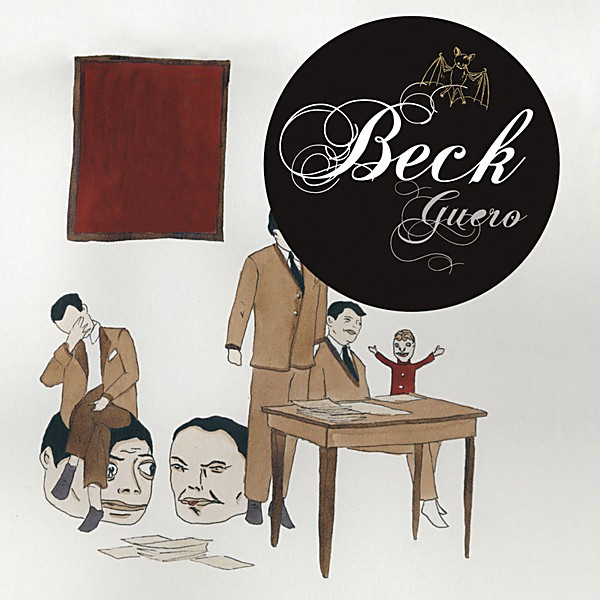

# Guero

By **Beck**

## Album Data

- **Catalog:** Beets
- **Format:** Digital, Album
- **Album:** Guero
- **Artist:** Beck
- **Albumartist:** Beck
- **Genre:** Indie Rock
- **MusicBrainz Album Artist ID:** [309c62ba-7a22-4277-9f67-4a162526d18a](https://musicbrainz.org/artist/309c62ba-7a22-4277-9f67-4a162526d18a)
- **MusicBrainz Album ID:** [c3619bbc-887b-4012-9024-0b7806333c4d](https://musicbrainz.org/release/c3619bbc-887b-4012-9024-0b7806333c4d)
- **MusicBrainz Release Group ID:** [e49e2f8a-94c0-3dcf-8ce6-9bc52a1a7867](https://musicbrainz.org/release-group/e49e2f8a-94c0-3dcf-8ce6-9bc52a1a7867)
- **Year:** 2005
- **Catalog #:** 
- **Label:** 
- **Total Tracks:** 11

## Album Tracks

### Track 01 - Sexx Laws

- **Artist:** Beck
- **Format:** AAC
- **Genre:** Indie Rock
- **Length:** 3:39
- **MusicBrainz Track ID:** 
- **Title:** Sexx Laws
- **Track:** 01
- **Year:** 1999

### Track 02 - Nicotine and Gravy

- **Artist:** Beck
- **Format:** AAC
- **Genre:** Indie Rock
- **Length:** 5:12
- **MusicBrainz Track ID:** 
- **Title:** Nicotine and Gravy
- **Track:** 02
- **Year:** 1999

### Track 03 - Mixed Bizness

- **Artist:** Beck
- **Format:** MP3
- **Genre:** Indie Rock
- **Length:** 4:10
- **MusicBrainz Track ID:** 
- **Title:** Mixed Bizness
- **Track:** 03
- **Year:** 1999

### Track 06 - Peaches & Cream

- **Artist:** Beck
- **Format:** AAC
- **Genre:** Indie Rock
- **Length:** 4:54
- **MusicBrainz Track ID:** 
- **Title:** Peaches & Cream
- **Track:** 06
- **Year:** 0000

### Track 08 - Milk and Honey

- **Artist:** Beck
- **Format:** AAC
- **Genre:** Alternative Dance
- **Length:** 5:19
- **MusicBrainz Track ID:** 
- **Title:** Milk and Honey
- **Track:** 08
- **Year:** 0000

### Track 09 - Beautiful Way

- **Artist:** Beck
- **Format:** AAC
- **Genre:** Indie Rock
- **Length:** 5:37
- **MusicBrainz Track ID:** 
- **Title:** Beautiful Way
- **Track:** 09
- **Year:** 1999

### Track 10 - Pressure Zone

- **Artist:** Beck
- **Format:** MP3
- **Genre:** Indie Rock
- **Length:** 3:14
- **MusicBrainz Track ID:** 
- **Title:** Pressure Zone
- **Track:** 10
- **Year:** 1999

## See also

- [Colors](Colors.md)
- [Midnite Vultures](Midnite_Vultures.md)
- [Morning Phase](Morning_Phase.md)
- [Mutations](Mutations.md)
- [Sea Change](Sea_Change.md)
- [Roon: Colors](../../Roon/Beck/Colors.md)
- [Roon: Dark Places](../../Roon/Beck/Dark_Places.md)
- [Roon: Everlasting Nothing](../../Roon/Beck/Everlasting_Nothing.md)
- [Roon: Guero](../../Roon/Beck/Guero.md)
- [Roon: Morning Phase](../../Roon/Beck/Morning_Phase.md)
- [Roon: Odelay](../../Roon/Beck/Odelay.md)
- [Vinyl: ](../../Vinyl/Beck/Beck.md)
- [Vinyl: Colors](../../Vinyl/Beck/Colors.md)
