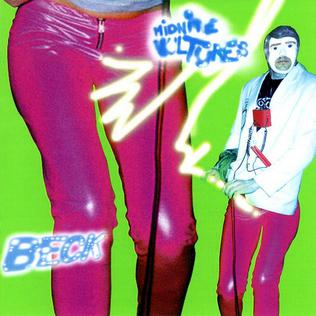

# Midnite Vultures

By **Beck**

## Album Data

- **Catalog:** Beets
- **Format:** Digital, Album
- **Album:** Midnite Vultures
- **Artist:** Beck
- **Albumartist:** Beck
- **Genre:** Funk
- **MusicBrainz Album Artist ID:** 
- **MusicBrainz Album ID:** 
- **MusicBrainz Release Group ID:** 
- **Year:** 1999
- **Catalog #:** 
- **Label:** Capitol Records
- **Total Tracks:** 13

## Album Tracks

### Track 01 - Cycle

- **Artist:** Beck
- **Format:** ALAC
- **Genre:** Folk Rock
- **Length:** 0:40
- **MusicBrainz Track ID:** [d0e94759-a734-4297-a995-fc1335907e03](https://musicbrainz.org/recording/d0e94759-a734-4297-a995-fc1335907e03)
- **Title:** Cycle
- **Track:** 01
- **Year:** 2014

### Track 02 - Morning

- **Artist:** Beck
- **Format:** ALAC
- **Genre:** Ska Punk
- **Length:** 5:19
- **MusicBrainz Track ID:** [45bc8627-f4b1-499b-9c99-1f79e24348a4](https://musicbrainz.org/recording/45bc8627-f4b1-499b-9c99-1f79e24348a4)
- **Title:** Morning
- **Track:** 02
- **Year:** 2014

### Track 03 - Heart Is a Drum

- **Artist:** Beck
- **Format:** ALAC
- **Genre:** Indie Rock
- **Length:** 4:31
- **MusicBrainz Track ID:** [6244520d-e1b5-4afb-b4fe-80b381ecb45a](https://musicbrainz.org/recording/6244520d-e1b5-4afb-b4fe-80b381ecb45a)
- **Title:** Heart Is a Drum
- **Track:** 03
- **Year:** 2014

### Track 04 - Say Goodbye

- **Artist:** Beck
- **Format:** ALAC
- **Genre:** Indie Rock
- **Length:** 3:29
- **MusicBrainz Track ID:** [0399e8c5-8a20-485d-b735-4a880715a61a](https://musicbrainz.org/recording/0399e8c5-8a20-485d-b735-4a880715a61a)
- **Title:** Say Goodbye
- **Track:** 04
- **Year:** 2014

### Track 05 - Blue Moon

- **Artist:** Beck
- **Format:** ALAC
- **Genre:** Indie Rock
- **Length:** 4:02
- **MusicBrainz Track ID:** [bfa1fac2-786e-45ab-b26a-3550ef5a9bac](https://musicbrainz.org/recording/bfa1fac2-786e-45ab-b26a-3550ef5a9bac)
- **Title:** Blue Moon
- **Track:** 05
- **Year:** 2014

### Track 06 - Unforgiven

- **Artist:** Beck
- **Format:** ALAC
- **Genre:** Indie Rock
- **Length:** 4:34
- **MusicBrainz Track ID:** [5f6231a0-4064-4f63-b98f-a1a56d201f73](https://musicbrainz.org/recording/5f6231a0-4064-4f63-b98f-a1a56d201f73)
- **Title:** Unforgiven
- **Track:** 06
- **Year:** 2014

### Track 07 - Wave

- **Artist:** Beck
- **Format:** ALAC
- **Genre:** Indie Rock
- **Length:** 3:40
- **MusicBrainz Track ID:** [1048fcb8-cf37-48bb-a69c-85ae643bfa1f](https://musicbrainz.org/recording/1048fcb8-cf37-48bb-a69c-85ae643bfa1f)
- **Title:** Wave
- **Track:** 07
- **Year:** 2014

### Track 08 - Don't Let It Go

- **Artist:** Beck
- **Format:** ALAC
- **Genre:** Indie Rock
- **Length:** 3:09
- **MusicBrainz Track ID:** [a2cae834-74cd-4e90-bd1b-69a2e34c8a05](https://musicbrainz.org/recording/a2cae834-74cd-4e90-bd1b-69a2e34c8a05)
- **Title:** Don't Let It Go
- **Track:** 08
- **Year:** 2014

### Track 09 - Blackbird Chain

- **Artist:** Beck
- **Format:** ALAC
- **Genre:** Folk Rock
- **Length:** 4:26
- **MusicBrainz Track ID:** [2f1511d2-e7b2-46bf-baa5-ff05c38c8ff6](https://musicbrainz.org/recording/2f1511d2-e7b2-46bf-baa5-ff05c38c8ff6)
- **Title:** Blackbird Chain
- **Track:** 09
- **Year:** 2014

### Track 10 - Phase

- **Artist:** Beck
- **Format:** ALAC
- **Genre:** Folk Rock
- **Length:** 1:03
- **MusicBrainz Track ID:** [baeac492-df17-4adc-b11d-f44c5de13f51](https://musicbrainz.org/recording/baeac492-df17-4adc-b11d-f44c5de13f51)
- **Title:** Phase
- **Track:** 10
- **Year:** 2014

### Track 11 - Turn Away

- **Artist:** Beck
- **Format:** ALAC
- **Genre:** Indie Rock
- **Length:** 3:05
- **MusicBrainz Track ID:** [9c9e1121-bc8f-4230-b648-638ee89c3e22](https://musicbrainz.org/recording/9c9e1121-bc8f-4230-b648-638ee89c3e22)
- **Title:** Turn Away
- **Track:** 11
- **Year:** 2014

### Track 12 - Country Down

- **Artist:** Beck
- **Format:** ALAC
- **Genre:** Folk Rock
- **Length:** 4:00
- **MusicBrainz Track ID:** [4b514017-868c-4783-bf75-461ca619edde](https://musicbrainz.org/recording/4b514017-868c-4783-bf75-461ca619edde)
- **Title:** Country Down
- **Track:** 12
- **Year:** 2014

### Track 13 - Waking Light

- **Artist:** Beck
- **Format:** ALAC
- **Genre:** Post-Rock
- **Length:** 5:02
- **MusicBrainz Track ID:** [1849c89d-4f82-4fdf-beb7-d61583b4ffc4](https://musicbrainz.org/recording/1849c89d-4f82-4fdf-beb7-d61583b4ffc4)
- **Title:** Waking Light
- **Track:** 13
- **Year:** 2014

## See also

- [Colors](Colors.md)
- [Guero](Guero.md)
- [Morning Phase](Morning_Phase.md)
- [Mutations](Mutations.md)
- [Sea Change](Sea_Change.md)
- [Roon: Colors](../../Roon/Beck/Colors.md)
- [Roon: Dark Places](../../Roon/Beck/Dark_Places.md)
- [Roon: Everlasting Nothing](../../Roon/Beck/Everlasting_Nothing.md)
- [Roon: Guero](../../Roon/Beck/Guero.md)
- [Roon: Morning Phase](../../Roon/Beck/Morning_Phase.md)
- [Roon: Odelay](../../Roon/Beck/Odelay.md)
- [Vinyl: ](../../Vinyl/Beck/Beck.md)
- [Vinyl: Colors](../../Vinyl/Beck/Colors.md)
