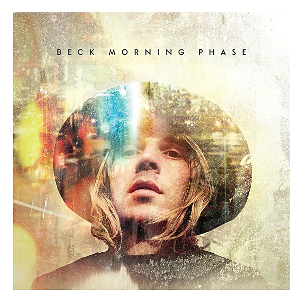

# Morning Phase

By **Beck**

## Album Data

- **Catalog:** Beets
- **Format:** Digital, Album
- **Album:** Morning Phase
- **Artist:** Beck
- **Albumartist:** Beck
- **Genre:** Folk Rock
- **MusicBrainz Album Artist ID:** [309c62ba-7a22-4277-9f67-4a162526d18a](https://musicbrainz.org/artist/309c62ba-7a22-4277-9f67-4a162526d18a)
- **MusicBrainz Album ID:** [621999be-7041-4394-8719-ca1bdebaac96](https://musicbrainz.org/release/621999be-7041-4394-8719-ca1bdebaac96)
- **MusicBrainz Release Group ID:** [bc4e1c5e-1fea-468d-b0ac-78b1c7f415f4](https://musicbrainz.org/release-group/bc4e1c5e-1fea-468d-b0ac-78b1c7f415f4)
- **Year:** 2014
- **Catalog #:** DGCSD-25309
- **Label:** DGC Records
- **Total Tracks:** 11

## Album Tracks

### Track 01 - Cold Brains

- **Artist:** Beck
- **Format:** ALAC
- **Genre:** Indie Rock
- **Length:** 3:41
- **MusicBrainz Track ID:** [9155d32e-ea14-45ab-b418-0475d10be664](https://musicbrainz.org/recording/9155d32e-ea14-45ab-b418-0475d10be664)
- **Title:** Cold Brains
- **Track:** 01
- **Year:** 1998

### Track 02 - Nobody's Fault but My Own

- **Artist:** Beck
- **Format:** ALAC
- **Genre:** Indie Rock
- **Length:** 5:02
- **MusicBrainz Track ID:** [2b59c2f2-2be2-443d-ac08-92fa8201dc77](https://musicbrainz.org/recording/2b59c2f2-2be2-443d-ac08-92fa8201dc77)
- **Title:** Nobody's Fault but My Own
- **Track:** 02
- **Year:** 1998

### Track 03 - Lazy Flies

- **Artist:** Beck
- **Format:** ALAC
- **Genre:** Lo-Fi
- **Length:** 3:43
- **MusicBrainz Track ID:** [384861e7-666a-473e-b725-dcb5da509dc6](https://musicbrainz.org/recording/384861e7-666a-473e-b725-dcb5da509dc6)
- **Title:** Lazy Flies
- **Track:** 03
- **Year:** 1998

### Track 04 - Canceled Check

- **Artist:** Beck
- **Format:** ALAC
- **Genre:** Indie Rock
- **Length:** 3:14
- **MusicBrainz Track ID:** [431dc724-cc0a-4a5d-b6ac-bae7ce437003](https://musicbrainz.org/recording/431dc724-cc0a-4a5d-b6ac-bae7ce437003)
- **Title:** Canceled Check
- **Track:** 04
- **Year:** 1998

### Track 05 - We Live Again

- **Artist:** Beck
- **Format:** ALAC
- **Genre:** Indie Rock
- **Length:** 3:04
- **MusicBrainz Track ID:** [fc0a9f07-739f-4ae6-8b6d-84911c115d40](https://musicbrainz.org/recording/fc0a9f07-739f-4ae6-8b6d-84911c115d40)
- **Title:** We Live Again
- **Track:** 05
- **Year:** 1998

### Track 06 - Tropicalia

- **Artist:** Beck
- **Format:** ALAC
- **Genre:** Tropicalia
- **Length:** 3:20
- **MusicBrainz Track ID:** [16994337-ca9f-42cc-8c5c-5f9a4a5ec657](https://musicbrainz.org/recording/16994337-ca9f-42cc-8c5c-5f9a4a5ec657)
- **Title:** Tropicalia
- **Track:** 06
- **Year:** 1998

### Track 07 - Dead Melodies

- **Artist:** Beck
- **Format:** ALAC
- **Genre:** Indie Rock
- **Length:** 2:35
- **MusicBrainz Track ID:** [6c6fe4c5-cce0-494f-b723-1f2e3f8790f0](https://musicbrainz.org/recording/6c6fe4c5-cce0-494f-b723-1f2e3f8790f0)
- **Title:** Dead Melodies
- **Track:** 07
- **Year:** 1998

### Track 08 - Bottle of Blues

- **Artist:** Beck
- **Format:** ALAC
- **Genre:** Indie Rock
- **Length:** 4:55
- **MusicBrainz Track ID:** [32e703e2-5a8b-4fdd-87ce-34671263de0b](https://musicbrainz.org/recording/32e703e2-5a8b-4fdd-87ce-34671263de0b)
- **Title:** Bottle of Blues
- **Track:** 08
- **Year:** 1998

### Track 09 - O Maria

- **Artist:** Beck
- **Format:** ALAC
- **Genre:** Indie Rock
- **Length:** 4:00
- **MusicBrainz Track ID:** [8718f6b9-6f72-4b9b-a4d3-7626a9133cee](https://musicbrainz.org/recording/8718f6b9-6f72-4b9b-a4d3-7626a9133cee)
- **Title:** O Maria
- **Track:** 09
- **Year:** 1998

### Track 10 - Sing It Again

- **Artist:** Beck
- **Format:** ALAC
- **Genre:** Alternative Rock
- **Length:** 4:19
- **MusicBrainz Track ID:** [1d3a5e7d-5ee9-4fdf-98f5-a317a9479441](https://musicbrainz.org/recording/1d3a5e7d-5ee9-4fdf-98f5-a317a9479441)
- **Title:** Sing It Again
- **Track:** 10
- **Year:** 1998

### Track 11 - Static / [Diamond Bollocks]

- **Artist:** Beck
- **Format:** ALAC
- **Genre:** Indie Rock
- **Length:** 11:19
- **MusicBrainz Track ID:** [e82cd0d6-a5f5-4540-8159-6b768988f4bd](https://musicbrainz.org/recording/e82cd0d6-a5f5-4540-8159-6b768988f4bd)
- **Title:** Static / [Diamond Bollocks]
- **Track:** 11
- **Year:** 1998

## See also

- [Colors](Colors.md)
- [Guero](Guero.md)
- [Midnite Vultures](Midnite_Vultures.md)
- [Mutations](Mutations.md)
- [Sea Change](Sea_Change.md)
- [Roon: Colors](../../Roon/Beck/Colors.md)
- [Roon: Dark Places](../../Roon/Beck/Dark_Places.md)
- [Roon: Everlasting Nothing](../../Roon/Beck/Everlasting_Nothing.md)
- [Roon: Guero](../../Roon/Beck/Guero.md)
- [Roon: Morning Phase](../../Roon/Beck/Morning_Phase.md)
- [Roon: Odelay](../../Roon/Beck/Odelay.md)
- [Vinyl: ](../../Vinyl/Beck/Beck.md)
- [Vinyl: Colors](../../Vinyl/Beck/Colors.md)
