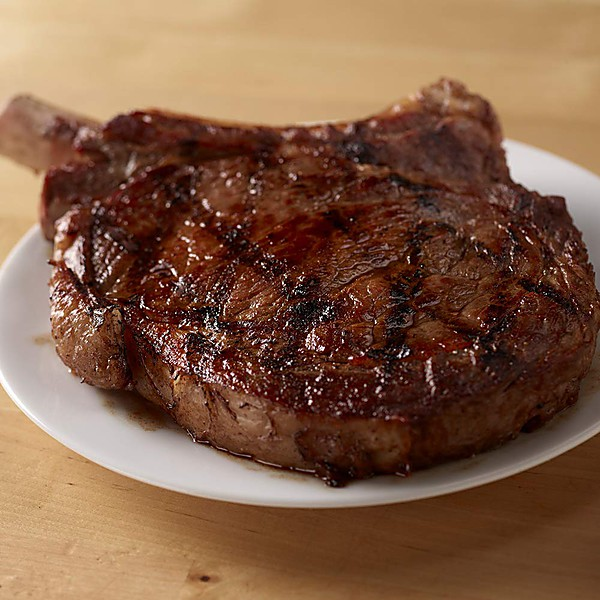

# Greatest Hits Vol. 2

By **Becker & Fagen - Founders Of Steely Dan**

## Album Data

- **Catalog:** Beets
- **Format:** Digital, Album
- **Album:** Greatest Hits Vol. 2
- **Artist:** Becker & Fagen - Founders Of Steely Dan
- **Albumartist:** Becker & Fagen - Founders Of Steely Dan
- **Genre:** Rock
- **MusicBrainz Album Artist ID:** 
- **MusicBrainz Album ID:** 
- **MusicBrainz Release Group ID:** 
- **Year:** 0000
- **Catalog #:** 
- **Label:** 
- **Total Tracks:** 11

## Album Tracks

### Track 01 - Charlie Freak

- **Artist:** Becker & Fagen - Founders Of Steely Dan
- **Format:** ALAC
- **Genre:** Rock
- **Length:** 2:37
- **MusicBrainz Track ID:** 
- **Title:** Charlie Freak
- **Track:** 01
- **Year:** 0000

### Track 02 - The Roaring Of The Lamb

- **Artist:** Becker & Fagen - Founders Of Steely Dan
- **Format:** ALAC
- **Genre:** Rock
- **Length:** 3:05
- **MusicBrainz Track ID:** 
- **Title:** The Roaring Of The Lamb
- **Track:** 02
- **Year:** 0000

### Track 03 - Soul Ram

- **Artist:** Becker & Fagen - Founders Of Steely Dan
- **Format:** ALAC
- **Genre:** Rock
- **Length:** 2:08
- **MusicBrainz Track ID:** 
- **Title:** Soul Ram
- **Track:** 03
- **Year:** 0000

### Track 04 - Brooklyn

- **Artist:** Becker & Fagen - Founders Of Steely Dan
- **Format:** ALAC
- **Genre:** Rock
- **Length:** 5:55
- **MusicBrainz Track ID:** 
- **Title:** Brooklyn
- **Track:** 04
- **Year:** 0000

### Track 05 - A Little With Sugar

- **Artist:** Becker & Fagen - Founders Of Steely Dan
- **Format:** ALAC
- **Genre:** Rock
- **Length:** 3:28
- **MusicBrainz Track ID:** 
- **Title:** A Little With Sugar
- **Track:** 05
- **Year:** 0000

### Track 06 - You Go Where I Go

- **Artist:** Becker & Fagen - Founders Of Steely Dan
- **Format:** ALAC
- **Genre:** Rock
- **Length:** 2:05
- **MusicBrainz Track ID:** 
- **Title:** You Go Where I Go
- **Track:** 06
- **Year:** 0000

### Track 07 - Ida Lee

- **Artist:** Becker & Fagen - Founders Of Steely Dan
- **Format:** ALAC
- **Genre:** Rock
- **Length:** 3:39
- **MusicBrainz Track ID:** 
- **Title:** Ida Lee
- **Track:** 07
- **Year:** 0000

### Track 08 - Any World

- **Artist:** Becker & Fagen - Founders Of Steely Dan
- **Format:** ALAC
- **Genre:** Rock
- **Length:** 3:38
- **MusicBrainz Track ID:** 
- **Title:** Any World
- **Track:** 08
- **Year:** 0000

### Track 09 - This Seat's Been Taken

- **Artist:** Becker & Fagen - Founders Of Steely Dan
- **Format:** ALAC
- **Genre:** Rock
- **Length:** 2:40
- **MusicBrainz Track ID:** 
- **Title:** This Seat's Been Taken
- **Track:** 09
- **Year:** 0000

### Track 10 - Berrytown

- **Artist:** Becker & Fagen - Founders Of Steely Dan
- **Format:** ALAC
- **Genre:** Rock
- **Length:** 2:46
- **MusicBrainz Track ID:** 
- **Title:** Berrytown
- **Track:** 10
- **Year:** 0000

### Track 11 - Sun Mountain

- **Artist:** Becker & Fagen - Founders Of Steely Dan
- **Format:** ALAC
- **Genre:** Rock
- **Length:** 2:48
- **MusicBrainz Track ID:** 
- **Title:** Sun Mountain
- **Track:** 11
- **Year:** 0000

