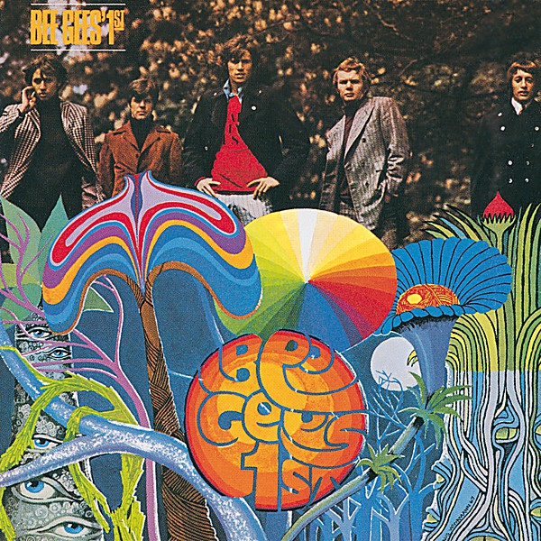

# Bee Gees' 1st

By **Bee Gees**

## Album Data

- **Catalog:** Beets
- **Format:** Digital, Album
- **Album:** Bee Gees' 1st
- **Artist:** Bee Gees
- **Albumartist:** Bee Gees
- **Genre:** Surf Rock
- **MusicBrainz Album Artist ID:** [bf0f7e29-dfe1-416c-b5c6-f9ebc19ea810](https://musicbrainz.org/artist/bf0f7e29-dfe1-416c-b5c6-f9ebc19ea810)
- **MusicBrainz Album ID:** [051a6028-bae4-349f-a887-2c20196f469f](https://musicbrainz.org/release/051a6028-bae4-349f-a887-2c20196f469f)
- **MusicBrainz Release Group ID:** [1eeb9586-7c42-3de7-b367-2552b42de905](https://musicbrainz.org/release-group/1eeb9586-7c42-3de7-b367-2552b42de905)
- **Year:** 1967
- **Catalog #:** R2 516159
- **Label:** Reprise Records
- **Total Tracks:** 57

## Album Tracks

### Track 01 - Odessa (City on the Black Sea)

- **Artist:** Bee Gees
- **Format:** MP3
- **Genre:** Symphony
- **Length:** 7:31
- **MusicBrainz Track ID:** [79cd904b-8d38-40d2-bb53-578e4ac15866](https://musicbrainz.org/recording/79cd904b-8d38-40d2-bb53-578e4ac15866)
- **Title:** Odessa (City on the Black Sea)
- **Track:** 01
- **Year:** 2009

### Track 02 - You'll Never See My Face Again

- **Artist:** Bee Gees
- **Format:** MP3
- **Genre:** Psychedelic Pop
- **Length:** 4:24
- **MusicBrainz Track ID:** [f79b8f07-1a08-4881-9cf0-2b72220ac966](https://musicbrainz.org/recording/f79b8f07-1a08-4881-9cf0-2b72220ac966)
- **Title:** You'll Never See My Face Again
- **Track:** 02
- **Year:** 2009

### Track 03 - Black Diamond

- **Artist:** Bee Gees
- **Format:** MP3
- **Genre:** Psychedelic Pop
- **Length:** 3:30
- **MusicBrainz Track ID:** [28be86b1-1ca9-4b2b-a260-aff0d419d032](https://musicbrainz.org/recording/28be86b1-1ca9-4b2b-a260-aff0d419d032)
- **Title:** Black Diamond
- **Track:** 03
- **Year:** 2009

### Track 04 - Marley Purt Drive

- **Artist:** Bee Gees
- **Format:** MP3
- **Genre:** Psychedelic Pop
- **Length:** 4:28
- **MusicBrainz Track ID:** [4dcda3e7-06a2-4193-8105-08139eadc31e](https://musicbrainz.org/recording/4dcda3e7-06a2-4193-8105-08139eadc31e)
- **Title:** Marley Purt Drive
- **Track:** 04
- **Year:** 2009

### Track 05 - Edison

- **Artist:** Bee Gees
- **Format:** MP3
- **Genre:** Psychedelic Pop
- **Length:** 3:10
- **MusicBrainz Track ID:** [4f9757f5-5a41-4b35-9018-feec4474d861](https://musicbrainz.org/recording/4f9757f5-5a41-4b35-9018-feec4474d861)
- **Title:** Edison
- **Track:** 05
- **Year:** 2009

### Track 06 - Melody Fair

- **Artist:** Bee Gees
- **Format:** MP3
- **Genre:** Soft Rock
- **Length:** 3:49
- **MusicBrainz Track ID:** [dffe6031-9368-4488-98c3-0fea1a4100df](https://musicbrainz.org/recording/dffe6031-9368-4488-98c3-0fea1a4100df)
- **Title:** Melody Fair
- **Track:** 06
- **Year:** 2009

### Track 07 - Suddenly

- **Artist:** Bee Gees
- **Format:** MP3
- **Genre:** Psychedelic Pop
- **Length:** 2:32
- **MusicBrainz Track ID:** [09cb52c6-ec69-40e4-80ea-6e78ffbd27bb](https://musicbrainz.org/recording/09cb52c6-ec69-40e4-80ea-6e78ffbd27bb)
- **Title:** Suddenly
- **Track:** 07
- **Year:** 2009

### Track 08 - Whisper Whisper

- **Artist:** Bee Gees
- **Format:** MP3
- **Genre:** Psychedelic Pop
- **Length:** 3:26
- **MusicBrainz Track ID:** [406d9012-2765-42bf-8cc0-e83d33e90360](https://musicbrainz.org/recording/406d9012-2765-42bf-8cc0-e83d33e90360)
- **Title:** Whisper Whisper
- **Track:** 08
- **Year:** 2009

### Track 09 - Lamplight

- **Artist:** Bee Gees
- **Format:** MP3
- **Genre:** Soft Rock
- **Length:** 4:50
- **MusicBrainz Track ID:** [6cf9c0f0-3c3d-40b7-9fd2-cff4a7ef7104](https://musicbrainz.org/recording/6cf9c0f0-3c3d-40b7-9fd2-cff4a7ef7104)
- **Title:** Lamplight
- **Track:** 09
- **Year:** 2009

### Track 10 - Sound of Love

- **Artist:** Bee Gees
- **Format:** MP3
- **Genre:** Soft Rock
- **Length:** 3:31
- **MusicBrainz Track ID:** [99720ff5-e467-4bc5-9df6-582bad070ab1](https://musicbrainz.org/recording/99720ff5-e467-4bc5-9df6-582bad070ab1)
- **Title:** Sound of Love
- **Track:** 10
- **Year:** 2009

### Track 11 - Give Your Best

- **Artist:** Bee Gees
- **Format:** MP3
- **Genre:** Psychedelic Pop
- **Length:** 3:28
- **MusicBrainz Track ID:** [221e43d0-b143-4846-a108-7339e2ec5373](https://musicbrainz.org/recording/221e43d0-b143-4846-a108-7339e2ec5373)
- **Title:** Give Your Best
- **Track:** 11
- **Year:** 2009

### Track 12 - Seven Seas Symphony

- **Artist:** Bee Gees
- **Format:** MP3
- **Genre:** Orchestral
- **Length:** 4:11
- **MusicBrainz Track ID:** [be1316b0-ffe0-4984-afff-67a2eb9f7548](https://musicbrainz.org/recording/be1316b0-ffe0-4984-afff-67a2eb9f7548)
- **Title:** Seven Seas Symphony
- **Track:** 12
- **Year:** 2009

### Track 13 - With All Nations (International Anthem)

- **Artist:** Bee Gees
- **Format:** MP3
- **Genre:** Pop
- **Length:** 1:49
- **MusicBrainz Track ID:** [18e52501-6c23-4b82-b10c-88531178ba88](https://musicbrainz.org/recording/18e52501-6c23-4b82-b10c-88531178ba88)
- **Title:** With All Nations (International Anthem)
- **Track:** 13
- **Year:** 2009

### Track 14 - I Laugh in Your Face

- **Artist:** Bee Gees
- **Format:** MP3
- **Genre:** Psychedelic Pop
- **Length:** 4:13
- **MusicBrainz Track ID:** [d21a2776-262f-4821-83be-58131efb7357](https://musicbrainz.org/recording/d21a2776-262f-4821-83be-58131efb7357)
- **Title:** I Laugh in Your Face
- **Track:** 14
- **Year:** 2009

### Track 15 - Never Say Never Again

- **Artist:** Bee Gees
- **Format:** MP3
- **Genre:** Psychedelic Pop
- **Length:** 3:32
- **MusicBrainz Track ID:** [e67fa615-b242-4b03-8b94-52a8895b1b0e](https://musicbrainz.org/recording/e67fa615-b242-4b03-8b94-52a8895b1b0e)
- **Title:** Never Say Never Again
- **Track:** 15
- **Year:** 2009

### Track 16 - First of May

- **Artist:** Bee Gees
- **Format:** MP3
- **Genre:** Soft Rock
- **Length:** 2:51
- **MusicBrainz Track ID:** [a39f289d-06f6-4f4b-b1db-b1f047c41bac](https://musicbrainz.org/recording/a39f289d-06f6-4f4b-b1db-b1f047c41bac)
- **Title:** First of May
- **Track:** 16
- **Year:** 2009

### Track 17 - The British Opera

- **Artist:** Bee Gees
- **Format:** MP3
- **Genre:** Psychedelic Pop
- **Length:** 3:17
- **MusicBrainz Track ID:** [6bdfb9be-4d9b-42cc-9c21-fcb08071d31b](https://musicbrainz.org/recording/6bdfb9be-4d9b-42cc-9c21-fcb08071d31b)
- **Title:** The British Opera
- **Track:** 17
- **Year:** 2009

### Track 18 - Odessa (City on the Black Sea)

- **Artist:** Bee Gees
- **Format:** MP3
- **Genre:** Symphony
- **Length:** 7:30
- **MusicBrainz Track ID:** [3d22fbbd-6c0f-4b2e-8599-d353f1811952](https://musicbrainz.org/recording/3d22fbbd-6c0f-4b2e-8599-d353f1811952)
- **Title:** Odessa (City on the Black Sea)
- **Track:** 18
- **Year:** 2009

### Track 19 - You’ll Never See My Face Again

- **Artist:** Bee Gees
- **Format:** MP3
- **Genre:** Psychedelic Pop
- **Length:** 4:15
- **MusicBrainz Track ID:** [7563240a-9234-4d4a-a86b-3e16a15f5f25](https://musicbrainz.org/recording/7563240a-9234-4d4a-a86b-3e16a15f5f25)
- **Title:** You’ll Never See My Face Again
- **Track:** 19
- **Year:** 2009

### Track 20 - Black Diamond

- **Artist:** Bee Gees
- **Format:** MP3
- **Genre:** Psychedelic Pop
- **Length:** 3:32
- **MusicBrainz Track ID:** [292eae51-1112-41bd-8b78-cfadc9b80737](https://musicbrainz.org/recording/292eae51-1112-41bd-8b78-cfadc9b80737)
- **Title:** Black Diamond
- **Track:** 20
- **Year:** 2009

### Track 21 - Marley Purt Drive

- **Artist:** Bee Gees
- **Format:** MP3
- **Genre:** Psychedelic Pop
- **Length:** 4:23
- **MusicBrainz Track ID:** [6c7e74e1-79ee-4b5c-8a3c-7d66c0c2c7a4](https://musicbrainz.org/recording/6c7e74e1-79ee-4b5c-8a3c-7d66c0c2c7a4)
- **Title:** Marley Purt Drive
- **Track:** 21
- **Year:** 2009

### Track 22 - Edison

- **Artist:** Bee Gees
- **Format:** MP3
- **Genre:** Psychedelic Pop
- **Length:** 3:06
- **MusicBrainz Track ID:** [0cd2018d-a451-4331-882c-2e8879118912](https://musicbrainz.org/recording/0cd2018d-a451-4331-882c-2e8879118912)
- **Title:** Edison
- **Track:** 22
- **Year:** 2009

### Track 23 - Melody Fair

- **Artist:** Bee Gees
- **Format:** MP3
- **Genre:** Soft Rock
- **Length:** 3:49
- **MusicBrainz Track ID:** [b0ac9467-5e77-4f99-9fcf-97910e008655](https://musicbrainz.org/recording/b0ac9467-5e77-4f99-9fcf-97910e008655)
- **Title:** Melody Fair
- **Track:** 23
- **Year:** 2009

### Track 24 - Suddenly

- **Artist:** Bee Gees
- **Format:** MP3
- **Genre:** Psychedelic Pop
- **Length:** 2:41
- **MusicBrainz Track ID:** [a8e34256-a053-4215-9110-51666cdadeeb](https://musicbrainz.org/recording/a8e34256-a053-4215-9110-51666cdadeeb)
- **Title:** Suddenly
- **Track:** 24
- **Year:** 2009

### Track 25 - Whisper Whisper

- **Artist:** Bee Gees
- **Format:** MP3
- **Genre:** Psychedelic Pop
- **Length:** 3:24
- **MusicBrainz Track ID:** [0c8c2bff-567e-4da2-9e28-397858531cf4](https://musicbrainz.org/recording/0c8c2bff-567e-4da2-9e28-397858531cf4)
- **Title:** Whisper Whisper
- **Track:** 25
- **Year:** 2009

### Track 26 - Lamplight

- **Artist:** Bee Gees
- **Format:** MP3
- **Genre:** Soft Rock
- **Length:** 4:49
- **MusicBrainz Track ID:** [c7c9a994-74c1-4ffb-9604-094da64b3121](https://musicbrainz.org/recording/c7c9a994-74c1-4ffb-9604-094da64b3121)
- **Title:** Lamplight
- **Track:** 26
- **Year:** 2009

### Track 27 - Sound of Love

- **Artist:** Bee Gees
- **Format:** MP3
- **Genre:** Soft Rock
- **Length:** 3:36
- **MusicBrainz Track ID:** [b0097bce-847d-4b20-8dfb-341cb81a3769](https://musicbrainz.org/recording/b0097bce-847d-4b20-8dfb-341cb81a3769)
- **Title:** Sound of Love
- **Track:** 27
- **Year:** 2009

### Track 28 - Give Your Best

- **Artist:** Bee Gees
- **Format:** MP3
- **Genre:** Psychedelic Pop
- **Length:** 3:29
- **MusicBrainz Track ID:** [6842b5c9-f6e4-4904-b4ee-57eb7e3a49d5](https://musicbrainz.org/recording/6842b5c9-f6e4-4904-b4ee-57eb7e3a49d5)
- **Title:** Give Your Best
- **Track:** 28
- **Year:** 2009

### Track 29 - Seven Seas Symphony

- **Artist:** Bee Gees
- **Format:** MP3
- **Genre:** Orchestral
- **Length:** 4:13
- **MusicBrainz Track ID:** [1fa7e41b-c548-4f46-b84c-8fe5baf6d7ee](https://musicbrainz.org/recording/1fa7e41b-c548-4f46-b84c-8fe5baf6d7ee)
- **Title:** Seven Seas Symphony
- **Track:** 29
- **Year:** 2009

### Track 30 - With All Nations (International Anthem)

- **Artist:** Bee Gees
- **Format:** MP3
- **Genre:** Pop
- **Length:** 1:50
- **MusicBrainz Track ID:** [dad88bef-4864-419f-be6b-2b40bf841900](https://musicbrainz.org/recording/dad88bef-4864-419f-be6b-2b40bf841900)
- **Title:** With All Nations (International Anthem)
- **Track:** 30
- **Year:** 2009

### Track 31 - I Laugh in Your Face

- **Artist:** Bee Gees
- **Format:** MP3
- **Genre:** Psychedelic Pop
- **Length:** 4:13
- **MusicBrainz Track ID:** [096f2331-5391-4f7f-be95-1abceb2fc8ae](https://musicbrainz.org/recording/096f2331-5391-4f7f-be95-1abceb2fc8ae)
- **Title:** I Laugh in Your Face
- **Track:** 31
- **Year:** 2009

### Track 32 - Never Say Never Again

- **Artist:** Bee Gees
- **Format:** MP3
- **Genre:** Psychedelic Pop
- **Length:** 3:32
- **MusicBrainz Track ID:** [aee19052-2dce-457c-a631-52854772b0b6](https://musicbrainz.org/recording/aee19052-2dce-457c-a631-52854772b0b6)
- **Title:** Never Say Never Again
- **Track:** 32
- **Year:** 2009

### Track 33 - First of May

- **Artist:** Bee Gees
- **Format:** MP3
- **Genre:** Soft Rock
- **Length:** 2:49
- **MusicBrainz Track ID:** [127504ba-281f-4c65-8735-f379d8590c44](https://musicbrainz.org/recording/127504ba-281f-4c65-8735-f379d8590c44)
- **Title:** First of May
- **Track:** 33
- **Year:** 2009

### Track 34 - The British Opera

- **Artist:** Bee Gees
- **Format:** MP3
- **Genre:** Psychedelic Pop
- **Length:** 3:21
- **MusicBrainz Track ID:** [72aa6965-f80f-44a8-8b44-83e23dc13629](https://musicbrainz.org/recording/72aa6965-f80f-44a8-8b44-83e23dc13629)
- **Title:** The British Opera
- **Track:** 34
- **Year:** 2009

### Track 35 - Odessa (demo)

- **Artist:** Bee Gees
- **Format:** MP3
- **Genre:** Psychedelic Pop
- **Length:** 6:40
- **MusicBrainz Track ID:** [9f5e1df2-4880-48ab-b832-a60d99b7d6d1](https://musicbrainz.org/recording/9f5e1df2-4880-48ab-b832-a60d99b7d6d1)
- **Title:** Odessa (demo)
- **Track:** 35
- **Year:** 2009

### Track 36 - You'll Never See My Face Again (alternate mix)

- **Artist:** Bee Gees
- **Format:** MP3
- **Genre:** Psychedelic Pop
- **Length:** 4:10
- **MusicBrainz Track ID:** [d0dc4de3-8eb5-40b7-a756-2cb97d057450](https://musicbrainz.org/recording/d0dc4de3-8eb5-40b7-a756-2cb97d057450)
- **Title:** You'll Never See My Face Again (alternate mix)
- **Track:** 36
- **Year:** 2009

### Track 37 - Black Diamond (demo)

- **Artist:** Bee Gees
- **Format:** MP3
- **Genre:** Psychedelic Pop
- **Length:** 4:02
- **MusicBrainz Track ID:** [ee5b4f6a-f625-450a-948c-b866a37f31cc](https://musicbrainz.org/recording/ee5b4f6a-f625-450a-948c-b866a37f31cc)
- **Title:** Black Diamond (demo)
- **Track:** 37
- **Year:** 2009

### Track 38 - Marley Purt Drive (alternate mix)

- **Artist:** Bee Gees
- **Format:** MP3
- **Genre:** Psychedelic Pop
- **Length:** 4:35
- **MusicBrainz Track ID:** [c09c9c6d-2c33-4969-aa63-e04964309094](https://musicbrainz.org/recording/c09c9c6d-2c33-4969-aa63-e04964309094)
- **Title:** Marley Purt Drive (alternate mix)
- **Track:** 38
- **Year:** 2009

### Track 39 - Barbara Came to Stay

- **Artist:** Bee Gees
- **Format:** MP3
- **Genre:** Psychedelic Pop
- **Length:** 3:07
- **MusicBrainz Track ID:** [422006cd-380e-43ef-a765-899bae05400b](https://musicbrainz.org/recording/422006cd-380e-43ef-a765-899bae05400b)
- **Title:** Barbara Came to Stay
- **Track:** 39
- **Year:** 2009

### Track 40 - Edison (alternate mix)

- **Artist:** Bee Gees
- **Format:** MP3
- **Genre:** Psychedelic Pop
- **Length:** 3:16
- **MusicBrainz Track ID:** [9c31ae17-2ab1-465c-b4fb-403111088326](https://musicbrainz.org/recording/9c31ae17-2ab1-465c-b4fb-403111088326)
- **Title:** Edison (alternate mix)
- **Track:** 40
- **Year:** 2009

### Track 41 - Melody Fair (demo)

- **Artist:** Bee Gees
- **Format:** MP3
- **Genre:** Psychedelic Pop
- **Length:** 3:10
- **MusicBrainz Track ID:** [891cdca7-81b0-4d07-bc86-4a98ea0faf06](https://musicbrainz.org/recording/891cdca7-81b0-4d07-bc86-4a98ea0faf06)
- **Title:** Melody Fair (demo)
- **Track:** 41
- **Year:** 2009

### Track 42 - Melody Fair (alternate mix)

- **Artist:** Bee Gees
- **Format:** MP3
- **Genre:** Psychedelic Pop
- **Length:** 3:46
- **MusicBrainz Track ID:** [8c77a427-643d-447a-be0e-9e4ed6490e89](https://musicbrainz.org/recording/8c77a427-643d-447a-be0e-9e4ed6490e89)
- **Title:** Melody Fair (alternate mix)
- **Track:** 42
- **Year:** 2009

### Track 43 - Suddenly (alternate mix)

- **Artist:** Bee Gees
- **Format:** MP3
- **Genre:** Psychedelic Pop
- **Length:** 2:17
- **MusicBrainz Track ID:** [287d4a06-c2fe-4556-b5b4-689c788cdf2a](https://musicbrainz.org/recording/287d4a06-c2fe-4556-b5b4-689c788cdf2a)
- **Title:** Suddenly (alternate mix)
- **Track:** 43
- **Year:** 2009

### Track 44 - Whisper Whisper, Part Two (alternate version)

- **Artist:** Bee Gees
- **Format:** MP3
- **Genre:** Psychedelic Pop
- **Length:** 1:08
- **MusicBrainz Track ID:** [13f8c3ad-9904-45f0-a64b-174d1289a868](https://musicbrainz.org/recording/13f8c3ad-9904-45f0-a64b-174d1289a868)
- **Title:** Whisper Whisper, Part Two (alternate version)
- **Track:** 44
- **Year:** 2009

### Track 45 - Lamplight (demo)

- **Artist:** Bee Gees
- **Format:** MP3
- **Genre:** Psychedelic Pop
- **Length:** 4:51
- **MusicBrainz Track ID:** [2a1b1246-353b-410e-8c85-a5c694c078b7](https://musicbrainz.org/recording/2a1b1246-353b-410e-8c85-a5c694c078b7)
- **Title:** Lamplight (demo)
- **Track:** 45
- **Year:** 2009

### Track 46 - Lamplight (alternate version)

- **Artist:** Bee Gees
- **Format:** MP3
- **Genre:** Psychedelic Pop
- **Length:** 5:06
- **MusicBrainz Track ID:** [e48910b2-64b7-429f-8601-20f6960d3b30](https://musicbrainz.org/recording/e48910b2-64b7-429f-8601-20f6960d3b30)
- **Title:** Lamplight (alternate version)
- **Track:** 46
- **Year:** 2009

### Track 47 - Sound of Love (alternate mix)

- **Artist:** Bee Gees
- **Format:** MP3
- **Genre:** Psychedelic Pop
- **Length:** 3:39
- **MusicBrainz Track ID:** [ba05ada2-0ff3-4631-9e57-b9590b4c8fee](https://musicbrainz.org/recording/ba05ada2-0ff3-4631-9e57-b9590b4c8fee)
- **Title:** Sound of Love (alternate mix)
- **Track:** 47
- **Year:** 2009

### Track 48 - Give Your Best (alternate mix)

- **Artist:** Bee Gees
- **Format:** MP3
- **Genre:** Psychedelic Pop
- **Length:** 3:37
- **MusicBrainz Track ID:** [6ace7b48-9ced-4322-9002-b4f9d3b523d2](https://musicbrainz.org/recording/6ace7b48-9ced-4322-9002-b4f9d3b523d2)
- **Title:** Give Your Best (alternate mix)
- **Track:** 48
- **Year:** 2009

### Track 49 - Seven Seas Symphony (demo)

- **Artist:** Bee Gees
- **Format:** MP3
- **Genre:** Psychedelic Pop
- **Length:** 2:15
- **MusicBrainz Track ID:** [2f11b031-84c6-40d8-9421-2a2dbb2421ee](https://musicbrainz.org/recording/2f11b031-84c6-40d8-9421-2a2dbb2421ee)
- **Title:** Seven Seas Symphony (demo)
- **Track:** 49
- **Year:** 2009

### Track 50 - With All Nations (International Anthem) (vocal version)

- **Artist:** Bee Gees
- **Format:** MP3
- **Genre:** Psychedelic Pop
- **Length:** 1:18
- **MusicBrainz Track ID:** [1e13f648-88a5-4a1b-a9cf-ba62f5c60efe](https://musicbrainz.org/recording/1e13f648-88a5-4a1b-a9cf-ba62f5c60efe)
- **Title:** With All Nations (International Anthem) (vocal version)
- **Track:** 50
- **Year:** 2009

### Track 51 - I Laugh in Your Face (alternate mix)

- **Artist:** Bee Gees
- **Format:** MP3
- **Genre:** Psychedelic Pop
- **Length:** 4:03
- **MusicBrainz Track ID:** [291f782e-f4b9-48c2-928f-a7cf85cbca21](https://musicbrainz.org/recording/291f782e-f4b9-48c2-928f-a7cf85cbca21)
- **Title:** I Laugh in Your Face (alternate mix)
- **Track:** 51
- **Year:** 2009

### Track 52 - Never Say Never Again (alternate mix)

- **Artist:** Bee Gees
- **Format:** MP3
- **Genre:** Psychedelic Pop
- **Length:** 3:58
- **MusicBrainz Track ID:** [377c4c6a-fa23-4213-9e07-448468ddf06e](https://musicbrainz.org/recording/377c4c6a-fa23-4213-9e07-448468ddf06e)
- **Title:** Never Say Never Again (alternate mix)
- **Track:** 52
- **Year:** 2009

### Track 53 - First of May (demo)

- **Artist:** Bee Gees
- **Format:** MP3
- **Genre:** Psychedelic Pop
- **Length:** 1:43
- **MusicBrainz Track ID:** [584d59dd-0637-49d0-9cf5-66a76dcce7b2](https://musicbrainz.org/recording/584d59dd-0637-49d0-9cf5-66a76dcce7b2)
- **Title:** First of May (demo)
- **Track:** 53
- **Year:** 2009

### Track 54 - First of May (alternate mix)

- **Artist:** Bee Gees
- **Format:** MP3
- **Genre:** Psychedelic Pop
- **Length:** 2:50
- **MusicBrainz Track ID:** [9e0f42ba-218f-44df-8815-dbc80139c1bf](https://musicbrainz.org/recording/9e0f42ba-218f-44df-8815-dbc80139c1bf)
- **Title:** First of May (alternate mix)
- **Track:** 54
- **Year:** 2009

### Track 55 - Nobody's Someone

- **Artist:** Bee Gees
- **Format:** MP3
- **Genre:** Pop
- **Length:** 3:17
- **MusicBrainz Track ID:** [e83db195-b005-4db6-aa2b-52bdf1fc685c](https://musicbrainz.org/recording/e83db195-b005-4db6-aa2b-52bdf1fc685c)
- **Title:** Nobody's Someone
- **Track:** 55
- **Year:** 2009

### Track 56 - Pity

- **Artist:** Bee Gees
- **Format:** MP3
- **Genre:** Psychedelic Pop
- **Length:** 3:49
- **MusicBrainz Track ID:** [58540034-9322-4949-8406-cba4d69e98ee](https://musicbrainz.org/recording/58540034-9322-4949-8406-cba4d69e98ee)
- **Title:** Pity
- **Track:** 56
- **Year:** 2009

### Track 57 - Odessa Promotional Spot

- **Artist:** Bee Gees
- **Format:** MP3
- **Genre:** Psychedelic Pop
- **Length:** 0:33
- **MusicBrainz Track ID:** [52f69f7f-65e3-4a78-8f48-f96627cc3833](https://musicbrainz.org/recording/52f69f7f-65e3-4a78-8f48-f96627cc3833)
- **Title:** Odessa Promotional Spot
- **Track:** 57
- **Year:** 2009

## See also

- [Odessa - Deluxe Edition](Odessa_-_Deluxe_Edition.md)
- [Odessa](Odessa.md)
- [Saturday Night Fever](Saturday_Night_Fever.md)
- [Tales From the Brothers Gibb](Tales_From_the_Brothers_Gibb.md)
- [CD: ](../../CD/Bee_Gees/Bee_Gees.md)
- [CD: Tales From The Brothers Gibb / A History In Song ( 1967-1990 ) (Disc 1)](../../CD/Bee_Gees/Tales_From_The_Brothers_Gibb_-_A_History_In_Song__1967-1990__Disc_1.md)
- [CD: "Tales From The Brothers Gibb, A History In Song 1967 -1990, Disc 4of4"](../../CD/Bee_Gees/Tales_From_The_Brothers_Gibb__A_History_In_Song_1967_-1990__Disc_4of4.md)
- [CD: Tales From The Brothers Gibb Cd 2](../../CD/Bee_Gees/Tales_From_The_Brothers_Gibb_Cd_2.md)
- [CD: Tales From The Brothers Gibb Disc 1](../../CD/Bee_Gees/Tales_From_The_Brothers_Gibb_Disc_1.md)
- [Roon: Bee Gees 1st (Deluxe Version)](../../Roon/Bee_Gees/Bee_Gees_1st_Deluxe_Version.md)
- [Roon: Best Of Bee Gees](../../Roon/Bee_Gees/Best_Of_Bee_Gees.md)
- [Roon: Odessa (Deluxe Edition)](../../Roon/Bee_Gees/Odessa_Deluxe_Edition.md)
- [Roon: Odessa](../../Roon/Bee_Gees/Odessa-_The_Complete_Odessa.md)
- [Roon: Tales From The Brothers Gibb](../../Roon/Bee_Gees/Tales_From_The_Brothers_Gibb.md)
- [Roon: Timeless - The All-Time Greatest Hits](../../Roon/Bee_Gees/Timeless_-_The_All-Time_Greatest_Hits.md)
- [Vinyl: ](../../Vinyl/Bee_Gees/Bee_Gees.md)
- [Vinyl: Odessa](../../Vinyl/Bee_Gees/Odessa.md)
- [Vinyl: To Love Somebody / How Can You Mend A Broken Heart](../../Vinyl/Bee_Gees/To_Love_Somebody_-_How_Can_You_Mend_A_Broken_Heart.md)
