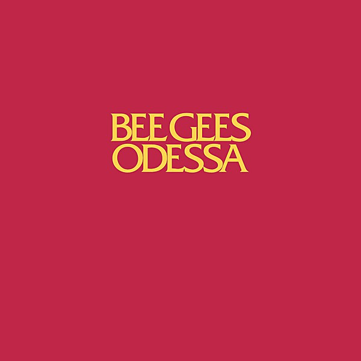

# Odessa

By **Bee Gees**

## Album Data

- **Catalog:** Beets
- **Format:** Digital, Album
- **Album:** Odessa
- **Artist:** Bee Gees
- **Albumartist:** Bee Gees
- **Genre:** Psychedelic Pop
- **MusicBrainz Album Artist ID:** [bf0f7e29-dfe1-416c-b5c6-f9ebc19ea810](https://musicbrainz.org/artist/bf0f7e29-dfe1-416c-b5c6-f9ebc19ea810)
- **MusicBrainz Album ID:** [e7539e48-5b03-48ce-92d3-efced81e2ef4](https://musicbrainz.org/release/e7539e48-5b03-48ce-92d3-efced81e2ef4)
- **MusicBrainz Release Group ID:** [b926b337-c2e1-3198-abeb-9a484b78cec9](https://musicbrainz.org/release-group/b926b337-c2e1-3198-abeb-9a484b78cec9)
- **Year:** 2009
- **Catalog #:** 
- **Label:** 
- **Total Tracks:** 23

## Album Tracks

### Track 01 - Odessa (Demo)

- **Artist:** Bee Gees
- **Format:** ALAC
- **Genre:** Disco
- **Length:** 6:42
- **MusicBrainz Track ID:** 
- **Title:** Odessa (Demo)
- **Track:** 01
- **Year:** 1969

### Track 02 - You'll Never See My Face Again (Alternate Mix)

- **Artist:** Bee Gees
- **Format:** ALAC
- **Genre:** Disco
- **Length:** 4:08
- **MusicBrainz Track ID:** 
- **Title:** You'll Never See My Face Again (Alternate Mix)
- **Track:** 02
- **Year:** 1969

### Track 03 - Black Diamond (Demo)

- **Artist:** Bee Gees
- **Format:** ALAC
- **Genre:** Disco
- **Length:** 4:03
- **MusicBrainz Track ID:** 
- **Title:** Black Diamond (Demo)
- **Track:** 03
- **Year:** 1969

### Track 04 - Marley Put Drive (Alternate Mix)

- **Artist:** Bee Gees
- **Format:** ALAC
- **Genre:** Disco
- **Length:** 4:35
- **MusicBrainz Track ID:** 
- **Title:** Marley Put Drive (Alternate Mix)
- **Track:** 04
- **Year:** 1969

### Track 05 - Barbara Came To Stay

- **Artist:** Bee Gees
- **Format:** ALAC
- **Genre:** Disco
- **Length:** 3:08
- **MusicBrainz Track ID:** 
- **Title:** Barbara Came To Stay
- **Track:** 05
- **Year:** 1969

### Track 06 - Edison (Alternate Mix)

- **Artist:** Bee Gees
- **Format:** ALAC
- **Genre:** Disco
- **Length:** 3:16
- **MusicBrainz Track ID:** 
- **Title:** Edison (Alternate Mix)
- **Track:** 06
- **Year:** 1969

### Track 07 - Melody Fair (Demo)

- **Artist:** Bee Gees
- **Format:** ALAC
- **Genre:** Disco
- **Length:** 3:08
- **MusicBrainz Track ID:** 
- **Title:** Melody Fair (Demo)
- **Track:** 07
- **Year:** 1969

### Track 08 - Melody Fair (Alternate Mix)

- **Artist:** Bee Gees
- **Format:** ALAC
- **Genre:** Disco
- **Length:** 3:47
- **MusicBrainz Track ID:** 
- **Title:** Melody Fair (Alternate Mix)
- **Track:** 08
- **Year:** 1969

### Track 09 - Suddenly (Alternate Mix)

- **Artist:** Bee Gees
- **Format:** ALAC
- **Genre:** Disco
- **Length:** 2:18
- **MusicBrainz Track ID:** 
- **Title:** Suddenly (Alternate Mix)
- **Track:** 09
- **Year:** 1969

### Track 10 - Whisper Whisper, Part Two (Alternate Version)

- **Artist:** Bee Gees
- **Format:** ALAC
- **Genre:** Disco
- **Length:** 1:09
- **MusicBrainz Track ID:** 
- **Title:** Whisper Whisper, Part Two (Alternate Version)
- **Track:** 10
- **Year:** 1969

### Track 11 - Lamplight (Demo)

- **Artist:** Bee Gees
- **Format:** ALAC
- **Genre:** Disco
- **Length:** 4:50
- **MusicBrainz Track ID:** 
- **Title:** Lamplight (Demo)
- **Track:** 11
- **Year:** 1969

### Track 12 - Lamplight (Alternate Version)

- **Artist:** Bee Gees
- **Format:** ALAC
- **Genre:** Disco
- **Length:** 5:04
- **MusicBrainz Track ID:** 
- **Title:** Lamplight (Alternate Version)
- **Track:** 12
- **Year:** 1969

### Track 13 - Sound Of Love (Alternate Mix)

- **Artist:** Bee Gees
- **Format:** ALAC
- **Genre:** Disco
- **Length:** 3:40
- **MusicBrainz Track ID:** 
- **Title:** Sound Of Love (Alternate Mix)
- **Track:** 13
- **Year:** 1969

### Track 14 - Give Your Best (Alternate Mix)

- **Artist:** Bee Gees
- **Format:** ALAC
- **Genre:** Disco
- **Length:** 3:37
- **MusicBrainz Track ID:** 
- **Title:** Give Your Best (Alternate Mix)
- **Track:** 14
- **Year:** 1969

### Track 15 - Seven Seas Symphony (Demo)

- **Artist:** Bee Gees
- **Format:** ALAC
- **Genre:** Disco
- **Length:** 2:17
- **MusicBrainz Track ID:** 
- **Title:** Seven Seas Symphony (Demo)
- **Track:** 15
- **Year:** 1969

### Track 16 - With All Nations (International Anthem) (Vocal Version)

- **Artist:** Bee Gees
- **Format:** ALAC
- **Genre:** Disco
- **Length:** 1:18
- **MusicBrainz Track ID:** 
- **Title:** With All Nations (International Anthem) (Vocal Version)
- **Track:** 16
- **Year:** 1969

### Track 17 - I Laugh In Your Face (Alternate Mix)

- **Artist:** Bee Gees
- **Format:** ALAC
- **Genre:** Disco
- **Length:** 4:03
- **MusicBrainz Track ID:** 
- **Title:** I Laugh In Your Face (Alternate Mix)
- **Track:** 17
- **Year:** 1969

### Track 18 - Never Say Never Again (Alternate Mix)

- **Artist:** Bee Gees
- **Format:** ALAC
- **Genre:** Disco
- **Length:** 3:55
- **MusicBrainz Track ID:** 
- **Title:** Never Say Never Again (Alternate Mix)
- **Track:** 18
- **Year:** 1969

### Track 19 - First Of May (Demo)

- **Artist:** Bee Gees
- **Format:** ALAC
- **Genre:** Disco
- **Length:** 1:45
- **MusicBrainz Track ID:** 
- **Title:** First Of May (Demo)
- **Track:** 19
- **Year:** 1969

### Track 20 - First Of May (Alternate Mix)

- **Artist:** Bee Gees
- **Format:** ALAC
- **Genre:** Disco
- **Length:** 2:49
- **MusicBrainz Track ID:** 
- **Title:** First Of May (Alternate Mix)
- **Track:** 20
- **Year:** 1969

### Track 21 - Nobody's Someone

- **Artist:** Bee Gees
- **Format:** ALAC
- **Genre:** Pop
- **Length:** 3:17
- **MusicBrainz Track ID:** 
- **Title:** Nobody's Someone
- **Track:** 21
- **Year:** 1969

### Track 22 - Pity

- **Artist:** Bee Gees
- **Format:** ALAC
- **Genre:** Disco
- **Length:** 3:49
- **MusicBrainz Track ID:** 
- **Title:** Pity
- **Track:** 22
- **Year:** 1969

### Track 23 - Odessa Promotional Spot

- **Artist:** Bee Gees
- **Format:** ALAC
- **Genre:** Disco
- **Length:** 0:32
- **MusicBrainz Track ID:** 
- **Title:** Odessa Promotional Spot
- **Track:** 23
- **Year:** 1969

## See also

- [Bee Gees' 1st](Bee_Gees_1st.md)
- [Odessa - Deluxe Edition](Odessa_-_Deluxe_Edition.md)
- [Saturday Night Fever](Saturday_Night_Fever.md)
- [Tales From the Brothers Gibb](Tales_From_the_Brothers_Gibb.md)
- [CD: ](../../CD/Bee_Gees/Bee_Gees.md)
- [CD: Tales From The Brothers Gibb / A History In Song ( 1967-1990 ) (Disc 1)](../../CD/Bee_Gees/Tales_From_The_Brothers_Gibb_-_A_History_In_Song__1967-1990__Disc_1.md)
- [CD: "Tales From The Brothers Gibb, A History In Song 1967 -1990, Disc 4of4"](../../CD/Bee_Gees/Tales_From_The_Brothers_Gibb__A_History_In_Song_1967_-1990__Disc_4of4.md)
- [CD: Tales From The Brothers Gibb Cd 2](../../CD/Bee_Gees/Tales_From_The_Brothers_Gibb_Cd_2.md)
- [CD: Tales From The Brothers Gibb Disc 1](../../CD/Bee_Gees/Tales_From_The_Brothers_Gibb_Disc_1.md)
- [Roon: Bee Gees 1st (Deluxe Version)](../../Roon/Bee_Gees/Bee_Gees_1st_Deluxe_Version.md)
- [Roon: Best Of Bee Gees](../../Roon/Bee_Gees/Best_Of_Bee_Gees.md)
- [Roon: Odessa (Deluxe Edition)](../../Roon/Bee_Gees/Odessa_Deluxe_Edition.md)
- [Roon: Odessa](../../Roon/Bee_Gees/Odessa-_The_Complete_Odessa.md)
- [Roon: Tales From The Brothers Gibb](../../Roon/Bee_Gees/Tales_From_The_Brothers_Gibb.md)
- [Roon: Timeless - The All-Time Greatest Hits](../../Roon/Bee_Gees/Timeless_-_The_All-Time_Greatest_Hits.md)
- [Vinyl: ](../../Vinyl/Bee_Gees/Bee_Gees.md)
- [Vinyl: Odessa](../../Vinyl/Bee_Gees/Odessa.md)
- [Vinyl: To Love Somebody / How Can You Mend A Broken Heart](../../Vinyl/Bee_Gees/To_Love_Somebody_-_How_Can_You_Mend_A_Broken_Heart.md)
