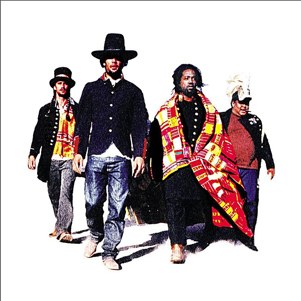

# Burn to Shine

By **Ben Harper**

## Album Data

- **Catalog:** Beets
- **Format:** Digital, Album
- **Album:** Burn to Shine
- **Artist:** Ben Harper
- **Albumartist:** Ben Harper
- **Genre:** Indie Rock
- **MusicBrainz Album Artist ID:** [1582a5b8-538e-45e7-9ae4-4099439a0e79](https://musicbrainz.org/artist/1582a5b8-538e-45e7-9ae4-4099439a0e79)
- **MusicBrainz Album ID:** [10f44d8a-7b62-4ebf-8faf-5eedfe63ebd2](https://musicbrainz.org/release/10f44d8a-7b62-4ebf-8faf-5eedfe63ebd2)
- **MusicBrainz Release Group ID:** [e9f21d4b-28f1-3813-a489-4afeb06174c2](https://musicbrainz.org/release-group/e9f21d4b-28f1-3813-a489-4afeb06174c2)
- **Year:** 1999
- **Catalog #:** 
- **Label:** 
- **Total Tracks:** 14

## Album Tracks

### Track 01 - Alone

- **Artist:** Ben Harper
- **Format:** ALAC
- **Genre:** Soul
- **Length:** 3:58
- **MusicBrainz Track ID:** [d15f3375-721d-41fb-96e9-9b246d15e36e](https://musicbrainz.org/recording/d15f3375-721d-41fb-96e9-9b246d15e36e)
- **Title:** Alone
- **Track:** 01
- **Year:** 1999

### Track 02 - The Woman in You

- **Artist:** Ben Harper
- **Format:** ALAC
- **Genre:** Soul
- **Length:** 5:41
- **MusicBrainz Track ID:** [8f1fd676-b6ec-4e2d-af3a-e2b679dfac92](https://musicbrainz.org/recording/8f1fd676-b6ec-4e2d-af3a-e2b679dfac92)
- **Title:** The Woman in You
- **Track:** 02
- **Year:** 1999

### Track 03 - Less

- **Artist:** Ben Harper
- **Format:** ALAC
- **Genre:** Rock
- **Length:** 4:05
- **MusicBrainz Track ID:** [ac4aca41-0ca1-423b-8ed6-f69d82df21aa](https://musicbrainz.org/recording/ac4aca41-0ca1-423b-8ed6-f69d82df21aa)
- **Title:** Less
- **Track:** 03
- **Year:** 1999

### Track 04 - Two Hands of a Prayer

- **Artist:** Ben Harper
- **Format:** ALAC
- **Genre:** Rock
- **Length:** 7:50
- **MusicBrainz Track ID:** [fef9e6dc-ac4e-4a19-a688-1bf353ba0612](https://musicbrainz.org/recording/fef9e6dc-ac4e-4a19-a688-1bf353ba0612)
- **Title:** Two Hands of a Prayer
- **Track:** 04
- **Year:** 1999

### Track 05 - Please Bleed

- **Artist:** Ben Harper
- **Format:** ALAC
- **Genre:** Alternative Rock
- **Length:** 4:37
- **MusicBrainz Track ID:** [d3b0609b-212a-4f26-b24d-fb04c30f775b](https://musicbrainz.org/recording/d3b0609b-212a-4f26-b24d-fb04c30f775b)
- **Title:** Please Bleed
- **Track:** 05
- **Year:** 1999

### Track 06 - Suzie Blue

- **Artist:** Ben Harper
- **Format:** ALAC
- **Genre:** Soft Rock
- **Length:** 4:29
- **MusicBrainz Track ID:** [a463a944-a531-4941-8a3c-877dc6cbf8a3](https://musicbrainz.org/recording/a463a944-a531-4941-8a3c-877dc6cbf8a3)
- **Title:** Suzie Blue
- **Track:** 06
- **Year:** 1999

### Track 07 - Steal My Kisses

- **Artist:** Ben Harper
- **Format:** ALAC
- **Genre:** Uk Garage
- **Length:** 4:05
- **MusicBrainz Track ID:** [26c6d080-f6f6-4406-9f41-20c7f198803b](https://musicbrainz.org/recording/26c6d080-f6f6-4406-9f41-20c7f198803b)
- **Title:** Steal My Kisses
- **Track:** 07
- **Year:** 1999

### Track 08 - Burn to Shine

- **Artist:** Ben Harper
- **Format:** ALAC
- **Genre:** Folk Rock
- **Length:** 3:34
- **MusicBrainz Track ID:** [0d3a48ad-505b-4622-b70d-086c0d3abff3](https://musicbrainz.org/recording/0d3a48ad-505b-4622-b70d-086c0d3abff3)
- **Title:** Burn to Shine
- **Track:** 08
- **Year:** 1999

### Track 09 - Show Me a Little Shame

- **Artist:** Ben Harper
- **Format:** ALAC
- **Genre:** Uk Garage
- **Length:** 3:44
- **MusicBrainz Track ID:** [ceb8ead6-77fe-41e2-b4c7-b970c57cb669](https://musicbrainz.org/recording/ceb8ead6-77fe-41e2-b4c7-b970c57cb669)
- **Title:** Show Me a Little Shame
- **Track:** 09
- **Year:** 1999

### Track 10 - Forgiven

- **Artist:** Ben Harper
- **Format:** ALAC
- **Genre:** Soul
- **Length:** 5:17
- **MusicBrainz Track ID:** [07b8ebaf-6ece-4dbd-9f59-55db4902658c](https://musicbrainz.org/recording/07b8ebaf-6ece-4dbd-9f59-55db4902658c)
- **Title:** Forgiven
- **Track:** 10
- **Year:** 1999

### Track 11 - Beloved One

- **Artist:** Ben Harper
- **Format:** ALAC
- **Genre:** Indie Rock
- **Length:** 4:03
- **MusicBrainz Track ID:** [7749e176-2c89-4acc-9cf8-d8245e92ff59](https://musicbrainz.org/recording/7749e176-2c89-4acc-9cf8-d8245e92ff59)
- **Title:** Beloved One
- **Track:** 11
- **Year:** 1999

### Track 12 - In the Lord's Arms

- **Artist:** Ben Harper
- **Format:** ALAC
- **Genre:** Soul
- **Length:** 3:06
- **MusicBrainz Track ID:** [7e9757b4-ed00-445f-af09-395c9fdc75d3](https://musicbrainz.org/recording/7e9757b4-ed00-445f-af09-395c9fdc75d3)
- **Title:** In the Lord's Arms
- **Track:** 12
- **Year:** 1999

