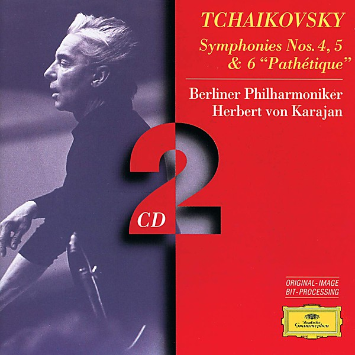

# BEETHOVEN 9 Symphonien - 1963 remastered / Karajan

By **Berliner Philharmoniker, Herbert Karajan**

## Album Data

- **Catalog:** Beets
- **Format:** Digital, Album
- **Album:** BEETHOVEN 9 Symphonien - 1963 remastered / Karajan
- **Artist:** Berliner Philharmoniker, Herbert Karajan
- **Albumartist:** Berliner Philharmoniker, Herbert Karajan
- **Genre:** Classical
- **MusicBrainz Album Artist ID:** 
- **MusicBrainz Album ID:** 
- **MusicBrainz Release Group ID:** 
- **Year:** 2014
- **Catalog #:** 
- **Label:** 
- **Total Tracks:** 11

## Album Tracks

### Track 02 - 1. Largo - Fantasmi. Presto

- **Artist:** Andreas Blau, Berliner Philharmoniker, Herbert von Karajan
- **Format:** MP3
- **Genre:** Classical
- **Length:** 3:29
- **MusicBrainz Track ID:** 
- **Title:** 1. Largo - Fantasmi. Presto
- **Track:** 02
- **Year:** 2016

### Track 03 - 2. Largo - Presto

- **Artist:** Andreas Blau, Berliner Philharmoniker, Herbert von Karajan
- **Format:** MP3
- **Genre:** Classical
- **Length:** 2:15
- **MusicBrainz Track ID:** 
- **Title:** 2. Largo - Presto
- **Track:** 03
- **Year:** 2016

### Track 04 - 3. Il sonno. Largo - Allegro

- **Artist:** Andreas Blau, Berliner Philharmoniker, Herbert von Karajan
- **Format:** MP3
- **Genre:** Classical
- **Length:** 3:39
- **MusicBrainz Track ID:** 
- **Title:** 3. Il sonno. Largo - Allegro
- **Track:** 04
- **Year:** 2016

### Track 01 - Adagio for Strings and Organ in G minor

- **Artist:** Berliner Philharmoniker, Herbert von Karajan, David Bell, Leon Spierer
- **Format:** MP3
- **Genre:** Classical
- **Length:** 11:50
- **MusicBrainz Track ID:** 
- **Title:** Adagio for Strings and Organ in G minor
- **Track:** 01
- **Year:** 2016

### Track 06 - arr. Max Seiffert

- **Artist:** Berliner Philharmoniker, Herbert von Karajan, Frank Maus
- **Format:** MP3
- **Genre:** Classical
- **Length:** 7:05
- **MusicBrainz Track ID:** 
- **Title:** arr. Max Seiffert
- **Track:** 06
- **Year:** 2016

### Track 05 - 2. Air

- **Artist:** David Bell, Berliner Philharmoniker, Herbert von Karajan
- **Format:** MP3
- **Genre:** Classical
- **Length:** 6:03
- **MusicBrainz Track ID:** 
- **Title:** 2. Air
- **Track:** 05
- **Year:** 2016

### Track 07 - Orfeo Ed Euridice Dance Of The Blessed Spirits

- **Artist:** Karlheinz Zoeller, Berliner Philharmoniker, Herbert von Karajan
- **Format:** MP3
- **Genre:** Classical
- **Length:** 6:50
- **MusicBrainz Track ID:** 
- **Title:** Orfeo Ed Euridice Dance Of The Blessed Spirits
- **Track:** 07
- **Year:** 2016

### Track 08 - 1. Marcia (Maestoso)

- **Artist:** Thomas Brandis, Emil Maas, Neithart Resa, Rainer Zepperitz, Berliner Philharmoniker, Herbert von Karajan
- **Format:** MP3
- **Genre:** Classical
- **Length:** 4:29
- **MusicBrainz Track ID:** 
- **Title:** 1. Marcia (Maestoso)
- **Track:** 08
- **Year:** 2016

### Track 09 - 2. Menuetto - Trio

- **Artist:** Thomas Brandis, Emil Maas, Neithart Resa, Rainer Zepperitz, Berliner Philharmoniker, Herbert von Karajan
- **Format:** MP3
- **Genre:** Classical
- **Length:** 4:39
- **MusicBrainz Track ID:** 
- **Title:** 2. Menuetto - Trio
- **Track:** 09
- **Year:** 2016

### Track 10 - 3. Rondeau (Allegretto - Adagio - Allegro)

- **Artist:** Thomas Brandis, Emil Maas, Neithart Resa, Rainer Zepperitz, Berliner Philharmoniker, Herbert von Karajan
- **Format:** MP3
- **Genre:** Classical
- **Length:** 4:49
- **MusicBrainz Track ID:** 
- **Title:** 3. Rondeau (Allegretto - Adagio - Allegro)
- **Track:** 10
- **Year:** 2016

## See also

- [KARAJAN / ALBINONI Adagio, PACHELBEL Canon](KARAJAN_-_ALBINONI_Adagio__PACHELBEL_Canon.md)
- [Tschaikowsky Symphonie No. 5 in E minor, Op. 64](Tschaikowsky_Symphonie_No_5_in_E_minor__Op_64.md)
