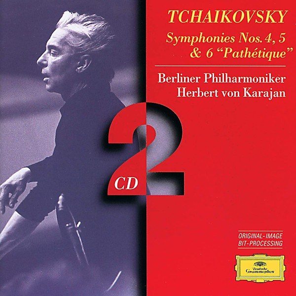

# Tschaikowsky Symphonie No. 5 in E minor, Op. 64

By **Berliner Philharmoniker, Herbert Karajan**

## Album Data

- **Catalog:** Beets
- **Format:** Digital, Album
- **Album:** Tschaikowsky Symphonie No. 5 in E minor, Op. 64
- **Artist:** Berliner Philharmoniker, Herbert Karajan
- **Albumartist:** Berliner Philharmoniker, Herbert Karajan
- **Genre:** Classical
- **MusicBrainz Album Artist ID:** 
- **MusicBrainz Album ID:** 
- **MusicBrainz Release Group ID:** 
- **Year:** 2016
- **Catalog #:** 
- **Label:** 
- **Total Tracks:** 04

## Album Tracks

### Track 01 - 1. Andante - Allegro con anima

- **Artist:** Berliner Philharmoniker, Herbert von Karajan
- **Format:** MP3
- **Genre:** Classical
- **Length:** 15:53
- **MusicBrainz Track ID:** 
- **Title:** 1. Andante - Allegro con anima
- **Track:** 01
- **Year:** 2016

### Track 02 - 2. Andante cantabile, con alcuna licenza - Moderato con anima

- **Artist:** Berliner Philharmoniker, Herbert von Karajan
- **Format:** MP3
- **Genre:** Classical
- **Length:** 14:38
- **MusicBrainz Track ID:** 
- **Title:** 2. Andante cantabile, con alcuna licenza - Moderato con anima
- **Track:** 02
- **Year:** 2016

### Track 04 - 4. Finale (Andante maestoso - Allegro vivace)

- **Artist:** Berliner Philharmoniker, Herbert von Karajan
- **Format:** MP3
- **Genre:** Classical
- **Length:** 12:32
- **MusicBrainz Track ID:** 
- **Title:** 4. Finale (Andante maestoso - Allegro vivace)
- **Track:** 04
- **Year:** 2016

### Track 03 - Valse

- **Artist:** Berliner Philharmoniker, Herbert von Karajan
- **Format:** MP3
- **Genre:** Classical
- **Length:** 6:35
- **MusicBrainz Track ID:** 
- **Title:** Valse
- **Track:** 03
- **Year:** 2016

## See also

- [BEETHOVEN 9 Symphonien - 1963 remastered / Karajan](BEETHOVEN_9_Symphonien_-_1963_remastered_-_Karajan.md)
- [KARAJAN / ALBINONI Adagio, PACHELBEL Canon](KARAJAN_-_ALBINONI_Adagio__PACHELBEL_Canon.md)
