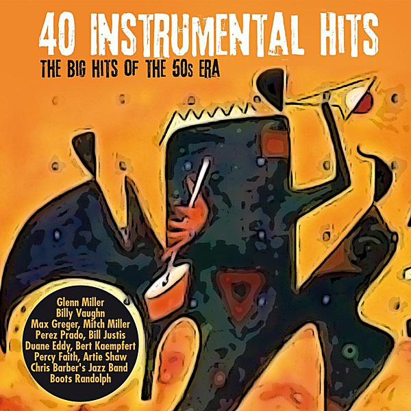

# That Happy Feeling

By **Bert Kaempfert**

## Album Data

- **Catalog:** Beets
- **Format:** Digital, Album
- **Album:** That Happy Feeling
- **Artist:** Bert Kaempfert
- **Albumartist:** Bert Kaempfert
- **Genre:** Orchestra
- **MusicBrainz Album Artist ID:** 
- **MusicBrainz Album ID:** 
- **MusicBrainz Release Group ID:** 
- **Year:** 0000
- **Catalog #:** 
- **Label:** 
- **Total Tracks:** 00

## Album Tracks

### Track 01 - A Swingin' Safari

- **Artist:** Bert Kaempfert
- **Format:** AAC
- **Genre:** Swing
- **Length:** 3:11
- **MusicBrainz Track ID:** 
- **Title:** A Swingin' Safari
- **Track:** 01
- **Year:** 0000

### Track 02 - That Happy Feeling

- **Artist:** Bert Kaempfert
- **Format:** AAC
- **Genre:** Orchestral
- **Length:** 2:58
- **MusicBrainz Track ID:** 
- **Title:** That Happy Feeling
- **Track:** 02
- **Year:** 0000

### Track 03 - Market Day

- **Artist:** Bert Kaempfert
- **Format:** AAC
- **Genre:** Smooth Jazz
- **Length:** 2:34
- **MusicBrainz Track ID:** 
- **Title:** Market Day
- **Track:** 03
- **Year:** 0000

### Track 04 - Take Me

- **Artist:** Bert Kaempfert
- **Format:** AAC
- **Genre:** Easy Listening
- **Length:** 3:08
- **MusicBrainz Track ID:** 
- **Title:** Take Me
- **Track:** 04
- **Year:** 0000

### Track 05 - Similau

- **Artist:** Bert Kaempfert
- **Format:** AAC
- **Genre:** Easy Listening
- **Length:** 3:01
- **MusicBrainz Track ID:** 
- **Title:** Similau
- **Track:** 05
- **Year:** 0000

### Track 06 - Zambesi

- **Artist:** Bert Kaempfert
- **Format:** AAC
- **Genre:** Easy Listening
- **Length:** 2:51
- **MusicBrainz Track ID:** 
- **Title:** Zambesi
- **Track:** 06
- **Year:** 0000

### Track 08 - Happy Trumpeter

- **Artist:** Bert Kaempfert
- **Format:** AAC
- **Genre:** Orchestral
- **Length:** 2:41
- **MusicBrainz Track ID:** 
- **Title:** Happy Trumpeter
- **Track:** 08
- **Year:** 0000

### Track 09 - Tootie Flutie

- **Artist:** Bert Kaempfert
- **Format:** AAC
- **Genre:** Orchestral
- **Length:** 2:13
- **MusicBrainz Track ID:** 
- **Title:** Tootie Flutie
- **Track:** 09
- **Year:** 0000

### Track 10 - Sunday In Madrid

- **Artist:** Bert Kaempfert
- **Format:** AAC
- **Genre:** Orchestra
- **Length:** 2:56
- **MusicBrainz Track ID:** 
- **Title:** Sunday In Madrid
- **Track:** 10
- **Year:** 0000

### Track 10 - Wimoweh

- **Artist:** Bert Kaempfert
- **Format:** AAC
- **Genre:** Easy Listening
- **Length:** 2:45
- **MusicBrainz Track ID:** 
- **Title:** Wimoweh
- **Track:** 10
- **Year:** 0000

### Track 11 - Black Beauty

- **Artist:** Bert Kaempfert
- **Format:** AAC
- **Genre:** Easy Listening
- **Length:** 2:41
- **MusicBrainz Track ID:** 
- **Title:** Black Beauty
- **Track:** 11
- **Year:** 0000

### Track 12 - Skokiaan

- **Artist:** Bert Kaempfert
- **Format:** AAC
- **Genre:** Easy Listening
- **Length:** 2:54
- **MusicBrainz Track ID:** 
- **Title:** Skokiaan
- **Track:** 12
- **Year:** 0000

