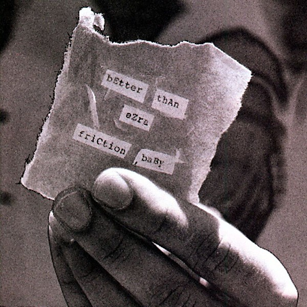

# Friction, Baby

By **Better Than Ezra**

## Album Data

- **Catalog:** Beets
- **Format:** Digital, Album
- **Album:** Friction, Baby
- **Artist:** Better Than Ezra
- **Albumartist:** Better Than Ezra
- **Genre:** Alternative Rock
- **MusicBrainz Album Artist ID:** [7986c185-d91d-4204-8ee2-eac5d503fe39](https://musicbrainz.org/artist/7986c185-d91d-4204-8ee2-eac5d503fe39)
- **MusicBrainz Album ID:** [15e2873d-db19-4c86-8e00-1830bee8c547](https://musicbrainz.org/release/15e2873d-db19-4c86-8e00-1830bee8c547)
- **MusicBrainz Release Group ID:** [0e420b8f-92de-3bfd-a156-d1cb93506b5d](https://musicbrainz.org/release-group/0e420b8f-92de-3bfd-a156-d1cb93506b5d)
- **Year:** 1996
- **Catalog #:** 7559-61944-2
- **Label:** Elektra Entertainment
- **Total Tracks:** 13

## Album Tracks

### Track 01 - King of New Orleans

- **Artist:** Better Than Ezra
- **Format:** ALAC
- **Genre:** Pop Rock
- **Length:** 4:07
- **MusicBrainz Track ID:** [3427b705-b18a-4a50-a4ef-0e484f8fa855](https://musicbrainz.org/recording/3427b705-b18a-4a50-a4ef-0e484f8fa855)
- **Title:** King of New Orleans
- **Track:** 01
- **Year:** 1996

### Track 02 - Rewind

- **Artist:** Better Than Ezra
- **Format:** ALAC
- **Genre:** Alternative Rock
- **Length:** 3:06
- **MusicBrainz Track ID:** [6f223e83-416d-47b6-ac70-fb4cddb0484b](https://musicbrainz.org/recording/6f223e83-416d-47b6-ac70-fb4cddb0484b)
- **Title:** Rewind
- **Track:** 02
- **Year:** 1996

### Track 03 - Long Lost

- **Artist:** Better Than Ezra
- **Format:** ALAC
- **Genre:** Alternative Rock
- **Length:** 3:40
- **MusicBrainz Track ID:** [abf11edb-7b66-440c-a98e-97476574f2fe](https://musicbrainz.org/recording/abf11edb-7b66-440c-a98e-97476574f2fe)
- **Title:** Long Lost
- **Track:** 03
- **Year:** 1996

### Track 04 - Normal Town

- **Artist:** Better Than Ezra
- **Format:** ALAC
- **Genre:** Alternative Rock
- **Length:** 3:39
- **MusicBrainz Track ID:** [4642069a-6b71-484a-abac-cc67cfd17dee](https://musicbrainz.org/recording/4642069a-6b71-484a-abac-cc67cfd17dee)
- **Title:** Normal Town
- **Track:** 04
- **Year:** 1996

### Track 05 - Scared, Are You?

- **Artist:** Better Than Ezra
- **Format:** ALAC
- **Genre:** Alternative Rock
- **Length:** 4:06
- **MusicBrainz Track ID:** [1db56988-cff3-433c-a0ea-60309ebd80cd](https://musicbrainz.org/recording/1db56988-cff3-433c-a0ea-60309ebd80cd)
- **Title:** Scared, Are You?
- **Track:** 05
- **Year:** 1996

### Track 06 - Return of the Postmoderns

- **Artist:** Better Than Ezra
- **Format:** ALAC
- **Genre:** Alternative Rock
- **Length:** 2:54
- **MusicBrainz Track ID:** [1dfe7763-6e09-4a45-a184-f1a34dd1b6bb](https://musicbrainz.org/recording/1dfe7763-6e09-4a45-a184-f1a34dd1b6bb)
- **Title:** Return of the Postmoderns
- **Track:** 06
- **Year:** 1996

### Track 07 - Hung the Moon

- **Artist:** Better Than Ezra
- **Format:** ALAC
- **Genre:** Alternative Rock
- **Length:** 3:46
- **MusicBrainz Track ID:** [04c1aae1-af2a-499a-9582-4dbd63c12933](https://musicbrainz.org/recording/04c1aae1-af2a-499a-9582-4dbd63c12933)
- **Title:** Hung the Moon
- **Track:** 07
- **Year:** 1996

### Track 08 - Desperately Wanting

- **Artist:** Better Than Ezra
- **Format:** ALAC
- **Genre:** Alternative Rock
- **Length:** 4:37
- **MusicBrainz Track ID:** [fb0f009a-2b24-4710-94f5-440866c67487](https://musicbrainz.org/recording/fb0f009a-2b24-4710-94f5-440866c67487)
- **Title:** Desperately Wanting
- **Track:** 08
- **Year:** 1996

### Track 09 - Still Life With Cooley

- **Artist:** Better Than Ezra
- **Format:** ALAC
- **Genre:** Alternative Rock
- **Length:** 3:58
- **MusicBrainz Track ID:** [814ff35c-ffbf-4e3e-b441-e6c0182fac20](https://musicbrainz.org/recording/814ff35c-ffbf-4e3e-b441-e6c0182fac20)
- **Title:** Still Life With Cooley
- **Track:** 09
- **Year:** 1996

### Track 10 - WWOZ

- **Artist:** Better Than Ezra
- **Format:** ALAC
- **Genre:** Pop Rock
- **Length:** 4:20
- **MusicBrainz Track ID:** [9e05e5c6-5f56-4299-b0ae-e552466a798f](https://musicbrainz.org/recording/9e05e5c6-5f56-4299-b0ae-e552466a798f)
- **Title:** WWOZ
- **Track:** 10
- **Year:** 1996

### Track 11 - Happy Endings

- **Artist:** Better Than Ezra
- **Format:** ALAC
- **Genre:** Americana
- **Length:** 2:43
- **MusicBrainz Track ID:** [90dbd3d3-4fca-48d1-bc65-28f4dd181d86](https://musicbrainz.org/recording/90dbd3d3-4fca-48d1-bc65-28f4dd181d86)
- **Title:** Happy Endings
- **Track:** 11
- **Year:** 1996

### Track 12 - Speeding Up to Slow Down

- **Artist:** Better Than Ezra
- **Format:** ALAC
- **Genre:** Americana
- **Length:** 4:09
- **MusicBrainz Track ID:** [ec3a030b-d5f7-4709-aec5-ad8c48d4ff9b](https://musicbrainz.org/recording/ec3a030b-d5f7-4709-aec5-ad8c48d4ff9b)
- **Title:** Speeding Up to Slow Down
- **Track:** 12
- **Year:** 1996

### Track 13 - At Ch. De Gaulle, Etc.

- **Artist:** Better Than Ezra
- **Format:** ALAC
- **Genre:** Alternative Rock
- **Length:** 2:17
- **MusicBrainz Track ID:** [bc1d36c7-ac58-47ba-8c0a-47401ee70d7d](https://musicbrainz.org/recording/bc1d36c7-ac58-47ba-8c0a-47401ee70d7d)
- **Title:** At Ch. De Gaulle, Etc.
- **Track:** 13
- **Year:** 1996

## See also

- [Deluxe](Deluxe.md)
