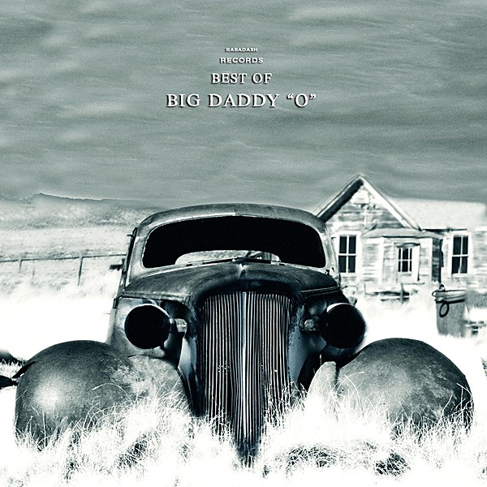

# The Best of Big Daddy

By **Big Daddy**

## Album Data

- **Catalog:** Beets
- **Format:** Digital, Album
- **Album:** The Best of Big Daddy
- **Artist:** Big Daddy
- **Albumartist:** Big Daddy
- **Genre:** Ragga
- **MusicBrainz Album Artist ID:** [09aee210-8761-4b66-84fa-1a5a835636c6](https://musicbrainz.org/artist/09aee210-8761-4b66-84fa-1a5a835636c6)
- **MusicBrainz Album ID:** [a0a5fd77-bf84-436b-b768-0b0b2e714bf3](https://musicbrainz.org/release/a0a5fd77-bf84-436b-b768-0b0b2e714bf3)
- **MusicBrainz Release Group ID:** [c46ba03e-0f2c-3e04-848e-12505d867d5e](https://musicbrainz.org/release-group/c46ba03e-0f2c-3e04-848e-12505d867d5e)
- **Year:** 2000
- **Catalog #:** OGL83001-2
- **Label:** Oglio Records
- **Total Tracks:** 16

## Album Tracks

### Track 01 - Dancing in the Dark

- **Artist:** Big Daddy
- **Format:** MP3
- **Genre:** Pop
- **Length:** 3:14
- **MusicBrainz Track ID:** [b01e4378-44f1-4967-a857-c24429939e62](https://musicbrainz.org/recording/b01e4378-44f1-4967-a857-c24429939e62)
- **Title:** Dancing in the Dark
- **Track:** 01
- **Year:** 2000

### Track 02 - Help Me Make It Through the Night

- **Artist:** Big Daddy
- **Format:** MP3
- **Genre:** Ragga
- **Length:** 2:18
- **MusicBrainz Track ID:** [d2adcd6a-32b3-4ce6-8742-8524dc04c365](https://musicbrainz.org/recording/d2adcd6a-32b3-4ce6-8742-8524dc04c365)
- **Title:** Help Me Make It Through the Night
- **Track:** 02
- **Year:** 2000

### Track 03 - Super Freak

- **Artist:** Big Daddy
- **Format:** MP3
- **Genre:** Ragga
- **Length:** 2:50
- **MusicBrainz Track ID:** [b5d1db33-9c1f-4f56-8418-894f0b26b06d](https://musicbrainz.org/recording/b5d1db33-9c1f-4f56-8418-894f0b26b06d)
- **Title:** Super Freak
- **Track:** 03
- **Year:** 2000

### Track 04 - Little Red Corvette

- **Artist:** Big Daddy
- **Format:** MP3
- **Genre:** Ragga
- **Length:** 2:37
- **MusicBrainz Track ID:** [47f7a931-2165-4e32-93ba-2775a2c75307](https://musicbrainz.org/recording/47f7a931-2165-4e32-93ba-2775a2c75307)
- **Title:** Little Red Corvette
- **Track:** 04
- **Year:** 2000

### Track 05 - Girls Just Wanna Have Fun

- **Artist:** Big Daddy
- **Format:** MP3
- **Genre:** Ragga
- **Length:** 2:50
- **MusicBrainz Track ID:** [6e3714a3-003e-465a-818f-ebc6ec587432](https://musicbrainz.org/recording/6e3714a3-003e-465a-818f-ebc6ec587432)
- **Title:** Girls Just Wanna Have Fun
- **Track:** 05
- **Year:** 2000

### Track 06 - Once in a Lifetime

- **Artist:** Big Daddy
- **Format:** MP3
- **Genre:** Ragga
- **Length:** 3:44
- **MusicBrainz Track ID:** [2b7088ff-47d9-485e-b221-adf53982e22a](https://musicbrainz.org/recording/2b7088ff-47d9-485e-b221-adf53982e22a)
- **Title:** Once in a Lifetime
- **Track:** 06
- **Year:** 2000

### Track 07 - Whip It

- **Artist:** Big Daddy
- **Format:** MP3
- **Genre:** Ragga
- **Length:** 1:54
- **MusicBrainz Track ID:** [df470ea6-1177-45d3-9198-c226f9aba585](https://musicbrainz.org/recording/df470ea6-1177-45d3-9198-c226f9aba585)
- **Title:** Whip It
- **Track:** 07
- **Year:** 2000

### Track 08 - My Heart Will Go On

- **Artist:** Big Daddy
- **Format:** MP3
- **Genre:** Ragga
- **Length:** 3:55
- **MusicBrainz Track ID:** [e673054c-354d-41d5-891c-d721dd264a17](https://musicbrainz.org/recording/e673054c-354d-41d5-891c-d721dd264a17)
- **Title:** My Heart Will Go On
- **Track:** 08
- **Year:** 2000

### Track 09 - Eye of the Tiger

- **Artist:** Big Daddy
- **Format:** MP3
- **Genre:** Ragga
- **Length:** 2:35
- **MusicBrainz Track ID:** [4c2c4b76-7c81-4f1c-b145-c3561f945bc1](https://musicbrainz.org/recording/4c2c4b76-7c81-4f1c-b145-c3561f945bc1)
- **Title:** Eye of the Tiger
- **Track:** 09
- **Year:** 2000

### Track 10 - Every Breath You Take

- **Artist:** Big Daddy
- **Format:** MP3
- **Genre:** Ragga
- **Length:** 3:05
- **MusicBrainz Track ID:** [bc067d3f-f07e-4ec4-9144-bf4d6608b0d3](https://musicbrainz.org/recording/bc067d3f-f07e-4ec4-9144-bf4d6608b0d3)
- **Title:** Every Breath You Take
- **Track:** 10
- **Year:** 2000

### Track 11 - Sukiyaki

- **Artist:** Big Daddy
- **Format:** MP3
- **Genre:** Ragga
- **Length:** 3:28
- **MusicBrainz Track ID:** [0f5cad20-a744-4022-9ce4-0b397d92bb8c](https://musicbrainz.org/recording/0f5cad20-a744-4022-9ce4-0b397d92bb8c)
- **Title:** Sukiyaki
- **Track:** 11
- **Year:** 2000

### Track 12 - Money for Nothing

- **Artist:** Big Daddy
- **Format:** MP3
- **Genre:** Pop
- **Length:** 3:18
- **MusicBrainz Track ID:** [cece729e-45bf-4780-85e4-15ad22bb11b4](https://musicbrainz.org/recording/cece729e-45bf-4780-85e4-15ad22bb11b4)
- **Title:** Money for Nothing
- **Track:** 12
- **Year:** 2000

### Track 13 - Sgt. Pepper's Lonely Hearts Club Band

- **Artist:** Big Daddy
- **Format:** MP3
- **Genre:** Ragga
- **Length:** 2:21
- **MusicBrainz Track ID:** [ff9d019d-548f-4694-ac67-1b7f1ac6c5d7](https://musicbrainz.org/recording/ff9d019d-548f-4694-ac67-1b7f1ac6c5d7)
- **Title:** Sgt. Pepper's Lonely Hearts Club Band
- **Track:** 13
- **Year:** 2000

### Track 14 - With a Little Help From My Friends

- **Artist:** Big Daddy
- **Format:** MP3
- **Genre:** Ragga
- **Length:** 2:50
- **MusicBrainz Track ID:** [00f3bf5d-49fe-42e2-9f34-37c1962c0ff9](https://musicbrainz.org/recording/00f3bf5d-49fe-42e2-9f34-37c1962c0ff9)
- **Title:** With a Little Help From My Friends
- **Track:** 14
- **Year:** 2000

### Track 15 - When I'm Sixty-Four

- **Artist:** Big Daddy
- **Format:** MP3
- **Genre:** Ragga
- **Length:** 3:20
- **MusicBrainz Track ID:** [59f16fd4-2d7f-48bf-aaa1-f3639817d7af](https://musicbrainz.org/recording/59f16fd4-2d7f-48bf-aaa1-f3639817d7af)
- **Title:** When I'm Sixty-Four
- **Track:** 15
- **Year:** 2000

### Track 16 - A Day in the Life

- **Artist:** Big Daddy
- **Format:** MP3
- **Genre:** Ragga
- **Length:** 4:59
- **MusicBrainz Track ID:** [2f83e053-bc2b-45be-b69f-206f61708310](https://musicbrainz.org/recording/2f83e053-bc2b-45be-b69f-206f61708310)
- **Title:** A Day in the Life
- **Track:** 16
- **Year:** 2000

