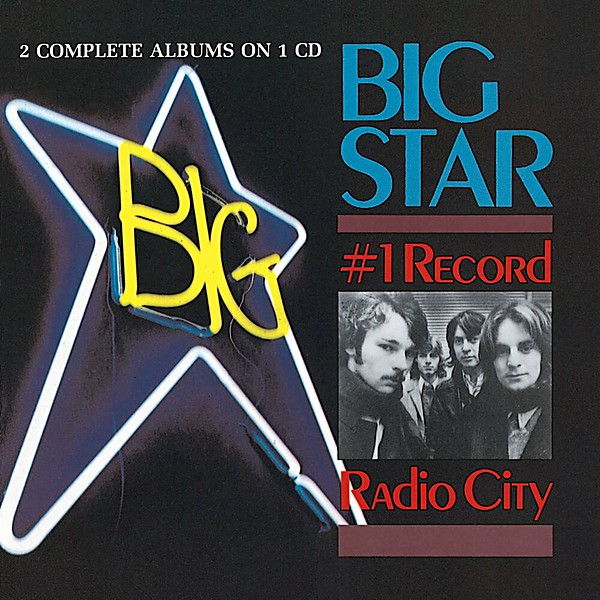

# #1 Record / Radio City

By **Big Star**

## Album Data

- **Catalog:** Beets
- **Format:** Digital, Album
- **Album:** #1 Record / Radio City
- **Artist:** Big Star
- **Albumartist:** Big Star
- **Genre:** Power Pop
- **MusicBrainz Album Artist ID:** [21d177ba-3d51-461e-9b3f-ad9a80b419dc](https://musicbrainz.org/artist/21d177ba-3d51-461e-9b3f-ad9a80b419dc)
- **MusicBrainz Album ID:** [0435b9a0-a47b-44cb-9c62-2d839a3f2312](https://musicbrainz.org/release/0435b9a0-a47b-44cb-9c62-2d839a3f2312)
- **MusicBrainz Release Group ID:** [05dc9b5a-6e9f-3eb8-aed9-16fe34a2d7fd](https://musicbrainz.org/release-group/05dc9b5a-6e9f-3eb8-aed9-16fe34a2d7fd)
- **Year:** 2009
- **Catalog #:** FAN-31457-02
- **Label:** Fantasy
- **Total Tracks:** 26

## Album Tracks

### Track 01 - Feel

- **Artist:** Big Star
- **Format:** AAC
- **Genre:** Power Pop
- **Length:** 3:32
- **MusicBrainz Track ID:** [34c837f6-26bc-448a-a1aa-c02cb6a09dfc](https://musicbrainz.org/recording/34c837f6-26bc-448a-a1aa-c02cb6a09dfc)
- **Title:** Feel
- **Track:** 01
- **Year:** 2009

### Track 02 - The Ballad of El Goodo

- **Artist:** Big Star
- **Format:** AAC
- **Genre:** Power Pop
- **Length:** 4:20
- **MusicBrainz Track ID:** [66defaf1-39c9-4466-88e2-7c2fe3751537](https://musicbrainz.org/recording/66defaf1-39c9-4466-88e2-7c2fe3751537)
- **Title:** The Ballad of El Goodo
- **Track:** 02
- **Year:** 2009

### Track 03 - In the Street

- **Artist:** Big Star
- **Format:** AAC
- **Genre:** Power Pop
- **Length:** 2:54
- **MusicBrainz Track ID:** [930cb068-c06f-44ea-97df-c60723ebd8df](https://musicbrainz.org/recording/930cb068-c06f-44ea-97df-c60723ebd8df)
- **Title:** In the Street
- **Track:** 03
- **Year:** 2009

### Track 04 - Thirteen

- **Artist:** Big Star
- **Format:** AAC
- **Genre:** Power Pop
- **Length:** 2:34
- **MusicBrainz Track ID:** [c43d06e1-1c31-44db-8f2e-8e188ccc224a](https://musicbrainz.org/recording/c43d06e1-1c31-44db-8f2e-8e188ccc224a)
- **Title:** Thirteen
- **Track:** 04
- **Year:** 2009

### Track 05 - Don’t Lie to Me

- **Artist:** Big Star
- **Format:** AAC
- **Genre:** Power Pop
- **Length:** 3:07
- **MusicBrainz Track ID:** [2d4893ea-84f4-49f0-9688-8eb1de797509](https://musicbrainz.org/recording/2d4893ea-84f4-49f0-9688-8eb1de797509)
- **Title:** Don’t Lie to Me
- **Track:** 05
- **Year:** 2009

### Track 06 - The India Song

- **Artist:** Big Star
- **Format:** AAC
- **Genre:** Power Pop
- **Length:** 2:20
- **MusicBrainz Track ID:** [41834443-03e6-47ca-8726-74495385b7ec](https://musicbrainz.org/recording/41834443-03e6-47ca-8726-74495385b7ec)
- **Title:** The India Song
- **Track:** 06
- **Year:** 2009

### Track 07 - When My Baby’s Beside Me

- **Artist:** Big Star
- **Format:** AAC
- **Genre:** Power Pop
- **Length:** 3:23
- **MusicBrainz Track ID:** [1fd0a858-c953-41a2-b6c1-f1dfa8ece5ce](https://musicbrainz.org/recording/1fd0a858-c953-41a2-b6c1-f1dfa8ece5ce)
- **Title:** When My Baby’s Beside Me
- **Track:** 07
- **Year:** 2009

### Track 08 - My Life Is Right

- **Artist:** Big Star
- **Format:** AAC
- **Genre:** Power Pop
- **Length:** 3:06
- **MusicBrainz Track ID:** [6c57e6ad-ca31-4e08-95c1-95dc4509a7aa](https://musicbrainz.org/recording/6c57e6ad-ca31-4e08-95c1-95dc4509a7aa)
- **Title:** My Life Is Right
- **Track:** 08
- **Year:** 2009

### Track 09 - Give Me Another Chance

- **Artist:** Big Star
- **Format:** AAC
- **Genre:** Power Pop
- **Length:** 3:27
- **MusicBrainz Track ID:** [de1cf872-9453-4384-890e-814c4d0d134c](https://musicbrainz.org/recording/de1cf872-9453-4384-890e-814c4d0d134c)
- **Title:** Give Me Another Chance
- **Track:** 09
- **Year:** 2009

### Track 10 - Try Again

- **Artist:** Big Star
- **Format:** AAC
- **Genre:** Power Pop
- **Length:** 3:32
- **MusicBrainz Track ID:** [720af8e0-deb0-458c-9cd6-5e6702999fc7](https://musicbrainz.org/recording/720af8e0-deb0-458c-9cd6-5e6702999fc7)
- **Title:** Try Again
- **Track:** 10
- **Year:** 2009

### Track 11 - Watch the Sunrise

- **Artist:** Big Star
- **Format:** AAC
- **Genre:** Power Pop
- **Length:** 3:44
- **MusicBrainz Track ID:** [fdad469b-e2f0-4926-a627-599807da0a96](https://musicbrainz.org/recording/fdad469b-e2f0-4926-a627-599807da0a96)
- **Title:** Watch the Sunrise
- **Track:** 11
- **Year:** 2009

### Track 12 - ST 100/6

- **Artist:** Big Star
- **Format:** AAC
- **Genre:** Psychedelic Pop
- **Length:** 0:57
- **MusicBrainz Track ID:** [d0c6def9-dc83-46b3-a038-256973759dee](https://musicbrainz.org/recording/d0c6def9-dc83-46b3-a038-256973759dee)
- **Title:** ST 100/6
- **Track:** 12
- **Year:** 2009

### Track 13 - In the Street (single mix)

- **Artist:** Big Star
- **Format:** AAC
- **Genre:** Power Pop
- **Length:** 3:00
- **MusicBrainz Track ID:** [a5417fbd-6015-4943-a9e1-8ae4c678ccfa](https://musicbrainz.org/recording/a5417fbd-6015-4943-a9e1-8ae4c678ccfa)
- **Title:** In the Street (single mix)
- **Track:** 13
- **Year:** 2009

### Track 14 - O My Soul

- **Artist:** Big Star
- **Format:** AAC
- **Genre:** Indie Rock
- **Length:** 5:37
- **MusicBrainz Track ID:** [1d95773e-ad67-4888-b76e-0fcd3351acc2](https://musicbrainz.org/recording/1d95773e-ad67-4888-b76e-0fcd3351acc2)
- **Title:** O My Soul
- **Track:** 14
- **Year:** 2009

### Track 15 - Life Is White

- **Artist:** Big Star
- **Format:** AAC
- **Genre:** Power Pop
- **Length:** 3:18
- **MusicBrainz Track ID:** [07b6686b-dcb1-49ba-9241-fbe3470b8d44](https://musicbrainz.org/recording/07b6686b-dcb1-49ba-9241-fbe3470b8d44)
- **Title:** Life Is White
- **Track:** 15
- **Year:** 2009

### Track 16 - Way Out West

- **Artist:** Big Star
- **Format:** AAC
- **Genre:** Power Pop
- **Length:** 2:50
- **MusicBrainz Track ID:** [68ebb5ba-b8b5-4066-9752-40de34044814](https://musicbrainz.org/recording/68ebb5ba-b8b5-4066-9752-40de34044814)
- **Title:** Way Out West
- **Track:** 16
- **Year:** 2009

### Track 17 - What’s Going Ahn

- **Artist:** Big Star
- **Format:** AAC
- **Genre:** Power Pop
- **Length:** 2:41
- **MusicBrainz Track ID:** [773ff8cb-cab2-47f1-b04f-1edc1c4e3bec](https://musicbrainz.org/recording/773ff8cb-cab2-47f1-b04f-1edc1c4e3bec)
- **Title:** What’s Going Ahn
- **Track:** 17
- **Year:** 2009

### Track 18 - You Get What You Deserve

- **Artist:** Big Star
- **Format:** AAC
- **Genre:** Power Pop
- **Length:** 3:07
- **MusicBrainz Track ID:** [d7578404-4a1e-4f2d-bc33-7d316118d08e](https://musicbrainz.org/recording/d7578404-4a1e-4f2d-bc33-7d316118d08e)
- **Title:** You Get What You Deserve
- **Track:** 18
- **Year:** 2009

### Track 19 - Mod Lang

- **Artist:** Big Star
- **Format:** AAC
- **Genre:** Power Pop
- **Length:** 2:45
- **MusicBrainz Track ID:** [2bb105d8-e055-4a6a-8fd6-d6d06649013b](https://musicbrainz.org/recording/2bb105d8-e055-4a6a-8fd6-d6d06649013b)
- **Title:** Mod Lang
- **Track:** 19
- **Year:** 2009

### Track 20 - Back of a Car

- **Artist:** Big Star
- **Format:** AAC
- **Genre:** Power Pop
- **Length:** 2:46
- **MusicBrainz Track ID:** [e2f166b0-fe6e-4507-83a2-6b4c07d5ff18](https://musicbrainz.org/recording/e2f166b0-fe6e-4507-83a2-6b4c07d5ff18)
- **Title:** Back of a Car
- **Track:** 20
- **Year:** 2009

### Track 21 - Daisy Glaze

- **Artist:** Big Star
- **Format:** AAC
- **Genre:** Power Pop
- **Length:** 3:48
- **MusicBrainz Track ID:** [979ff1d8-326a-436f-8da7-59f52e7ed940](https://musicbrainz.org/recording/979ff1d8-326a-436f-8da7-59f52e7ed940)
- **Title:** Daisy Glaze
- **Track:** 21
- **Year:** 2009

### Track 22 - She’s a Mover

- **Artist:** Big Star
- **Format:** AAC
- **Genre:** Power Pop
- **Length:** 3:13
- **MusicBrainz Track ID:** [cd832847-5f4d-44ad-8730-f59db226608c](https://musicbrainz.org/recording/cd832847-5f4d-44ad-8730-f59db226608c)
- **Title:** She’s a Mover
- **Track:** 22
- **Year:** 2009

### Track 23 - September Gurls

- **Artist:** Big Star
- **Format:** AAC
- **Genre:** Power Pop
- **Length:** 2:48
- **MusicBrainz Track ID:** [a9844e7d-ec3b-45f9-a44d-281b042948f5](https://musicbrainz.org/recording/a9844e7d-ec3b-45f9-a44d-281b042948f5)
- **Title:** September Gurls
- **Track:** 23
- **Year:** 2009

### Track 24 - Morpha Too

- **Artist:** Big Star
- **Format:** AAC
- **Genre:** Indie Rock
- **Length:** 1:28
- **MusicBrainz Track ID:** [440c0f94-3606-4955-84db-b4c25ec830ee](https://musicbrainz.org/recording/440c0f94-3606-4955-84db-b4c25ec830ee)
- **Title:** Morpha Too
- **Track:** 24
- **Year:** 2009

### Track 25 - I’m in Love With a Girl

- **Artist:** Big Star
- **Format:** AAC
- **Genre:** Power Pop
- **Length:** 1:47
- **MusicBrainz Track ID:** [8325a30d-70ef-4baf-9722-dec9ba21eb2d](https://musicbrainz.org/recording/8325a30d-70ef-4baf-9722-dec9ba21eb2d)
- **Title:** I’m in Love With a Girl
- **Track:** 25
- **Year:** 2009

### Track 26 - O My Soul (single mix)

- **Artist:** Big Star
- **Format:** AAC
- **Genre:** Power Pop
- **Length:** 2:50
- **MusicBrainz Track ID:** [5127becd-cf19-4c2d-8e3a-40bb96e82f52](https://musicbrainz.org/recording/5127becd-cf19-4c2d-8e3a-40bb96e82f52)
- **Title:** O My Soul (single mix)
- **Track:** 26
- **Year:** 2009

