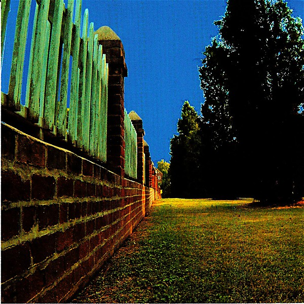

# Back to Even

By **Bill Lloyd**

## Album Data

- **Catalog:** Beets
- **Format:** Digital, Album
- **Album:** Back to Even
- **Artist:** Bill Lloyd
- **Albumartist:** Bill Lloyd
- **Genre:** Power Pop
- **MusicBrainz Album Artist ID:** [f66d71fd-ccd7-4426-8781-b75b9e390f74](https://musicbrainz.org/artist/f66d71fd-ccd7-4426-8781-b75b9e390f74)
- **MusicBrainz Album ID:** [4a1d0a38-5ee8-44ba-93ce-8eae01a4b6b3](https://musicbrainz.org/release/4a1d0a38-5ee8-44ba-93ce-8eae01a4b6b3)
- **MusicBrainz Release Group ID:** [194a61c6-f711-3fe0-90c9-234f35d24016](https://musicbrainz.org/release-group/194a61c6-f711-3fe0-90c9-234f35d24016)
- **Year:** 2004
- **Catalog #:** 
- **Label:** 
- **Total Tracks:** 14

## Album Tracks

### Track 01 - Standing on the Shoulders of Giants

- **Artist:** Bill Lloyd
- **Format:** ALAC
- **Genre:** Power Pop
- **Length:** 3:36
- **MusicBrainz Track ID:** [2c079001-4bd5-4786-9360-c0f2ff16862d](https://musicbrainz.org/recording/2c079001-4bd5-4786-9360-c0f2ff16862d)
- **Title:** Standing on the Shoulders of Giants
- **Track:** 01
- **Year:** 1999

### Track 02 - Cool and Gone

- **Artist:** Bill Lloyd
- **Format:** ALAC
- **Genre:** Power Pop
- **Length:** 3:47
- **MusicBrainz Track ID:** [dd7004e3-129d-4151-afd0-c8d856cff704](https://musicbrainz.org/recording/dd7004e3-129d-4151-afd0-c8d856cff704)
- **Title:** Cool and Gone
- **Track:** 02
- **Year:** 1999

### Track 03 - Sweet Virginia

- **Artist:** Bill Lloyd
- **Format:** ALAC
- **Genre:** Power Pop
- **Length:** 3:56
- **MusicBrainz Track ID:** [2341af3f-1ce2-46cc-974b-802dbed137c7](https://musicbrainz.org/recording/2341af3f-1ce2-46cc-974b-802dbed137c7)
- **Title:** Sweet Virginia
- **Track:** 03
- **Year:** 1999

### Track 04 - Dr. Roberts Second Opinion

- **Artist:** Bill Lloyd
- **Format:** ALAC
- **Genre:** Power Pop
- **Length:** 5:08
- **MusicBrainz Track ID:** [a2fd90c4-ecd3-4ca2-96de-ef0e96dda38e](https://musicbrainz.org/recording/a2fd90c4-ecd3-4ca2-96de-ef0e96dda38e)
- **Title:** Dr. Roberts Second Opinion
- **Track:** 04
- **Year:** 1999

### Track 05 - Holding Back the Waterfall

- **Artist:** Bill Lloyd
- **Format:** ALAC
- **Genre:** Power Pop
- **Length:** 4:44
- **MusicBrainz Track ID:** [8f30699f-1373-45e1-8e6a-d299e3274160](https://musicbrainz.org/recording/8f30699f-1373-45e1-8e6a-d299e3274160)
- **Title:** Holding Back the Waterfall
- **Track:** 05
- **Year:** 1999

### Track 06 - (Who You Gonna) Run to Now

- **Artist:** Bill Lloyd
- **Format:** ALAC
- **Genre:** Power Pop
- **Length:** 3:49
- **MusicBrainz Track ID:** [a0c8c527-2fce-451f-beaf-5f8cae511d2b](https://musicbrainz.org/recording/a0c8c527-2fce-451f-beaf-5f8cae511d2b)
- **Title:** (Who You Gonna) Run to Now
- **Track:** 06
- **Year:** 1999

### Track 07 - Complaints

- **Artist:** Bill Lloyd
- **Format:** ALAC
- **Genre:** Power Pop
- **Length:** 1:45
- **MusicBrainz Track ID:** [8d5e888a-d283-406a-8739-c290a218160f](https://musicbrainz.org/recording/8d5e888a-d283-406a-8739-c290a218160f)
- **Title:** Complaints
- **Track:** 07
- **Year:** 1999

### Track 08 - Don't Kid Yourself

- **Artist:** Bill Lloyd
- **Format:** ALAC
- **Genre:** Power Pop
- **Length:** 3:08
- **MusicBrainz Track ID:** [6bfbff23-0225-4d5a-bcc6-ee79d1f74046](https://musicbrainz.org/recording/6bfbff23-0225-4d5a-bcc6-ee79d1f74046)
- **Title:** Don't Kid Yourself
- **Track:** 08
- **Year:** 1999

### Track 09 - This Is the Way

- **Artist:** Bill Lloyd
- **Format:** ALAC
- **Genre:** Power Pop
- **Length:** 3:04
- **MusicBrainz Track ID:** [b721b66c-982d-49c9-a673-5a3ba2796c13](https://musicbrainz.org/recording/b721b66c-982d-49c9-a673-5a3ba2796c13)
- **Title:** This Is the Way
- **Track:** 09
- **Year:** 1999

### Track 10 - She Won't Be Back

- **Artist:** Bill Lloyd
- **Format:** ALAC
- **Genre:** Power Pop
- **Length:** 3:45
- **MusicBrainz Track ID:** [7071a0f4-4b91-4205-ac31-4e3a44a78ed7](https://musicbrainz.org/recording/7071a0f4-4b91-4205-ac31-4e3a44a78ed7)
- **Title:** She Won't Be Back
- **Track:** 10
- **Year:** 1999

### Track 11 - Box of Snakes

- **Artist:** Bill Lloyd
- **Format:** ALAC
- **Genre:** Power Pop
- **Length:** 4:42
- **MusicBrainz Track ID:** [15220641-7fff-4000-8227-e08f71010694](https://musicbrainz.org/recording/15220641-7fff-4000-8227-e08f71010694)
- **Title:** Box of Snakes
- **Track:** 11
- **Year:** 1999

### Track 12 - So You Won't Have To

- **Artist:** Bill Lloyd
- **Format:** ALAC
- **Genre:** Power Pop
- **Length:** 4:00
- **MusicBrainz Track ID:** [71c4d3ce-d2fd-456b-ac2d-854300d8ea96](https://musicbrainz.org/recording/71c4d3ce-d2fd-456b-ac2d-854300d8ea96)
- **Title:** So You Won't Have To
- **Track:** 12
- **Year:** 1999

### Track 13 - Years Away From Here

- **Artist:** Bill Lloyd
- **Format:** ALAC
- **Genre:** Power Pop
- **Length:** 3:30
- **MusicBrainz Track ID:** [59d74e28-0ad2-42e0-98e8-eedc054a0295](https://musicbrainz.org/recording/59d74e28-0ad2-42e0-98e8-eedc054a0295)
- **Title:** Years Away From Here
- **Track:** 13
- **Year:** 1999

### Track 14 - Turn Me on Dead Man

- **Artist:** Bill Lloyd
- **Format:** ALAC
- **Genre:** Power Pop
- **Length:** 7:44
- **MusicBrainz Track ID:** [7514984b-6ef6-453c-9aff-9d08f4c3c73a](https://musicbrainz.org/recording/7514984b-6ef6-453c-9aff-9d08f4c3c73a)
- **Title:** Turn Me on Dead Man
- **Track:** 14
- **Year:** 1999

## See also

- [Standing on the Shoulders of Giants](Standing_on_the_Shoulders_of_Giants.md)
