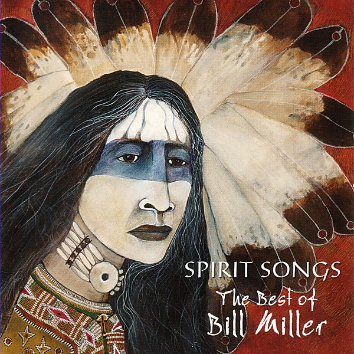

# Spirit Songs

By **Bill Miller**

## Album Data

- **Catalog:** Beets
- **Format:** Digital, Album
- **Album:** Spirit Songs
- **Artist:** Bill Miller
- **Albumartist:** Bill Miller
- **Genre:** Americana
- **MusicBrainz Album Artist ID:** [186bf3f4-9320-4738-a95c-fd0c62948c56](https://musicbrainz.org/artist/186bf3f4-9320-4738-a95c-fd0c62948c56)
- **MusicBrainz Album ID:** [d063abcf-54bb-4736-bcc4-89d9405b071b](https://musicbrainz.org/release/d063abcf-54bb-4736-bcc4-89d9405b071b)
- **MusicBrainz Release Group ID:** [fbe94ebc-15b6-3bc3-91ab-3e8c9c040fed](https://musicbrainz.org/release-group/fbe94ebc-15b6-3bc3-91ab-3e8c9c040fed)
- **Year:** 2004
- **Catalog #:** 
- **Label:** 
- **Total Tracks:** 16

## Album Tracks

### Track 01 - Dreams of Wounded Knee

- **Artist:** Bill Miller
- **Format:** AAC
- **Genre:** Americana
- **Length:** 4:17
- **MusicBrainz Track ID:** [51b4ddfa-0ef9-4d51-986d-1ea7a3b4fd5a](https://musicbrainz.org/recording/51b4ddfa-0ef9-4d51-986d-1ea7a3b4fd5a)
- **Title:** Dreams of Wounded Knee
- **Track:** 01
- **Year:** 2004

### Track 02 - Praises

- **Artist:** Bill Miller
- **Format:** AAC
- **Genre:** Americana
- **Length:** 5:42
- **MusicBrainz Track ID:** [859972b3-654b-4899-9d20-d46b01584c10](https://musicbrainz.org/recording/859972b3-654b-4899-9d20-d46b01584c10)
- **Title:** Praises
- **Track:** 02
- **Year:** 2004

### Track 03 - Faith of a Child

- **Artist:** Bill Miller
- **Format:** AAC
- **Genre:** Americana
- **Length:** 6:56
- **MusicBrainz Track ID:** [5ccf3570-1cd4-4507-84ab-566181f7a06c](https://musicbrainz.org/recording/5ccf3570-1cd4-4507-84ab-566181f7a06c)
- **Title:** Faith of a Child
- **Track:** 03
- **Year:** 2004

### Track 04 - Listen To Me

- **Artist:** Bill Miller
- **Format:** AAC
- **Genre:** Americana
- **Length:** 6:07
- **MusicBrainz Track ID:** [9290fa1d-bc2c-48af-a78d-331e7314aff0](https://musicbrainz.org/recording/9290fa1d-bc2c-48af-a78d-331e7314aff0)
- **Title:** Listen To Me
- **Track:** 04
- **Year:** 2004

### Track 05 - Ghostdance

- **Artist:** Bill Miller
- **Format:** AAC
- **Genre:** Americana
- **Length:** 4:25
- **MusicBrainz Track ID:** [0e8f1937-96f4-4536-98f0-92ac8e011fb6](https://musicbrainz.org/recording/0e8f1937-96f4-4536-98f0-92ac8e011fb6)
- **Title:** Ghostdance
- **Track:** 05
- **Year:** 2004

### Track 06 - The Sun is Gonna Rise

- **Artist:** Bill Miller
- **Format:** AAC
- **Genre:** Americana
- **Length:** 4:57
- **MusicBrainz Track ID:** [533c61d9-7643-4813-9c37-ba05f3bb6484](https://musicbrainz.org/recording/533c61d9-7643-4813-9c37-ba05f3bb6484)
- **Title:** The Sun is Gonna Rise
- **Track:** 06
- **Year:** 2004

### Track 07 - Every Mountain I Climb

- **Artist:** Bill Miller
- **Format:** AAC
- **Genre:** Americana
- **Length:** 4:10
- **MusicBrainz Track ID:** [ebf59996-d393-4bb6-9776-32c335b7a354](https://musicbrainz.org/recording/ebf59996-d393-4bb6-9776-32c335b7a354)
- **Title:** Every Mountain I Climb
- **Track:** 07
- **Year:** 2004

### Track 08 - Reservation Road

- **Artist:** Bill Miller
- **Format:** AAC
- **Genre:** Americana
- **Length:** 6:05
- **MusicBrainz Track ID:** [5cb2fcf4-6bc3-4068-90ea-25bdf701746e](https://musicbrainz.org/recording/5cb2fcf4-6bc3-4068-90ea-25bdf701746e)
- **Title:** Reservation Road
- **Track:** 08
- **Year:** 2004

### Track 09 - Tumbleweed

- **Artist:** Bill Miller
- **Format:** AAC
- **Genre:** Americana
- **Length:** 5:00
- **MusicBrainz Track ID:** [8c687575-a6ad-4f3e-97a3-403c6d8aaab0](https://musicbrainz.org/recording/8c687575-a6ad-4f3e-97a3-403c6d8aaab0)
- **Title:** Tumbleweed
- **Track:** 09
- **Year:** 2004

### Track 10 - Geronimo’s Cadillac

- **Artist:** Bill Miller
- **Format:** AAC
- **Genre:** Americana
- **Length:** 5:36
- **MusicBrainz Track ID:** [d8c1b8cb-4247-4d08-a9b1-df6083ec1a9f](https://musicbrainz.org/recording/d8c1b8cb-4247-4d08-a9b1-df6083ec1a9f)
- **Title:** Geronimo’s Cadillac
- **Track:** 10
- **Year:** 2004

### Track 11 - The Art of Survival

- **Artist:** Bill Miller
- **Format:** AAC
- **Genre:** Americana
- **Length:** 5:03
- **MusicBrainz Track ID:** [4bd9de56-9f48-4e98-ab81-05079c19fa79](https://musicbrainz.org/recording/4bd9de56-9f48-4e98-ab81-05079c19fa79)
- **Title:** The Art of Survival
- **Track:** 11
- **Year:** 2004

### Track 12 - Wind Spirit

- **Artist:** Bill Miller
- **Format:** AAC
- **Genre:** Americana
- **Length:** 2:55
- **MusicBrainz Track ID:** [e591a26d-b167-40f7-97d1-4177ee6786fe](https://musicbrainz.org/recording/e591a26d-b167-40f7-97d1-4177ee6786fe)
- **Title:** Wind Spirit
- **Track:** 12
- **Year:** 2004

### Track 13 - Never Too Far

- **Artist:** Bill Miller
- **Format:** AAC
- **Genre:** Americana
- **Length:** 4:07
- **MusicBrainz Track ID:** [2f3f3eb8-a8c3-4706-81de-2ded2da05b42](https://musicbrainz.org/recording/2f3f3eb8-a8c3-4706-81de-2ded2da05b42)
- **Title:** Never Too Far
- **Track:** 13
- **Year:** 2004

### Track 14 - You Are the Rain

- **Artist:** Bill Miller
- **Format:** AAC
- **Genre:** Americana
- **Length:** 5:32
- **MusicBrainz Track ID:** [32b96834-83c7-4fbc-acbf-ff93297d6d37](https://musicbrainz.org/recording/32b96834-83c7-4fbc-acbf-ff93297d6d37)
- **Title:** You Are the Rain
- **Track:** 14
- **Year:** 2004

### Track 15 - Love Sustained

- **Artist:** Bill Miller
- **Format:** AAC
- **Genre:** Americana
- **Length:** 3:50
- **MusicBrainz Track ID:** [769997b8-194a-4c91-8032-8d1522b783b0](https://musicbrainz.org/recording/769997b8-194a-4c91-8032-8d1522b783b0)
- **Title:** Love Sustained
- **Track:** 15
- **Year:** 2004

### Track 16 - Underneath the Blue Sky

- **Artist:** Bill Miller
- **Format:** AAC
- **Genre:** Americana
- **Length:** 4:05
- **MusicBrainz Track ID:** [9071ee12-5278-44c0-9e6a-a20a21771094](https://musicbrainz.org/recording/9071ee12-5278-44c0-9e6a-a20a21771094)
- **Title:** Underneath the Blue Sky
- **Track:** 16
- **Year:** 2004

## See also

- [Roon: Spirit Songs](../../Roon/Bill_Miller/Spirit_Songs-_The_Best_Of_Bill_Miller.md)
