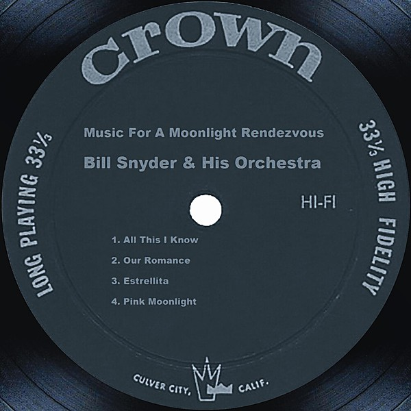

# 1950

By **Bill Snyder & his Orchestra**

## Album Data

- **Catalog:** Beets
- **Format:** Digital, Album
- **Album:** 1950
- **Artist:** Bill Snyder & His Orchestra
- **Albumartist:** Bill Snyder & his Orchestra
- **Genre:** Unknown
- **MusicBrainz Album Artist ID:** 
- **MusicBrainz Album ID:** 
- **MusicBrainz Release Group ID:** 
- **Year:** 1950
- **Catalog #:** 
- **Label:** 
- **Total Tracks:** 00

## Album Tracks

### Track 00 - Bewitched

- **Artist:** Bill Snyder & his Orchestra
- **Format:** ALAC
- **Genre:** Unknown
- **Length:** 2:51
- **MusicBrainz Track ID:** 
- **Title:** Bewitched
- **Track:** 00
- **Year:** 1950

