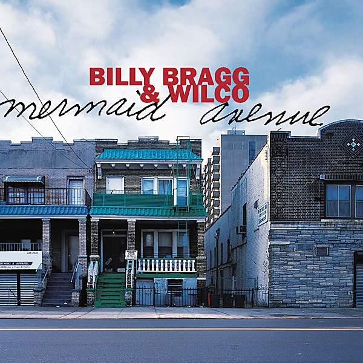

# Mermaid Avenue

By **Billy Bragg & Wilco**

## Album Data

- **Catalog:** Beets
- **Format:** Digital, Album
- **Album:** Mermaid Avenue
- **Artist:** Billy Bragg & Wilco
- **Albumartist:** Billy Bragg & Wilco
- **Genre:** Folk Rock
- **MusicBrainz Album Artist ID:** [7cec4a03-0a83-4308-856a-afb8aa5db0fc](https://musicbrainz.org/artist/7cec4a03-0a83-4308-856a-afb8aa5db0fc)
- **MusicBrainz Album ID:** [0491813b-1bad-3340-84af-278d44db4f0d](https://musicbrainz.org/release/0491813b-1bad-3340-84af-278d44db4f0d)
- **MusicBrainz Release Group ID:** [9ae4e54c-ec74-3f15-823a-8302fc9a832d](https://musicbrainz.org/release-group/9ae4e54c-ec74-3f15-823a-8302fc9a832d)
- **Year:** 1998
- **Catalog #:** 62204-2
- **Label:** Elektra Entertainment
- **Total Tracks:** 15

## Album Tracks

### Track 01 - Walt Whitman’s Niece

- **Artist:** Billy Bragg & Wilco
- **Format:** AAC
- **Genre:** Folk Rock
- **Length:** 3:53
- **MusicBrainz Track ID:** [a7a81578-25eb-4bcb-bde3-0ac07e6ed0e4](https://musicbrainz.org/recording/a7a81578-25eb-4bcb-bde3-0ac07e6ed0e4)
- **Title:** Walt Whitman’s Niece
- **Track:** 01
- **Year:** 1998

### Track 02 - California Stars

- **Artist:** Billy Bragg & Wilco
- **Format:** AAC
- **Genre:** Folk Rock
- **Length:** 4:58
- **MusicBrainz Track ID:** [8ad92273-a5d7-425b-956e-c9354322824a](https://musicbrainz.org/recording/8ad92273-a5d7-425b-956e-c9354322824a)
- **Title:** California Stars
- **Track:** 02
- **Year:** 1998

### Track 03 - Way Over Yonder in the Minor Key

- **Artist:** Billy Bragg & Wilco
- **Format:** AAC
- **Genre:** Americana
- **Length:** 4:06
- **MusicBrainz Track ID:** [4cd3e598-ab7a-4cc7-9f09-4b48619cb6d9](https://musicbrainz.org/recording/4cd3e598-ab7a-4cc7-9f09-4b48619cb6d9)
- **Title:** Way Over Yonder in the Minor Key
- **Track:** 03
- **Year:** 1998

### Track 04 - Birds and Ships

- **Artist:** Billy Bragg & Wilco
- **Format:** AAC
- **Genre:** Americana
- **Length:** 2:15
- **MusicBrainz Track ID:** [a284f2c3-a615-427c-bda2-3b743ee13e26](https://musicbrainz.org/recording/a284f2c3-a615-427c-bda2-3b743ee13e26)
- **Title:** Birds and Ships
- **Track:** 04
- **Year:** 1998

### Track 05 - Hoodoo Voodoo

- **Artist:** Billy Bragg & Wilco
- **Format:** AAC
- **Genre:** Rockabilly
- **Length:** 3:12
- **MusicBrainz Track ID:** [ad10bfb1-9c55-4cc3-b698-7941a088aaae](https://musicbrainz.org/recording/ad10bfb1-9c55-4cc3-b698-7941a088aaae)
- **Title:** Hoodoo Voodoo
- **Track:** 05
- **Year:** 1998

### Track 06 - She Came Along to Me

- **Artist:** Billy Bragg & Wilco
- **Format:** AAC
- **Genre:** Acid Jazz
- **Length:** 3:28
- **MusicBrainz Track ID:** [09e12072-6a40-44c4-982a-a5f5dc5a5f59](https://musicbrainz.org/recording/09e12072-6a40-44c4-982a-a5f5dc5a5f59)
- **Title:** She Came Along to Me
- **Track:** 06
- **Year:** 1998

### Track 07 - At My Window Sad and Lonely

- **Artist:** Billy Bragg & Wilco
- **Format:** AAC
- **Genre:** Americana
- **Length:** 3:27
- **MusicBrainz Track ID:** [72e95c8d-9a05-4361-b21b-232fdc593134](https://musicbrainz.org/recording/72e95c8d-9a05-4361-b21b-232fdc593134)
- **Title:** At My Window Sad and Lonely
- **Track:** 07
- **Year:** 1998

### Track 08 - Ingrid Bergman

- **Artist:** Billy Bragg & Wilco
- **Format:** AAC
- **Genre:** Americana
- **Length:** 1:50
- **MusicBrainz Track ID:** [f3abb89d-450d-4985-b75e-d8240f4d0de1](https://musicbrainz.org/recording/f3abb89d-450d-4985-b75e-d8240f4d0de1)
- **Title:** Ingrid Bergman
- **Track:** 08
- **Year:** 1998

### Track 09 - Christ for President

- **Artist:** Billy Bragg & Wilco
- **Format:** AAC
- **Genre:** Folk Rock
- **Length:** 2:42
- **MusicBrainz Track ID:** [39ccdf5c-abd9-4b71-95b7-3df970557e15](https://musicbrainz.org/recording/39ccdf5c-abd9-4b71-95b7-3df970557e15)
- **Title:** Christ for President
- **Track:** 09
- **Year:** 1998

### Track 10 - I Guess I Planted

- **Artist:** Billy Bragg & Wilco
- **Format:** AAC
- **Genre:** Acid Jazz
- **Length:** 3:33
- **MusicBrainz Track ID:** [3d343d24-4829-4c69-98ae-306ea3c03e07](https://musicbrainz.org/recording/3d343d24-4829-4c69-98ae-306ea3c03e07)
- **Title:** I Guess I Planted
- **Track:** 10
- **Year:** 1998

### Track 11 - One by One

- **Artist:** Billy Bragg & Wilco
- **Format:** AAC
- **Genre:** Americana
- **Length:** 3:26
- **MusicBrainz Track ID:** [7635d707-9ccb-4618-b251-c785e3c7ba2a](https://musicbrainz.org/recording/7635d707-9ccb-4618-b251-c785e3c7ba2a)
- **Title:** One by One
- **Track:** 11
- **Year:** 1998

### Track 12 - Eisler on the Go

- **Artist:** Billy Bragg & Wilco
- **Format:** AAC
- **Genre:** Acid Jazz
- **Length:** 2:57
- **MusicBrainz Track ID:** [3f45e336-74cc-4ee5-9f34-0edd511ef51f](https://musicbrainz.org/recording/3f45e336-74cc-4ee5-9f34-0edd511ef51f)
- **Title:** Eisler on the Go
- **Track:** 12
- **Year:** 1998

### Track 13 - Hesitating Beauty

- **Artist:** Billy Bragg & Wilco
- **Format:** AAC
- **Genre:** Americana
- **Length:** 3:05
- **MusicBrainz Track ID:** [db8136f7-94da-4d40-b760-6daa42e00189](https://musicbrainz.org/recording/db8136f7-94da-4d40-b760-6daa42e00189)
- **Title:** Hesitating Beauty
- **Track:** 13
- **Year:** 1998

### Track 14 - Another Man’s Done Gone

- **Artist:** Billy Bragg & Wilco
- **Format:** AAC
- **Genre:** Folk Rock
- **Length:** 1:36
- **MusicBrainz Track ID:** [aafa7831-479d-4446-a173-39e07c7b7f0f](https://musicbrainz.org/recording/aafa7831-479d-4446-a173-39e07c7b7f0f)
- **Title:** Another Man’s Done Gone
- **Track:** 14
- **Year:** 1998

### Track 15 - The Unwelcome Guest

- **Artist:** Billy Bragg & Wilco
- **Format:** AAC
- **Genre:** Americana
- **Length:** 5:05
- **MusicBrainz Track ID:** [6c7da971-726b-4e96-b038-ab6464f0d9a7](https://musicbrainz.org/recording/6c7da971-726b-4e96-b038-ab6464f0d9a7)
- **Title:** The Unwelcome Guest
- **Track:** 15
- **Year:** 1998

