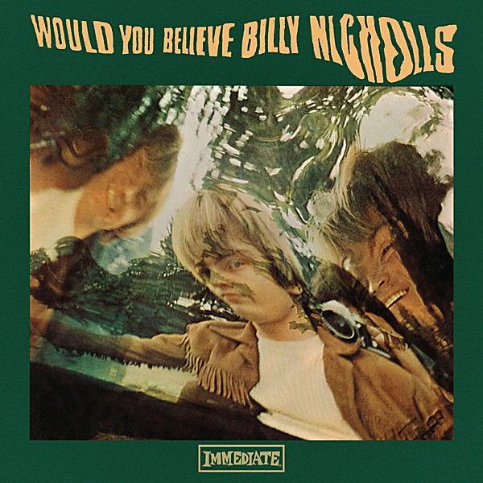

# Would You Believe

By **Billy Nicholls**

## Album Data

- **Catalog:** Beets
- **Format:** Digital, Album
- **Album:** Would You Believe
- **Artist:** Billy Nicholls
- **Albumartist:** Billy Nicholls
- **Genre:** Freakbeat
- **MusicBrainz Album Artist ID:** [1dcbd59e-747a-47b3-88f1-582875048eac](https://musicbrainz.org/artist/1dcbd59e-747a-47b3-88f1-582875048eac)
- **MusicBrainz Album ID:** [743bf5a7-f33e-46ec-8acc-bca21c9f82b7](https://musicbrainz.org/release/743bf5a7-f33e-46ec-8acc-bca21c9f82b7)
- **MusicBrainz Release Group ID:** [8a5772db-dfeb-352d-8df5-13263a2ac32d](https://musicbrainz.org/release-group/8a5772db-dfeb-352d-8df5-13263a2ac32d)
- **Year:** 1999
- **Catalog #:** NEMCD 414
- **Label:** Immediate
- **Total Tracks:** 14

## Album Tracks

### Track 01 - Would You Believe?

- **Artist:** Billy Nicholls
- **Format:** ALAC
- **Genre:** Psychedelic Pop
- **Length:** 2:43
- **MusicBrainz Track ID:** [f5f3a108-10db-42de-9d34-9c5fee6db5d9](https://musicbrainz.org/recording/f5f3a108-10db-42de-9d34-9c5fee6db5d9)
- **Title:** Would You Believe?
- **Track:** 01
- **Year:** 1999

### Track 02 - Come Again

- **Artist:** Billy Nicholls
- **Format:** ALAC
- **Genre:** Freakbeat
- **Length:** 2:36
- **MusicBrainz Track ID:** [f459156e-8b8d-478b-8c2b-eff8d4168f58](https://musicbrainz.org/recording/f459156e-8b8d-478b-8c2b-eff8d4168f58)
- **Title:** Come Again
- **Track:** 02
- **Year:** 1999

### Track 03 - Life Is Short

- **Artist:** Billy Nicholls
- **Format:** ALAC
- **Genre:** Sunshine Pop
- **Length:** 3:09
- **MusicBrainz Track ID:** [400a81e6-3e25-48a3-919b-151f9ee11baf](https://musicbrainz.org/recording/400a81e6-3e25-48a3-919b-151f9ee11baf)
- **Title:** Life Is Short
- **Track:** 03
- **Year:** 1999

### Track 04 - Feeling Easy

- **Artist:** Billy Nicholls
- **Format:** ALAC
- **Genre:** Sunshine Pop
- **Length:** 3:14
- **MusicBrainz Track ID:** [fce4724a-ab11-4ea2-8a8a-22c266895285](https://musicbrainz.org/recording/fce4724a-ab11-4ea2-8a8a-22c266895285)
- **Title:** Feeling Easy
- **Track:** 04
- **Year:** 1999

### Track 05 - Daytime Girl

- **Artist:** Billy Nicholls
- **Format:** ALAC
- **Genre:** Dream Pop
- **Length:** 2:44
- **MusicBrainz Track ID:** [acddcdc7-abfd-45d1-b758-f3447645c83f](https://musicbrainz.org/recording/acddcdc7-abfd-45d1-b758-f3447645c83f)
- **Title:** Daytime Girl
- **Track:** 05
- **Year:** 1999

### Track 06 - Daytime Girl (Coda)

- **Artist:** Billy Nicholls
- **Format:** ALAC
- **Genre:** Dream Pop
- **Length:** 1:39
- **MusicBrainz Track ID:** [1d5d87ea-d0f6-43c8-b27d-d141ab2e2a10](https://musicbrainz.org/recording/1d5d87ea-d0f6-43c8-b27d-d141ab2e2a10)
- **Title:** Daytime Girl (Coda)
- **Track:** 06
- **Year:** 1999

### Track 07 - London Social Degree

- **Artist:** Billy Nicholls
- **Format:** ALAC
- **Genre:** Freakbeat
- **Length:** 2:22
- **MusicBrainz Track ID:** [7e306093-171e-47ba-a150-2678c6cf3062](https://musicbrainz.org/recording/7e306093-171e-47ba-a150-2678c6cf3062)
- **Title:** London Social Degree
- **Track:** 07
- **Year:** 1999

### Track 08 - Portobello Road

- **Artist:** Billy Nicholls
- **Format:** ALAC
- **Genre:** Freakbeat
- **Length:** 2:07
- **MusicBrainz Track ID:** [45e9bd4c-ca90-4ffb-9a10-f2662215c466](https://musicbrainz.org/recording/45e9bd4c-ca90-4ffb-9a10-f2662215c466)
- **Title:** Portobello Road
- **Track:** 08
- **Year:** 1999

### Track 09 - Question Mark

- **Artist:** Billy Nicholls
- **Format:** ALAC
- **Genre:** Freakbeat
- **Length:** 2:29
- **MusicBrainz Track ID:** [a9052f53-457d-4089-90bd-a90eb3e4a217](https://musicbrainz.org/recording/a9052f53-457d-4089-90bd-a90eb3e4a217)
- **Title:** Question Mark
- **Track:** 09
- **Year:** 1999

### Track 10 - Being Happy

- **Artist:** Billy Nicholls
- **Format:** ALAC
- **Genre:** Psychedelic Pop
- **Length:** 2:30
- **MusicBrainz Track ID:** [824da233-c10a-40d3-b04d-4245e66ce495](https://musicbrainz.org/recording/824da233-c10a-40d3-b04d-4245e66ce495)
- **Title:** Being Happy
- **Track:** 10
- **Year:** 1999

### Track 11 - Girl From New York

- **Artist:** Billy Nicholls
- **Format:** ALAC
- **Genre:** Freakbeat
- **Length:** 3:21
- **MusicBrainz Track ID:** [e3d4f8db-3441-41d0-952a-a6e50e08b08a](https://musicbrainz.org/recording/e3d4f8db-3441-41d0-952a-a6e50e08b08a)
- **Title:** Girl From New York
- **Track:** 11
- **Year:** 1999

### Track 12 - It Brings Me Down

- **Artist:** Billy Nicholls
- **Format:** ALAC
- **Genre:** Freakbeat
- **Length:** 4:41
- **MusicBrainz Track ID:** [98cf0435-e8b1-44cd-9c20-f29d0360a5b8](https://musicbrainz.org/recording/98cf0435-e8b1-44cd-9c20-f29d0360a5b8)
- **Title:** It Brings Me Down
- **Track:** 12
- **Year:** 1999

### Track 13 - Would You Believe? (Mono single version)

- **Artist:** Billy Nicholls
- **Format:** ALAC
- **Genre:** Freakbeat
- **Length:** 2:45
- **MusicBrainz Track ID:** [93f9a952-01c1-463a-bd9e-984176e4f73d](https://musicbrainz.org/recording/93f9a952-01c1-463a-bd9e-984176e4f73d)
- **Title:** Would You Believe? (Mono single version)
- **Track:** 13
- **Year:** 1999

### Track 14 - Daytime Girl (Mono single version)

- **Artist:** Billy Nicholls
- **Format:** ALAC
- **Genre:** Freakbeat
- **Length:** 2:45
- **MusicBrainz Track ID:** [209e87bc-5a6a-4cad-8229-1c1dd421a612](https://musicbrainz.org/recording/209e87bc-5a6a-4cad-8229-1c1dd421a612)
- **Title:** Daytime Girl (Mono single version)
- **Track:** 14
- **Year:** 1999

