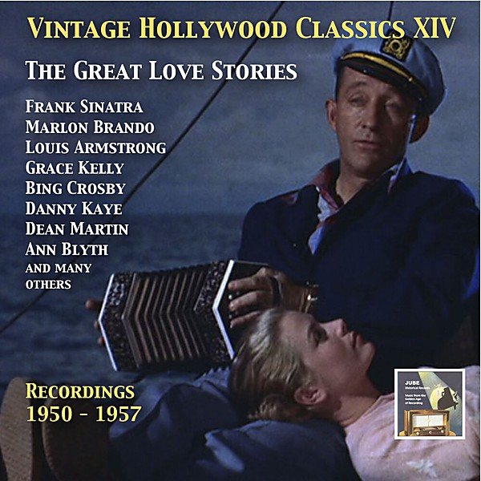

# 1950

By **Bing Crosby**

## Album Data

- **Catalog:** Beets
- **Format:** Digital, Album
- **Album:** 1950
- **Artist:** Bing Crosby
- **Albumartist:** Bing Crosby
- **Genre:** Swing
- **MusicBrainz Album Artist ID:** 
- **MusicBrainz Album ID:** 
- **MusicBrainz Release Group ID:** 
- **Year:** 1950
- **Catalog #:** 
- **Label:** 
- **Total Tracks:** 00

## Album Tracks

### Track 00 - Soon

- **Artist:** Bing Crosby/Georgie Stoll
- **Format:** ALAC
- **Genre:** Swing
- **Length:** 3:02
- **MusicBrainz Track ID:** 
- **Title:** Soon
- **Track:** 00
- **Year:** 1935

## See also

- [From CD - orig. Decca 392](From_CD_-_orig_Decca_392.md)
- [Vinyl: ](../../Vinyl/Bing_Crosby/Bing_Crosby.md)
- [Vinyl: "Silent Night (Christmas Hymn) / Adeste Fideles (Oh, Come, All Ye Faithful)"](../../Vinyl/Bing_Crosby/Silent_Night_Christmas_Hymn_-_Adeste_Fideles_Oh__Come__All_Ye_Faithful.md)
