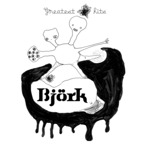

# Greatest Hits

By **Björk**

## Album Data

- **Catalog:** Beets
- **Format:** Digital, Album
- **Album:** Greatest Hits
- **Artist:** Björk
- **Albumartist:** Björk
- **Genre:** Electronica
- **MusicBrainz Album Artist ID:** [https](https://musicbrainz.org/artist/https)
- **MusicBrainz Album ID:** [https](https://musicbrainz.org/release/https)
- **MusicBrainz Release Group ID:** 
- **Year:** 2002
- **Catalog #:** 
- **Label:** 
- **Total Tracks:** 00

## Album Tracks

### Track 00 - Pagan Poetry (5.1)

- **Artist:** Björk
- **Format:** AAC
- **Genre:** Electronica
- **Length:** 4:01
- **MusicBrainz Track ID:** 
- **Title:** Pagan Poetry (5.1)
- **Track:** 00
- **Year:** 0000

### Track 00 - Pagan Poetry (stereo)

- **Artist:** Björk
- **Format:** AAC
- **Genre:** Electronica
- **Length:** 4:11
- **MusicBrainz Track ID:** 
- **Title:** Pagan Poetry (stereo)
- **Track:** 00
- **Year:** 0000

## See also

- [Pagan Poetry](Pagan_Poetry.md)
- [Vulnicura](Vulnicura.md)
- [Roon: Greatest Hits](../../Roon/Björk/Greatest_Hits.md)
