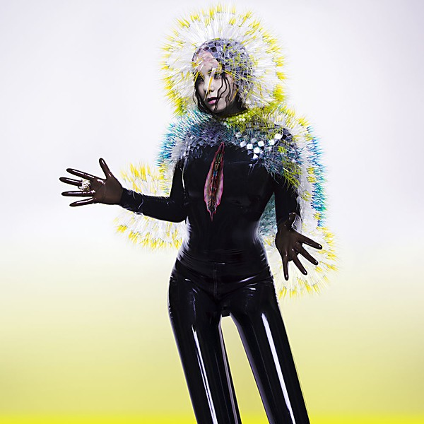

# Vulnicura

By **Björk**

## Album Data

- **Catalog:** Beets
- **Format:** Digital, Album
- **Album:** Vulnicura
- **Artist:** Björk
- **Albumartist:** Björk
- **Genre:** Electronic
- **MusicBrainz Album Artist ID:** [87c5dedd-371d-4a53-9f7f-80522fb7f3cb](https://musicbrainz.org/artist/87c5dedd-371d-4a53-9f7f-80522fb7f3cb)
- **MusicBrainz Album ID:** [45a2061b-675f-49f1-a5eb-63100b7ca8eb](https://musicbrainz.org/release/45a2061b-675f-49f1-a5eb-63100b7ca8eb)
- **MusicBrainz Release Group ID:** [73efadfc-07db-42bd-81ab-7a35a2601990](https://musicbrainz.org/release-group/73efadfc-07db-42bd-81ab-7a35a2601990)
- **Year:** 2015
- **Catalog #:** TPLP1231DL
- **Label:** One Little Indian Records
- **Total Tracks:** 09

## Album Tracks

### Track 01 - Stonemilker

- **Artist:** Björk
- **Format:** ALAC
- **Genre:** Orchestral
- **Length:** 6:49
- **MusicBrainz Track ID:** [d5381101-4d6b-4331-b7c9-709188d7dca2](https://musicbrainz.org/recording/d5381101-4d6b-4331-b7c9-709188d7dca2)
- **Title:** Stonemilker
- **Track:** 01
- **Year:** 2015

### Track 02 - Lionsong

- **Artist:** Björk
- **Format:** ALAC
- **Genre:** Trip Hop
- **Length:** 6:08
- **MusicBrainz Track ID:** [b0069a45-df23-4a20-883c-d032985747f3](https://musicbrainz.org/recording/b0069a45-df23-4a20-883c-d032985747f3)
- **Title:** Lionsong
- **Track:** 02
- **Year:** 2015

### Track 03 - History of Touches

- **Artist:** Björk
- **Format:** ALAC
- **Genre:** Dark Ambient
- **Length:** 3:00
- **MusicBrainz Track ID:** [70026b20-d981-48ef-a12a-7300ab156fe2](https://musicbrainz.org/recording/70026b20-d981-48ef-a12a-7300ab156fe2)
- **Title:** History of Touches
- **Track:** 03
- **Year:** 2015

### Track 04 - Black Lake

- **Artist:** Björk
- **Format:** ALAC
- **Genre:** Orchestral
- **Length:** 10:08
- **MusicBrainz Track ID:** [d61b45ac-2167-4ffd-80f0-7a49ebd6c00b](https://musicbrainz.org/recording/d61b45ac-2167-4ffd-80f0-7a49ebd6c00b)
- **Title:** Black Lake
- **Track:** 04
- **Year:** 2015

### Track 05 - Family

- **Artist:** Björk
- **Format:** ALAC
- **Genre:** Samba
- **Length:** 8:02
- **MusicBrainz Track ID:** [cef1d961-4660-4b45-a02c-74d6c5bd7121](https://musicbrainz.org/recording/cef1d961-4660-4b45-a02c-74d6c5bd7121)
- **Title:** Family
- **Track:** 05
- **Year:** 2015

### Track 06 - Notget

- **Artist:** Björk
- **Format:** ALAC
- **Genre:** Contemporary Classical
- **Length:** 6:26
- **MusicBrainz Track ID:** [083b56f6-4fe6-4ff7-900b-f9e009404151](https://musicbrainz.org/recording/083b56f6-4fe6-4ff7-900b-f9e009404151)
- **Title:** Notget
- **Track:** 06
- **Year:** 2015

### Track 08 - Mouth Mantra

- **Artist:** Björk
- **Format:** ALAC
- **Genre:** Baroque Pop
- **Length:** 6:09
- **MusicBrainz Track ID:** [31c025a4-471a-48a7-8c57-2af66e7821c9](https://musicbrainz.org/recording/31c025a4-471a-48a7-8c57-2af66e7821c9)
- **Title:** Mouth Mantra
- **Track:** 08
- **Year:** 2015

### Track 09 - Quicksand

- **Artist:** Björk
- **Format:** ALAC
- **Genre:** Miami Bass
- **Length:** 3:45
- **MusicBrainz Track ID:** [bf1e290b-7506-4a89-9e46-6c20c0c937fc](https://musicbrainz.org/recording/bf1e290b-7506-4a89-9e46-6c20c0c937fc)
- **Title:** Quicksand
- **Track:** 09
- **Year:** 2015

### Track 07 - Atom Dance

- **Artist:** Björk feat. Anohni
- **Format:** ALAC
- **Genre:** Electronic
- **Length:** 8:10
- **MusicBrainz Track ID:** [47376f61-e186-43f8-afcb-91852c066696](https://musicbrainz.org/recording/47376f61-e186-43f8-afcb-91852c066696)
- **Title:** Atom Dance
- **Track:** 07
- **Year:** 2015

## See also

- [Greatest Hits](Greatest_Hits.md)
- [Pagan Poetry](Pagan_Poetry.md)
- [Roon: Greatest Hits](../../Roon/Björk/Greatest_Hits.md)
