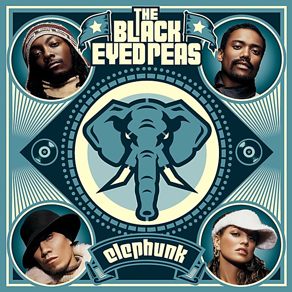

# Elephunk

By **Black Eyed Peas**

## Album Data

- **Catalog:** Beets
- **Format:** Digital, Album
- **Album:** Elephunk
- **Artist:** Black Eyed Peas
- **Albumartist:** Black Eyed Peas
- **Genre:** Funk
- **MusicBrainz Album Artist ID:** [d5be5333-4171-427e-8e12-732087c6b78e](https://musicbrainz.org/artist/d5be5333-4171-427e-8e12-732087c6b78e)
- **MusicBrainz Album ID:** [7a932661-4b2d-4c00-8efe-fa69314077f4](https://musicbrainz.org/release/7a932661-4b2d-4c00-8efe-fa69314077f4)
- **MusicBrainz Release Group ID:** [7ba035ec-c437-3cfb-833b-22ae68313a3f](https://musicbrainz.org/release-group/7ba035ec-c437-3cfb-833b-22ae68313a3f)
- **Year:** 2004
- **Catalog #:** 
- **Label:** A&M Records
- **Total Tracks:** 15

## Album Tracks

### Track 01 - Pump It

- **Artist:** Black Eyed Peas
- **Format:** ALAC
- **Genre:** Funk
- **Length:** 3:33
- **MusicBrainz Track ID:** [a4b2afdf-c88d-4f56-b8ea-db012c6df054](https://musicbrainz.org/recording/a4b2afdf-c88d-4f56-b8ea-db012c6df054)
- **Title:** Pump It
- **Track:** 01
- **Year:** 2005

### Track 02 - Don’t Phunk With My Heart

- **Artist:** Black Eyed Peas
- **Format:** ALAC
- **Genre:** Funk
- **Length:** 3:59
- **MusicBrainz Track ID:** [a28fd793-c89a-47a4-a850-873665aed8cb](https://musicbrainz.org/recording/a28fd793-c89a-47a4-a850-873665aed8cb)
- **Title:** Don’t Phunk With My Heart
- **Track:** 02
- **Year:** 2005

### Track 04 - Don’t Lie

- **Artist:** Black Eyed Peas
- **Format:** ALAC
- **Genre:** Funk
- **Length:** 3:39
- **MusicBrainz Track ID:** [30ff27cf-325f-4b7c-bd3b-848718945ca3](https://musicbrainz.org/recording/30ff27cf-325f-4b7c-bd3b-848718945ca3)
- **Title:** Don’t Lie
- **Track:** 04
- **Year:** 2005

### Track 05 - My Humps

- **Artist:** Black Eyed Peas
- **Format:** ALAC
- **Genre:** Funk
- **Length:** 5:26
- **MusicBrainz Track ID:** [859663e0-0b03-42ff-8364-14b7f50e04f0](https://musicbrainz.org/recording/859663e0-0b03-42ff-8364-14b7f50e04f0)
- **Title:** My Humps
- **Track:** 05
- **Year:** 2005

### Track 08 - Feel It

- **Artist:** Black Eyed Peas
- **Format:** ALAC
- **Genre:** Funk
- **Length:** 4:19
- **MusicBrainz Track ID:** [4886b9ac-493d-4817-9ded-9bfbe6270310](https://musicbrainz.org/recording/4886b9ac-493d-4817-9ded-9bfbe6270310)
- **Title:** Feel It
- **Track:** 08
- **Year:** 2005

### Track 09 - Gone Going

- **Artist:** Black Eyed Peas
- **Format:** ALAC
- **Genre:** Funk
- **Length:** 3:13
- **MusicBrainz Track ID:** [098fa222-9030-4470-b22d-04987a7894f2](https://musicbrainz.org/recording/098fa222-9030-4470-b22d-04987a7894f2)
- **Title:** Gone Going
- **Track:** 09
- **Year:** 2005

### Track 11 - Disco Club

- **Artist:** Black Eyed Peas
- **Format:** ALAC
- **Genre:** Pop
- **Length:** 3:48
- **MusicBrainz Track ID:** [d35c65d0-1991-40db-b943-74effcc57ac2](https://musicbrainz.org/recording/d35c65d0-1991-40db-b943-74effcc57ac2)
- **Title:** Disco Club
- **Track:** 11
- **Year:** 2005

### Track 12 - Bebot

- **Artist:** Black Eyed Peas
- **Format:** ALAC
- **Genre:** Funk
- **Length:** 3:30
- **MusicBrainz Track ID:** [77efc899-2c59-428c-bb72-1d4f99f53803](https://musicbrainz.org/recording/77efc899-2c59-428c-bb72-1d4f99f53803)
- **Title:** Bebot
- **Track:** 12
- **Year:** 2005

### Track 13 - Ba Bump

- **Artist:** Black Eyed Peas
- **Format:** ALAC
- **Genre:** Funk
- **Length:** 3:56
- **MusicBrainz Track ID:** [e8a48fcd-21f0-44cd-97ab-257addd42c5d](https://musicbrainz.org/recording/e8a48fcd-21f0-44cd-97ab-257addd42c5d)
- **Title:** Ba Bump
- **Track:** 13
- **Year:** 2005

### Track 14 - Audio Delite at Low Fidelity / Change

- **Artist:** Black Eyed Peas
- **Format:** ALAC
- **Genre:** Pop
- **Length:** 5:29
- **MusicBrainz Track ID:** [696f6ddf-4912-491b-b78c-ad8a3cc2f934](https://musicbrainz.org/recording/696f6ddf-4912-491b-b78c-ad8a3cc2f934)
- **Title:** Audio Delite at Low Fidelity / Change
- **Track:** 14
- **Year:** 2005

### Track 10 - They Don’t Want Music

- **Artist:** Black Eyed Peas feat. James Brown
- **Format:** ALAC
- **Genre:** Funk
- **Length:** 6:46
- **MusicBrainz Track ID:** [3e3bdd04-75bf-4178-956c-9c6300203c14](https://musicbrainz.org/recording/3e3bdd04-75bf-4178-956c-9c6300203c14)
- **Title:** They Don’t Want Music
- **Track:** 10
- **Year:** 2005

### Track 06 - Like That

- **Artist:** Black Eyed Peas feat. John Legend, Q‐Tip, Talib Kweli & CeeLo Green
- **Format:** ALAC
- **Genre:** Funk
- **Length:** 4:34
- **MusicBrainz Track ID:** [6eb69287-bbde-4249-8971-d6f759927c9d](https://musicbrainz.org/recording/6eb69287-bbde-4249-8971-d6f759927c9d)
- **Title:** Like That
- **Track:** 06
- **Year:** 2005

### Track 07 - Dum Diddly

- **Artist:** Black Eyed Peas feat. Dante Santiago
- **Format:** ALAC
- **Genre:** Funk
- **Length:** 4:19
- **MusicBrainz Track ID:** [2351226c-16bf-47f5-a643-521bb7f27ed6](https://musicbrainz.org/recording/2351226c-16bf-47f5-a643-521bb7f27ed6)
- **Title:** Dum Diddly
- **Track:** 07
- **Year:** 2005

### Track 15 - Union

- **Artist:** Black Eyed Peas feat. Sting
- **Format:** ALAC
- **Genre:** Funk
- **Length:** 5:04
- **MusicBrainz Track ID:** [26b30431-5527-48c9-a7f0-3d3d5663699c](https://musicbrainz.org/recording/26b30431-5527-48c9-a7f0-3d3d5663699c)
- **Title:** Union
- **Track:** 15
- **Year:** 2005

### Track 03 - My Style

- **Artist:** Black Eyed Peas featuring Justin Timberlake
- **Format:** ALAC
- **Genre:** Pop
- **Length:** 4:28
- **MusicBrainz Track ID:** [6cff92bd-988a-4470-8032-ac8ecf311f67](https://musicbrainz.org/recording/6cff92bd-988a-4470-8032-ac8ecf311f67)
- **Title:** My Style
- **Track:** 03
- **Year:** 2005

## See also

- [Monkey Business](Monkey_Business.md)
- [The E.N.D.](The_END.md)
- [Roon: Behind The Front](../../Roon/Black_Eyed_Peas/Behind_The_Front.md)
- [Roon: Bridging The Gap](../../Roon/Black_Eyed_Peas/Bridging_The_Gap.md)
- [Roon: DON'T YOU WORRY (Malaa Remix)](../../Roon/Black_Eyed_Peas/DONT_YOU_WORRY_Malaa_Remix.md)
- [Roon: DON'T YOU WORRY](../../Roon/Black_Eyed_Peas/DONT_YOU_WORRY.md)
- [Roon: Elephunk](../../Roon/Black_Eyed_Peas/Elephunk.md)
- [Roon: Monkey Business](../../Roon/Black_Eyed_Peas/Monkey_Business.md)
- [Roon: The E.N.D. (Energy Never Dies)](../../Roon/Black_Eyed_Peas/The_END_Energy_Never_Dies.md)
- [Vinyl: Behind The Front](../../Vinyl/Black_Eyed_Peas/Behind_The_Front.md)
- [Vinyl: ](../../Vinyl/Black_Eyed_Peas/Black_Eyed_Peas.md)
