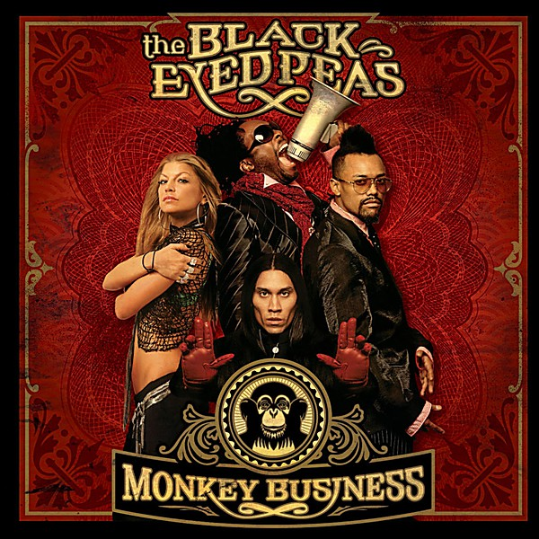

# Monkey Business

By **Black Eyed Peas**

## Album Data

- **Catalog:** Beets
- **Format:** Digital, Album
- **Album:** Monkey Business
- **Artist:** Black Eyed Peas
- **Albumartist:** Black Eyed Peas
- **Genre:** Funk
- **MusicBrainz Album Artist ID:** [d5be5333-4171-427e-8e12-732087c6b78e](https://musicbrainz.org/artist/d5be5333-4171-427e-8e12-732087c6b78e)
- **MusicBrainz Album ID:** [c847245e-42db-41ef-b0f0-cd64409ce18b](https://musicbrainz.org/release/c847245e-42db-41ef-b0f0-cd64409ce18b)
- **MusicBrainz Release Group ID:** [990c6869-9722-3190-9e49-bbac56ae53b6](https://musicbrainz.org/release-group/990c6869-9722-3190-9e49-bbac56ae53b6)
- **Year:** 2005
- **Catalog #:** B0012887-01
- **Label:** Interscope Records
- **Total Tracks:** 15

## Album Tracks

### Track 01 - Boom Boom Pow

- **Artist:** Black Eyed Peas
- **Format:** ALAC
- **Genre:** Pop
- **Length:** 5:07
- **MusicBrainz Track ID:** [a4bbf91f-ec8b-44a2-90f9-898c875aa297](https://musicbrainz.org/recording/a4bbf91f-ec8b-44a2-90f9-898c875aa297)
- **Title:** Boom Boom Pow
- **Track:** 01
- **Year:** 2009

### Track 02 - Rock That Body

- **Artist:** Black Eyed Peas
- **Format:** ALAC
- **Genre:** Electro
- **Length:** 4:28
- **MusicBrainz Track ID:** [5663941d-aab2-41da-ab1a-ba3f5e509a64](https://musicbrainz.org/recording/5663941d-aab2-41da-ab1a-ba3f5e509a64)
- **Title:** Rock That Body
- **Track:** 02
- **Year:** 2009

### Track 03 - Meet Me Halfway

- **Artist:** Black Eyed Peas
- **Format:** ALAC
- **Genre:** Pop
- **Length:** 4:44
- **MusicBrainz Track ID:** [72efde9b-88c8-46dd-85d2-2208513bb0fb](https://musicbrainz.org/recording/72efde9b-88c8-46dd-85d2-2208513bb0fb)
- **Title:** Meet Me Halfway
- **Track:** 03
- **Year:** 2009

### Track 04 - Imma Be

- **Artist:** Black Eyed Peas
- **Format:** ALAC
- **Genre:** Pop
- **Length:** 4:16
- **MusicBrainz Track ID:** [9ac15b6e-fdc7-4c54-9ed8-a161412d9f8b](https://musicbrainz.org/recording/9ac15b6e-fdc7-4c54-9ed8-a161412d9f8b)
- **Title:** Imma Be
- **Track:** 04
- **Year:** 2009

### Track 05 - I Gotta Feeling

- **Artist:** Black Eyed Peas
- **Format:** ALAC
- **Genre:** Pop
- **Length:** 4:48
- **MusicBrainz Track ID:** [abcb30ab-58a7-4f63-9699-952b9b422fc2](https://musicbrainz.org/recording/abcb30ab-58a7-4f63-9699-952b9b422fc2)
- **Title:** I Gotta Feeling
- **Track:** 05
- **Year:** 2009

### Track 06 - Alive

- **Artist:** Black Eyed Peas
- **Format:** ALAC
- **Genre:** Electropop
- **Length:** 5:02
- **MusicBrainz Track ID:** [08524e88-8077-4709-ad2d-0a1d7086847d](https://musicbrainz.org/recording/08524e88-8077-4709-ad2d-0a1d7086847d)
- **Title:** Alive
- **Track:** 06
- **Year:** 2009

### Track 07 - Missing You

- **Artist:** Black Eyed Peas
- **Format:** ALAC
- **Genre:** Electropop
- **Length:** 4:34
- **MusicBrainz Track ID:** [2fdea24e-1c80-4916-87ab-3feb9b2e6829](https://musicbrainz.org/recording/2fdea24e-1c80-4916-87ab-3feb9b2e6829)
- **Title:** Missing You
- **Track:** 07
- **Year:** 2009

### Track 08 - Ring-a-Ling

- **Artist:** Black Eyed Peas
- **Format:** ALAC
- **Genre:** Electropop
- **Length:** 4:32
- **MusicBrainz Track ID:** [82b6a7d2-37f3-4661-84f3-72c1ccc8f783](https://musicbrainz.org/recording/82b6a7d2-37f3-4661-84f3-72c1ccc8f783)
- **Title:** Ring-a-Ling
- **Track:** 08
- **Year:** 2009

### Track 09 - Party All the Time

- **Artist:** Black Eyed Peas
- **Format:** ALAC
- **Genre:** Pop
- **Length:** 4:43
- **MusicBrainz Track ID:** [0081a862-5354-4f8e-b3fa-5172b8691a50](https://musicbrainz.org/recording/0081a862-5354-4f8e-b3fa-5172b8691a50)
- **Title:** Party All the Time
- **Track:** 09
- **Year:** 2009

### Track 10 - Out of My Head

- **Artist:** Black Eyed Peas
- **Format:** ALAC
- **Genre:** Boogie
- **Length:** 3:51
- **MusicBrainz Track ID:** [2d9af4c2-38a6-48fa-ae2f-234204caa603](https://musicbrainz.org/recording/2d9af4c2-38a6-48fa-ae2f-234204caa603)
- **Title:** Out of My Head
- **Track:** 10
- **Year:** 2009

### Track 11 - Electric City

- **Artist:** Black Eyed Peas
- **Format:** ALAC
- **Genre:** House
- **Length:** 4:08
- **MusicBrainz Track ID:** [257d498f-5e44-4791-83dc-11425c97c1ed](https://musicbrainz.org/recording/257d498f-5e44-4791-83dc-11425c97c1ed)
- **Title:** Electric City
- **Track:** 11
- **Year:** 2009

### Track 12 - Showdown

- **Artist:** Black Eyed Peas
- **Format:** ALAC
- **Genre:** Pop
- **Length:** 4:27
- **MusicBrainz Track ID:** [5ce7e313-e688-4cc8-854e-416eab07f60b](https://musicbrainz.org/recording/5ce7e313-e688-4cc8-854e-416eab07f60b)
- **Title:** Showdown
- **Track:** 12
- **Year:** 2009

### Track 13 - Now Generation

- **Artist:** Black Eyed Peas
- **Format:** ALAC
- **Genre:** Funk
- **Length:** 4:06
- **MusicBrainz Track ID:** [c42b6436-6f3f-46d2-848b-b87c761635af](https://musicbrainz.org/recording/c42b6436-6f3f-46d2-848b-b87c761635af)
- **Title:** Now Generation
- **Track:** 13
- **Year:** 2009

### Track 14 - One Tribe

- **Artist:** Black Eyed Peas
- **Format:** ALAC
- **Genre:** Electropop
- **Length:** 4:40
- **MusicBrainz Track ID:** [25ca3f76-fc04-4f53-97c2-b4a5bbb0d03f](https://musicbrainz.org/recording/25ca3f76-fc04-4f53-97c2-b4a5bbb0d03f)
- **Title:** One Tribe
- **Track:** 14
- **Year:** 2009

### Track 15 - Rockin to the Beat

- **Artist:** Black Eyed Peas
- **Format:** ALAC
- **Genre:** Electro
- **Length:** 3:45
- **MusicBrainz Track ID:** [2f20ca3d-14bb-4a54-9197-648be2ae0df0](https://musicbrainz.org/recording/2f20ca3d-14bb-4a54-9197-648be2ae0df0)
- **Title:** Rockin to the Beat
- **Track:** 15
- **Year:** 2009

## See also

- [Elephunk](Elephunk.md)
- [The E.N.D.](The_END.md)
- [Roon: Behind The Front](../../Roon/Black_Eyed_Peas/Behind_The_Front.md)
- [Roon: Bridging The Gap](../../Roon/Black_Eyed_Peas/Bridging_The_Gap.md)
- [Roon: DON'T YOU WORRY (Malaa Remix)](../../Roon/Black_Eyed_Peas/DONT_YOU_WORRY_Malaa_Remix.md)
- [Roon: DON'T YOU WORRY](../../Roon/Black_Eyed_Peas/DONT_YOU_WORRY.md)
- [Roon: Elephunk](../../Roon/Black_Eyed_Peas/Elephunk.md)
- [Roon: Monkey Business](../../Roon/Black_Eyed_Peas/Monkey_Business.md)
- [Roon: The E.N.D. (Energy Never Dies)](../../Roon/Black_Eyed_Peas/The_END_Energy_Never_Dies.md)
- [Vinyl: Behind The Front](../../Vinyl/Black_Eyed_Peas/Behind_The_Front.md)
- [Vinyl: ](../../Vinyl/Black_Eyed_Peas/Black_Eyed_Peas.md)
